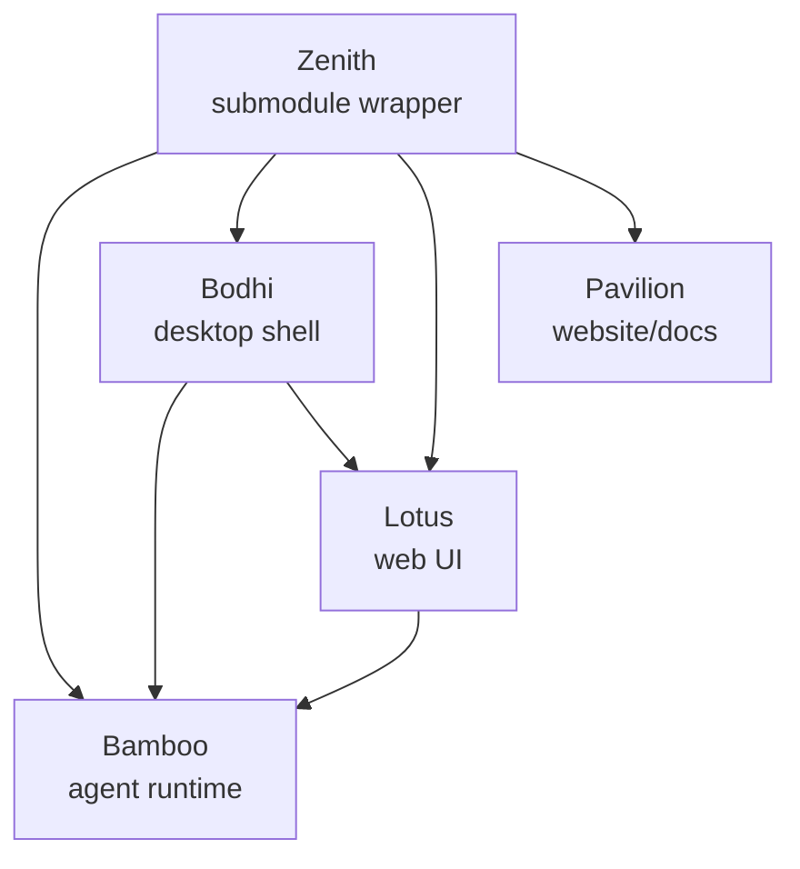

# Zenith

Zenith 是一个轻量级 monorepo 入口，用来协调四个独立项目的 Git submodule：

- [`bamboo/`](./bamboo) — Rust AI agent backend / runtime
- [`bodhi/`](./bodhi) — Bodhi AI 桌面 Agent 工作台（Tauri）
- [`lotus/`](./lotus) — Web UI（React + Vite）
- [`pavilion/`](./pavilion) — 官网与对外内容站点

> **Zenith 本身不是产品本体。**
> 它更像一个 release train + submodule wrapper，用来统一管理 Bamboo、Bodhi、Lotus、Pavilion 四个仓库的版本与协作关系。

## 从哪里开始

### 如果你是用户
- 想了解 Agent runtime：从 [`bamboo/README.md`](./bamboo/README.md) 开始
- 想了解桌面产品：从 [`bodhi/README.md`](./bodhi/README.md) 开始
- 想看官网 / 对外内容：查看 [`pavilion/`](./pavilion)

### 如果你是开发者
- Monorepo 与 submodule 工作流：看下方「开发与同步」
- Bamboo 后端开发：进入 [`bamboo/`](./bamboo)
- Bodhi 桌面端开发：进入 [`bodhi/`](./bodhi)
- Lotus 前端开发：进入 [`lotus/`](./lotus)

## 仓库职责边界



- **Zenith**：维护 submodule 指针、跨仓库发布编排、少量根级说明
- **Bamboo**：模型调用、工具、技能、任务、记忆、调度、HTTP/SSE API
- **Bodhi**：桌面壳、原生集成、打包发布、桌面运行时体验
- **Lotus**：前端产品界面与 Web 交互
- **Pavilion**：官网、宣传内容、长篇对外叙事

## Clone

```bash
git clone --recursive https://github.com/bigduu/Zenith.git
cd Zenith
```

如果你已经 clone 过但没有带 submodule：

```bash
git submodule update --init --recursive
```

## 开发与同步

查看当前 submodule 指针：

```bash
git submodule status
```

拉取各子模块最新提交：

```bash
git submodule update --remote --recursive
```

在子模块中工作并推送后，回到 Zenith 提交指针更新：

```bash
git add .gitmodules bamboo bodhi lotus pavilion
git commit -m "chore: bump submodule pointers"
git push
```

## 在子模块里开发

```bash
cd bamboo
# or bodhi / lotus / pavilion
```

建议流程：

1. 在对应子模块里开发、提交、推送
2. 回到 Zenith 根仓库
3. 提交更新后的 submodule pointer

## Coordinated Release Train

Zenith 根仓库负责统一发布节奏：

1. `bamboo` → publish crate
2. `lotus` → publish npm package
3. `bodhi` → build and publish desktop binaries

相关文件：
- `.github/workflows/release-train.yml`
- `.github/release-train.config.json`

建议策略：
- **正常发布只走 Zenith 的 Release Train**
- 子仓库独立发布 workflow 仅用于紧急恢复

## 文档放置原则

为了避免根仓库继续膨胀：

- **Zenith 根目录**：只保留轻量入口、submodule 工作流、release train 说明
- **Bamboo 文档**：运行时、架构、研究、memory / prompt / tools / scheduler 等内容
- **Bodhi 文档**：桌面产品、桌面运行时、打包、桌面架构、产品对比内容
- **Lotus 文档**：前端实现与 UI 行为
- **Pavilion**：更偏官网、文章、对外叙事

---

如果你只是第一次接触这个项目，建议直接先看：

- [`bamboo/README.md`](./bamboo/README.md)
- [`bodhi/README.md`](./bodhi/README.md)
