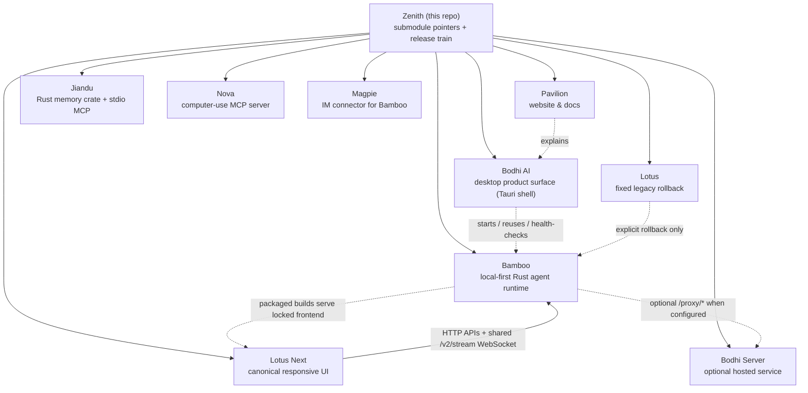

<div align="center">

# Zenith

### Bodhi AI — the local-first desktop agent that does the work, not just chats.

**It uses tools, keeps memory, and shows you every step — not just a final answer.**
Zenith is its home base: the desktop product, UIs, Rust runtime, optional hosted
services, shared memory, computer use, IM integration, and docs in one recursive clone.

[](https://github.com/bigduu/Zenith/actions/workflows/submodule-guard.yml)
[](https://github.com/bigduu/Zenith/actions/workflows/release-train.yml)
[](https://github.com/bigduu/Zenith/actions/workflows/nightly-release.yml)
[](./README.zh-CN.md)

**[▶ Start with Bodhi AI](https://github.com/bigduu/Bodhi-AI)** · [Lotus Next](https://github.com/bigduu/lotus-next) · [Bamboo](https://github.com/bigduu/Bamboo-agent) · [Bodhi Server](https://github.com/bigduu/bodhi-server) · [Pavilion](https://github.com/bigduu/Pavilion) · [Architecture Overview](https://github.com/bigduu/Pavilion/blob/main/articles/zenith-architecture-overview.md)

</div>

> Bodhi AI turns AI from a chat box into a desktop workbench that actually does the work: you hand it a task, it uses tools, keeps memory, and produces results — and you can watch the whole thing happen. **Zenith** ties the product, the UI, the execution engine, optional hosted services, and the docs together — and keeps their releases in sync.

---

## Key capabilities at a glance

| Capability | What it means |
|---|---|
| **A map of the whole system** | One repo shows how product, UI, runtime, backend, and docs divide the work and fit together |
| **Nine submodules, one clone** | Pull the full product stack and companion services in a single recursive clone |
| **Coordinated release train** | One verified Lotus Next artifact feeds Bamboo → Bodhi in dependency order, all driven by one fail-closed config |
| **Daily nightly versioning** | Calendar-versioned (`YYYY.M.N`) auto-bump and nightly release |
| **Submodule guard** | CI validates submodule pointers on pushes to and pull requests targeting `main` |
| **Clear "start here" routing** | Whether you want the product, the frontend, or the runtime, there is a clear door in |

---

## Architecture

Zenith holds almost no business logic itself. It is a thin-shell monorepo: it pins nine Git submodules, owns the root-level documentation, and orchestrates releases across repos. The real features live inside the submodules.


```mermaid
graph TD
  Z["Zenith (this repo)<br/>submodule pointers + release train"]

  Z --> B["Bodhi AI<br/>desktop product surface (Tauri shell)"]
  Z --> L["Lotus<br/>fixed legacy rollback"]
  Z --> R["Bamboo<br/>local-first Rust agent runtime"]
  Z --> S["Bodhi Server<br/>optional hosted service"]
  Z --> P["Pavilion<br/>website & docs"]
  Z --> J["Jiandu<br/>Rust memory crate + stdio MCP"]
  Z --> N["Nova<br/>computer-use MCP server"]
  Z --> LN["Lotus Next<br/>canonical responsive UI"]
  Z --> M["Magpie<br/>IM connector for Bamboo"]

  B -. starts / reuses / health-checks .-> R
  R -. packaged builds serve locked frontend .-> LN
  LN -->|HTTP APIs + shared /v2/stream WebSocket| R
  L -. explicit rollback only .-> R
  R -. optional /proxy/* when configured .-> S
  P -. explains .-> B
```

> **Note** —— Bodhi owns the native desktop shell and the Bamboo sidecar lifecycle: it starts or reuses `bamboo serve` and waits for it to become healthy. Packaged builds use the exact Lotus Next npm artifact locked by Bamboo, Bodhi, and the Zenith release policy; legacy Lotus remains only an explicit fixed-version rollback. Lotus Next sends requests over HTTP and receives live events through the shared `/v2/stream` WebSocket. Bodhi Server is optional for local operation and is used, when configured, for accounts/authentication, credential storage, quota/billing, model routing, and provider proxying.

### What each module does

| Module | Path | Role | Start here |
|---|---|---|---|
| **Bodhi AI** | `bodhi/` | Product surface: Tauri shell, native integration, packaging, and managed Bamboo sidecar lifecycle | [Bodhi AI](https://github.com/bigduu/Bodhi-AI) |
| **Lotus** | `lotus/` | Frozen legacy React + Vite UI retained only as the fixed rollback package while retirement acceptance remains open | [Lotus](https://github.com/bigduu/Lotus) |
| **Bamboo** | `bamboo/` | Execution engine and production Lotus Next host: local-first Rust runtime with HTTP, WebSocket, and legacy SSE APIs | [Bamboo Agent](https://github.com/bigduu/Bamboo-agent) |
| **Bodhi Server** | `bodhi-server/` | Optional hosted Go service: accounts/auth, API keys, encrypted provider credentials, model routing, billing/quota, provider proxy | [Bodhi Server](https://github.com/bigduu/bodhi-server) |
| **Pavilion** | `pavilion/` | Website & docs: download page, doc center, public narrative | [Pavilion](https://github.com/bigduu/Pavilion) |
| **Jiandu** | `jiandu/` | Authoritative shared memory: independent filesystem-backed Rust store, embedding-free lexical recall, host-generated Dream snapshot persistence, and one-tool stdio MCP | [Jiandu](https://github.com/bigduu/Jiandu) · [agent guidance](./AGENTS.md#shared-memory-via-jiandu-mcp) · [portable Skill](https://github.com/bigduu/Jiandu/blob/v0.2.0/skills/jiandu-memory/SKILL.md) |
| **Nova** | `nova/` | Computer use: native desktop interaction exposed through MCP | [Nova](https://github.com/bigduu/Nova) |
| **Lotus Next** | `lotus-next/` | Canonical responsive React + Vite UI and the default frontend artifact consumed by Bamboo and Bodhi releases | [Lotus Next](https://github.com/bigduu/lotus-next) |
| **Magpie** | `magpie/` | IM integration: standalone connector and Bamboo service plugin | [Magpie](https://github.com/bigduu/Magpie) |
| **Zenith (root)** | `.` | Coordinator: submodule pointers, root docs, release train | You are here |

---

## Signature deep-dives

### Start here routing

Zenith's biggest job is getting any person to the right door fast.

**If you just want to understand the product**
- See the product itself → [Bodhi AI](https://github.com/bigduu/Bodhi-AI)
- See why the overall design is organized this way → [Zenith Architecture Overview](https://github.com/bigduu/Pavilion/blob/main/articles/zenith-architecture-overview.md)
- See the website / download / docs narrative → [Pavilion](https://github.com/bigduu/Pavilion)

**If you want to build**
- Desktop product / Tauri shell → `bodhi/`
- Canonical frontend interaction / React UI → `lotus-next/`
- Fixed legacy rollback only → `lotus/`
- Agent runtime / Rust backend → `bamboo/`
- Optional hosted accounts / credentials / routing / billing → `bodhi-server/`
- Website / docs / public content → `pavilion/`
- Shared-memory MCP → `jiandu/`
- Computer-use MCP → `nova/`
- IM connector / Bamboo service plugin → `magpie/`

### The stack, organized on purpose

The core product path is split so each layer can evolve on its own yet converge into one product at release time:

- **UI & experience** live in Lotus Next (React/Vite); requests use HTTP and live events use one shared WebSocket.
- **Execution and production UI hosting** live in Bamboo (Rust), local-first and runnable as a standalone service.
- **Optional hosted accounts, credentials, model routing, quota/billing, and provider proxying** live in Bodhi Server (Go) when configured. The local Bodhi + Bamboo path does not require it.
- **The desktop shell** lives in Bodhi: it owns native integration, packaging, and the managed Bamboo sidecar lifecycle, while release builds consume the same exact locked Lotus Next artifact as Bamboo.
- **Public narrative** lives in Pavilion, decoupled from code.

Three companion submodules keep separate boundaries: Jiandu owns the authoritative
filesystem memory root, deterministic embedding-free lexical recall, host-generated
Dream snapshot bytes, and the one-tool stdio MCP server. Hosts choose query terms,
optional reranking, prompt placement and budgets, and Dream generation and cadence;
the optional portable Skill teaches this contract but must be explicitly enabled by
its host. Nova provides computer use over MCP, and Magpie connects IM platforms to
Bamboo. Legacy Lotus stays frozen as a bounded rollback until the remaining migration
acceptance and retirement gates are complete.

### Coordinated release train

Shipping several repos at once, in dependency order, is error-prone. Zenith reduces it to one reviewed authority file plus one workflow.

Lotus Next publication is a separate protected producer step. After that artifact has passed its own source review and downstream lock refresh, the release train consumes it without republishing or rewriting it. The downstream order is fixed:

1. **Bamboo** → publish crates while staging the selected exact frontend package (`publish-crate.yml` in `bigduu/Bamboo-agent`)
2. **Bodhi** → build and publish desktop assets using the same frontend package/version plus the exact accepted Bamboo revision (`release.yml` in `bigduu/Bodhi-AI`)

Before either dispatch, the train validates the config schema, root gitlinks, live accepted Bamboo/Bodhi refs, the Lotus Next artifact-source pointer, package name/version, registry tarball SHA-1 and integrity. For Lotus Next it also verifies the canonical universal manifest, every resource size/hash, the combined resource digest, source revision, clean state, and entrypoint. A mismatch stops the train before any cross-repository dispatch; a later Lotus Next development commit does not invalidate already accepted immutable bytes.

The train supports **partial releases** with `targets=bamboo` or `targets=bodhi`. An excluded Bamboo leg stays pinned to the last published version recorded in config; collision checks reject reused downstream versions unless `resume=true` is explicitly used for the same partial train. Manual callers may override downstream release versions, but frontend selection resolves only to the committed Lotus Next artifact or the single fixed legacy rollback.

The nightly job scans Bamboo, Bodhi, and the Lotus Next registry when choosing the next `YYYY.M.N` number, updates only downstream version fields, and never changes the committed frontend identity. The accepted source refs/revisions, downstream versions, and exact frontend bytes are maintained in
[`.github/release-train.config.json`](./.github/release-train.config.json); the
README intentionally does not copy their values.

Related workflows (under `.github/workflows/`):

| Workflow | Purpose |
|---|---|
| `release-policy.yml` | Tests policy semantics and round-trips both locked npm artifacts on relevant changes |
| `release-train.yml` | Fail-closed release (full or partial via `targets`): locked frontend → Bamboo → Bodhi |
| `nightly-release.yml` | Daily downstream-only auto-bump (`YYYY.M.N`) at 04:00 UTC |
| `submodule-guard.yml` | Validates submodule pointers on pushes to and pull requests targeting `main` |

> **Default policy** —— Normal releases go through Zenith's release train; per-repo standalone flows are for recovery or special cases only.

---

## Quick start / Development

### Clone the full stack

```bash
git clone --recursive https://github.com/bigduu/Zenith.git
cd Zenith
```

Already cloned without submodules:

```bash
git submodule update --init --recursive
```

### Run the desktop app

```bash
cd lotus
npm install
cd ../bodhi
npm install
npm run tauri:dev
```

> `tauri:dev` builds `../bamboo` as the managed debug sidecar, starts `../lotus` with Vite HMR, and launches Bodhi. Bodhi starts or reuses Bamboo and waits for its health endpoint, while the development UI remains on Vite; packaged builds load the Lotus frontend served by Bamboo. See `bodhi/package.json` and the [Bodhi README](https://github.com/bigduu/Bodhi-AI).

### Run the UI on its own

```bash
cd lotus
npm install
npm run dev
```

> The Vite UI can start on its own; live agent data requires a separately running Bamboo service.

### Run the agent runtime

```bash
cd bamboo
cargo run -- serve --port 9562
```

> `bamboo serve` accepts optional `--port` / `--bind` / `--data-dir` / `--static-dir` / `--workers` overrides. Without `--port` it uses the configured port. Run `bamboo --help` for the current command surface and see the [Bamboo README](https://github.com/bigduu/Bamboo-agent#quick-start--development) for authoritative usage.

### Manage submodule pointers

```bash
# show pinned revisions
git submodule status

# pull latest upstream commits
git submodule update --remote --recursive

# after submodule work, bump pointers from root
git add .gitmodules bamboo bodhi bodhi-server jiandu lotus lotus-next magpie nova pavilion
git commit -m "chore: bump submodule pointers"
git push
```

> Workflow: Develop, commit, and push inside the submodule first, then bump and commit the pointer in Zenith. Full release steps live in [`AGENTS.md`](./AGENTS.md).

---

## The rest of the stack

| Module | Repository |
|---|---|
| Bodhi AI — desktop product surface | https://github.com/bigduu/Bodhi-AI |
| Lotus — frozen fixed-version legacy rollback | https://github.com/bigduu/Lotus |
| Bamboo — Rust agent runtime | https://github.com/bigduu/Bamboo-agent |
| Bodhi Server — optional hosted accounts, credentials, routing, billing/quota, and provider proxy | https://github.com/bigduu/bodhi-server |
| Pavilion — website & docs | https://github.com/bigduu/Pavilion |
| Jiandu — filesystem-backed Rust memory library + stdio MCP server | https://github.com/bigduu/Jiandu |
| Nova — computer-use MCP server | https://github.com/bigduu/Nova |
| Lotus Next — canonical responsive frontend and default release artifact | https://github.com/bigduu/lotus-next |
| Magpie — IM connector for Bamboo | https://github.com/bigduu/Magpie |

**Key docs**
- [Zenith Architecture Overview](https://github.com/bigduu/Pavilion/blob/main/articles/zenith-architecture-overview.md) — why the system is organized this way
- [`AGENTS.md`](./AGENTS.md) — contribution rules, multi-agent collaboration, full release playbook

---

Only clicking one link? Open **[Bodhi AI](https://github.com/bigduu/Bodhi-AI)**. Want the why? Read the **[Zenith Architecture Overview](https://github.com/bigduu/Pavilion/blob/main/articles/zenith-architecture-overview.md)**.
