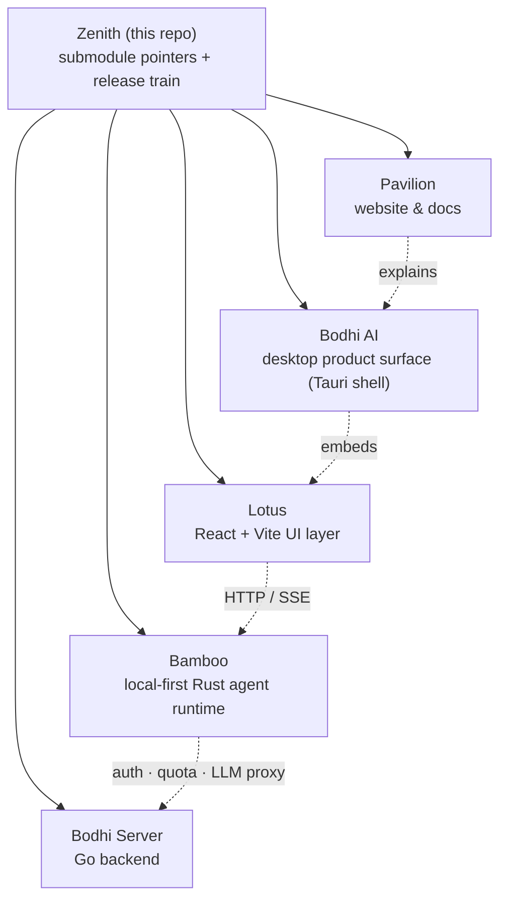

# Zenith

> **一句话：把一个能真正帮你把事情做完的 AI 桌面产品，连同它背后的整套系统，组织在同一个仓库里。**
> **In one line: the single entry point that ties a "get-things-done" AI desktop product together with the entire system behind it.**

**中文** —— Bodhi AI 想把 AI 从一个只会聊天的窗口，变成一个真正能推进工作的桌面工作台：你交代任务，它使用工具、留下记忆、把结果做出来，整个过程你都看得见。Zenith 就是这套系统的总入口——它把桌面产品、界面、执行引擎、服务端和官网文档组织在一起，并统一它们的发布节奏。

**English** —— Bodhi AI turns AI from a chat box into a desktop workbench that actually does the work: you hand it a task, it uses tools, keeps memory, and produces results — and you can watch the whole thing happen, not just read a final answer. Zenith is the home base that holds the desktop product, the UI, the execution engine, the backend, and the docs together — and keeps their releases in sync.

**第一次来？先打开 [Bodhi AI](https://github.com/bigduu/Bodhi-AI)。** First time here? Start with **[Bodhi AI](https://github.com/bigduu/Bodhi-AI)**.

[Bodhi AI](https://github.com/bigduu/Bodhi-AI) · [Lotus](https://github.com/bigduu/Lotus) · [Bamboo](https://github.com/bigduu/Bamboo-agent) · [Bodhi Server](https://github.com/bigduu/bodhi-server) · [Pavilion](https://github.com/bigduu/Pavilion) · [Architecture Overview](https://github.com/bigduu/Pavilion/blob/main/articles/zenith-architecture-overview.md)

---

## Key capabilities at a glance · 核心能力速览

| 能力 / Capability | 说明 / What it means |
|---|---|
| **整套系统的地图 / A map of the whole system** | 一个仓库就能看清产品、UI、runtime、backend、文档如何分工与协作 / One repo shows how product, UI, runtime, backend, and docs divide the work and fit together |
| **5 个 submodule 一键拉取 / Five submodules, one clone** | `--recursive` 一次拉全栈，不用手动跑五个仓库 / Pull the full stack in a single recursive clone |
| **协调发布列车 / Coordinated release train** | Bamboo → Lotus → Bodhi 顺序发布，版本号从一份配置统一驱动 / Bamboo → Lotus → Bodhi published in order, all driven by one config file |
| **每日 Nightly 自动版本 / Daily nightly versioning** | 按 `YYYY.M.N` 日历版本自动递增并触发发布 / Calendar-versioned (`YYYY.M.N`) auto-bump and nightly release |
| **指针守护 / Submodule guard** | CI 在每次 push / PR 校验 submodule 指针的健康 / CI validates submodule pointers on every push and PR |
| **明确的“从哪开始” / Clear "start here" routing** | 无论你想看产品、写前端还是改 runtime，都有明确入口 / Whether you want the product, the frontend, or the runtime, there is a clear door in |

---

## Architecture · 架构地图

**中文** —— Zenith 本身几乎不放业务代码，它是一个"薄壳"monorepo：维护 5 个 Git submodule 的指针、根级说明文档，以及跨仓库的发布编排。真正的功能都活在子模块里。

**English** —— Zenith holds almost no business logic itself. It is a thin-shell monorepo: it pins five Git submodules, owns the root-level documentation, and orchestrates releases across repos. The real features live inside the submodules.


```mermaid
graph TD
  Z["Zenith (this repo)<br/>submodule pointers + release train"]

  Z --> B["Bodhi AI<br/>desktop product surface (Tauri shell)"]
  Z --> L["Lotus<br/>React + Vite UI layer"]
  Z --> R["Bamboo<br/>local-first Rust agent runtime"]
  Z --> S["Bodhi Server<br/>Go backend"]
  Z --> P["Pavilion<br/>website & docs"]

  B -. embeds .-> L
  L -. HTTP / SSE .-> R
  R -. auth · quota · LLM proxy .-> S
  P -. explains .-> B
```

> **重要 / Note** —— Bodhi 桌面壳负责承载界面与原生集成；Lotus 是真正的界面层；Lotus 通过 **HTTP / SSE** 与 Bamboo runtime 通信（不是 Tauri IPC）。Bamboo 把需要账号、配额、计费与 LLM 代理的能力交给 Go 后端 Bodhi Server。/ The Bodhi shell hosts the UI and native integration; Lotus is the actual UI; Lotus talks to the Bamboo runtime over **HTTP / SSE** (not Tauri IPC); Bamboo defers account, quota, billing, and LLM-proxy concerns to the Go backend, Bodhi Server.

### What each module does · 各模块职责

| Module | 路径 | 角色 / Role | Start here |
|---|---|---|---|
| **Bodhi AI** | `bodhi/` | 对外产品门面：Tauri 桌面壳，承载 UI、原生集成与打包发布 / Product surface: Tauri desktop shell hosting the UI, native integration, packaging | [Bodhi AI](https://github.com/bigduu/Bodhi-AI) |
| **Lotus** | `lotus/` | UI 交互层：React + Vite 前端，实时事件流、界面状态与设置 / UI layer: React + Vite frontend, live event stream, view state, settings | [Lotus](https://github.com/bigduu/Lotus) |
| **Bamboo** | `bamboo/` | 执行引擎：本地优先的 Rust agent runtime，任务、工具、记忆与 HTTP/SSE API / Execution engine: local-first Rust agent runtime — tasks, tools, memory, HTTP/SSE API | [Bamboo Agent](https://github.com/bigduu/Bamboo-agent) |
| **Bodhi Server** | `bodhi-server/` | 服务端能力：Go 后端，认证、持久化、配额/计费与 LLM 代理 / Backend: Go server — auth, persistence, quota/billing, LLM proxy | [Bodhi Server](https://github.com/bigduu/bodhi-server) |
| **Pavilion** | `pavilion/` | 官网与文档：下载入口、文档中心与对外叙事 / Website & docs: download page, doc center, public narrative | [Pavilion](https://github.com/bigduu/Pavilion) |
| **Zenith (root)** | `.` | 协调仓库：submodule 指针、根级文档、release train / Coordinator: submodule pointers, root docs, release train | You are here |

---

## Signature deep-dives · 旗舰能力详解

### 1. Start here routing · "从哪里开始"路由

**中文** —— Zenith 最大的价值，是让任何一个人都能快速找到正确的入口。

**English** —— Zenith's biggest job is getting any person to the right door fast.

**如果你只想了解产品 / If you just want to understand the product**
- 看产品本身 → [Bodhi AI](https://github.com/bigduu/Bodhi-AI)
- 看整体设计为什么这样组织 → [Zenith Architecture Overview](https://github.com/bigduu/Pavilion/blob/main/articles/zenith-architecture-overview.md)
- 看官网 / 下载 / 文档叙事 → [Pavilion](https://github.com/bigduu/Pavilion)

**如果你想参与开发 / If you want to build**
- 桌面产品 / Tauri 壳 → `bodhi/`
- 前端交互 / React UI → `lotus/`
- Agent runtime / Rust 后端 → `bamboo/`
- 服务端 / Go backend → `bodhi-server/`
- 官网 / 文档 / 对外内容 → `pavilion/`

### 2. The stack, organized on purpose · 这套栈为什么这样分

**中文** —— 拆成五块不是为了好看，而是为了让每一层都能独立演进，又能在发布时收敛成一个产品：

**English** —— The five-way split exists so each layer can evolve on its own yet converge into one product at release time:

- **界面与体验** 放在 Lotus（React/Vite），可以独立迭代、独立测试。/ **UI & experience** live in Lotus (React/Vite) and iterate and test independently.
- **执行逻辑** 放在 Bamboo（Rust），本地优先、可单独跑成 HTTP 服务。/ **Execution** lives in Bamboo (Rust), local-first, runnable as a standalone HTTP service.
- **账号、配额、计费、LLM 代理** 放在 Bodhi Server（Go），把需要服务端信任的能力集中起来。`bodhi-server/internal/` 下能看到 `auth`、`quota`、`pricing`、`proxy`、`database` 等真实模块。/ **Account, quota, billing, LLM proxy** live in Bodhi Server (Go) — the server-trusted concerns, visible as real modules under `bodhi-server/internal/` (`auth`, `quota`, `pricing`, `proxy`, `database`).
- **桌面壳** 放在 Bodhi，只负责"把界面装进一个可安装的桌面 App"。/ **The desktop shell** lives in Bodhi and only wraps the UI into an installable desktop app.
- **对外叙事** 放在 Pavilion，与代码解耦。/ **Public narrative** lives in Pavilion, decoupled from code.

### 3. Coordinated release train · 协调发布列车

**中文** —— 多个仓库要同时升级版本、按依赖顺序发布，很容易出错。Zenith 用一份配置 + 一条 workflow 把它变成一次点击。

**English** —— Shipping several repos at once, in dependency order, is error-prone. Zenith reduces it to one config plus one workflow.

发布顺序固定为 / The order is fixed:

1. **Bamboo** → 发布 crate（`bigduu/Bamboo-agent` 的 `publish-crate.yml`）/ publish crate
2. **Lotus** → 发布 npm 包 `@bigduu/lotus`（`bigduu/Lotus` 的 `publish-npm.yml`）/ publish npm package
3. **Bodhi** → 构建并发布桌面产物（`bigduu/Bodhi-AI` 的 `deploy.yml`）/ build & ship desktop assets

每一步之间，release train 会**等待制品在 crates.io / npm 上真正可见**后再进入下一步（见 `release-train.yml` 中的 `wait_for_crates_version` / `wait_for_npm_version`）。所有版本与 ref 默认从 `.github/release-train.config.json` 读取（`from_manifest`），也可在手动触发时覆盖。

Between steps, the train **waits until the artifact is actually visible on crates.io / npm** before continuing (see `wait_for_crates_version` / `wait_for_npm_version` in `release-train.yml`). All versions and refs default to `.github/release-train.config.json` (`from_manifest`), and can be overridden when dispatched manually.

当前配置 / Current config (`.github/release-train.config.json`):

```json
{
  "refs":     { "bamboo": "main", "lotus": "main", "bodhi": "main" },
  "versions": { "release": "2026.6.2", "bamboo": "2026.6.2", "lotus": "2026.6.2", "bodhi": "2026.6.2" },
  "options":  { "lotus_skip_tests": false }
}
```

相关 workflow / Related workflows (under `.github/workflows/`):

| Workflow | 作用 / Purpose |
|---|---|
| `release-train.yml` | 手动触发的协调发布：Bamboo → Lotus → Bodhi / Manual coordinated release |
| `nightly-release.yml` | 每天 UTC 04:00（北京时间 12:00）按 `YYYY.M.N` 自动递增版本并触发 / Daily nightly auto-bump (`YYYY.M.N`) at 04:00 UTC |
| `submodule-guard.yml` | 每次 push / PR 校验 submodule 指针 / Validates submodule pointers on push & PR |

> **默认策略 / Default policy** —— 正常发布走 Zenith 的 release train；子仓库的独立发布流程仅用于恢复或特殊情况。/ Normal releases go through Zenith's release train; per-repo standalone flows are for recovery or special cases only.

---

## Quick start / Development · 快速开始与开发

### Clone the full stack · 拉取全栈

```bash
git clone --recursive https://github.com/bigduu/Zenith.git
cd Zenith
```

已经 clone 但没带 submodule / Already cloned without submodules:

```bash
git submodule update --init --recursive
```

### Run the desktop app · 运行桌面产品

```bash
cd bodhi
npm install
npm run tauri:dev
```

> Bodhi 的 `web:dev` / `tauri:dev` 会驱动 `../lotus` 的 Vite 前端；脚本定义见 `bodhi/package.json`。/ Bodhi's `web:dev` / `tauri:dev` drive the Vite frontend in `../lotus`; see `bodhi/package.json`.

### Run the UI on its own · 单独跑前端

```bash
cd lotus
npm install
npm run dev
```

### Run the agent runtime · 运行执行引擎

```bash
cd bamboo
cargo run -- serve --port 9562
```

> `bamboo serve` 接受 `--port` / `--bind` / `--data-dir` / `--workers` 等可选参数覆盖配置文件；定义见 `bamboo/src/bin/bamboo.rs`。不传 `--port` 时使用配置文件中的端口。/ `bamboo serve` accepts optional `--port` / `--bind` / `--data-dir` / `--workers` overrides; defined in `bamboo/src/bin/bamboo.rs`. Without `--port` it uses the configured port.

### Manage submodule pointers · 维护 submodule 指针

```bash
# 查看当前指针 / show pinned revisions
git submodule status

# 拉取各子模块最新提交 / pull latest upstream commits
git submodule update --remote --recursive

# 子模块改动后，回到根仓库提交指针 / after submodule work, bump pointers from root
git add .gitmodules bamboo bodhi lotus pavilion bodhi-server
git commit -m "chore: bump submodule pointers"
git push
```

> 推荐流程 / Workflow: 先在子模块里开发、提交、push，再回 Zenith 更新并提交对应的 submodule 指针。完整发布步骤见 [`AGENTS.md`](./AGENTS.md) 的 Release Playbook。/ Develop, commit, and push inside the submodule first, then bump and commit the pointer in Zenith. Full release steps live in [`AGENTS.md`](./AGENTS.md).

---

## The rest of the stack · 其余模块与文档

| 模块 / Module | Repository |
|---|---|
| Bodhi AI — 桌面产品门面 / desktop product surface | https://github.com/bigduu/Bodhi-AI |
| Lotus — React UI 层 / React UI layer | https://github.com/bigduu/Lotus |
| Bamboo — Rust agent runtime | https://github.com/bigduu/Bamboo-agent |
| Bodhi Server — Go backend | https://github.com/bigduu/bodhi-server |
| Pavilion — 官网与文档 / website & docs | https://github.com/bigduu/Pavilion |

**关键文档 / Key docs**
- [Zenith Architecture Overview](https://github.com/bigduu/Pavilion/blob/main/articles/zenith-architecture-overview.md) — 整套系统为什么这样组织 / why the system is organized this way
- [`AGENTS.md`](./AGENTS.md) — 贡献规范、多 agent 协作与完整 Release Playbook / contribution rules, multi-agent collaboration, full release playbook

---

读完只准备点开一个链接？先看 **[Bodhi AI](https://github.com/bigduu/Bodhi-AI)**。
想理解这套系统为什么长成这样？再看 **[Zenith Architecture Overview](https://github.com/bigduu/Pavilion/blob/main/articles/zenith-architecture-overview.md)**。

Only clicking one link? Open **[Bodhi AI](https://github.com/bigduu/Bodhi-AI)**. Want the why? Read the **[Zenith Architecture Overview](https://github.com/bigduu/Pavilion/blob/main/articles/zenith-architecture-overview.md)**.
