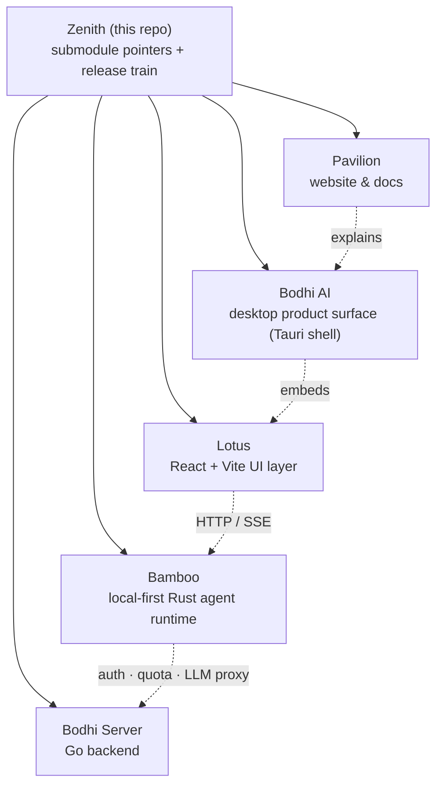

<div align="center">

# Zenith

### Bodhi AI — the local-first desktop agent that does the work, not just chats.

**It uses tools, keeps memory, and shows you every step — not just a final answer.**
Zenith is its home base: the desktop product, UI, Rust runtime, Go backend, and docs
in one recursive clone, released in lockstep.

[](https://github.com/bigduu/Zenith/actions/workflows/submodule-guard.yml)
[](https://github.com/bigduu/Zenith/actions/workflows/release-train.yml)
[](https://github.com/bigduu/Zenith/actions/workflows/nightly-release.yml)
[](./README.zh-CN.md)

**[▶ Start with Bodhi AI](https://github.com/bigduu/Bodhi-AI)** · [Lotus](https://github.com/bigduu/Lotus) · [Bamboo](https://github.com/bigduu/Bamboo-agent) · [Bodhi Server](https://github.com/bigduu/bodhi-server) · [Pavilion](https://github.com/bigduu/Pavilion) · [Architecture Overview](https://github.com/bigduu/Pavilion/blob/main/articles/zenith-architecture-overview.md)

</div>

<!-- TODO(readme): a product demo GIF/screenshot of Bodhi AI right here is the single biggest
     click/star driver (cf. aider's screencast). Borrow one from Pavilion/Bodhi when ready:
     <p align="center"></p> -->

> Bodhi AI turns AI from a chat box into a desktop workbench that actually does the work: you hand it a task, it uses tools, keeps memory, and produces results — and you can watch the whole thing happen. **Zenith** ties the product, the UI, the execution engine, the backend, and the docs together — and keeps their releases in sync.

---

## Key capabilities at a glance

| Capability | What it means |
|---|---|
| **A map of the whole system** | One repo shows how product, UI, runtime, backend, and docs divide the work and fit together |
| **Five submodules, one clone** | Pull the full stack in a single recursive clone |
| **Coordinated release train** | Lotus → Bamboo → Bodhi published in dependency order, all driven by one config file |
| **Daily nightly versioning** | Calendar-versioned (`YYYY.M.N`) auto-bump and nightly release |
| **Submodule guard** | CI validates submodule pointers on every push and PR |
| **Clear "start here" routing** | Whether you want the product, the frontend, or the runtime, there is a clear door in |

---

## Architecture

Zenith holds almost no business logic itself. It is a thin-shell monorepo: it pins five Git submodules, owns the root-level documentation, and orchestrates releases across repos. The real features live inside the submodules.


```mermaid
graph TD
  Z["Zenith (this repo)<br/>submodule pointers + release train"]

  Z --> B["Bodhi AI<br/>desktop product surface (Tauri shell)"]
  Z --> L["Lotus<br/>React + Vite UI layer"]
  Z --> R["Bamboo<br/>local-first Rust agent runtime"]
  Z --> S["Bodhi Server<br/>Go backend"]
  Z --> P["Pavilion<br/>website & docs"]

  B -. embeds .-> L
  L -. HTTP / SSE .-> R
  R -. auth · quota · LLM proxy .-> S
  P -. explains .-> B
```

> **Note** —— The Bodhi shell hosts the UI and native integration; Lotus is the actual UI; Lotus talks to the Bamboo runtime over **HTTP / SSE** (not Tauri IPC); Bamboo defers account, quota, billing, and LLM-proxy concerns to the Go backend, Bodhi Server.

### What each module does

| Module | Path | Role | Start here |
|---|---|---|---|
| **Bodhi AI** | `bodhi/` | Product surface: Tauri desktop shell hosting the UI, native integration, packaging | [Bodhi AI](https://github.com/bigduu/Bodhi-AI) |
| **Lotus** | `lotus/` | UI layer: React + Vite frontend, live event stream, view state, settings | [Lotus](https://github.com/bigduu/Lotus) |
| **Bamboo** | `bamboo/` | Execution engine: local-first Rust agent runtime — tasks, tools, memory, HTTP/SSE API | [Bamboo Agent](https://github.com/bigduu/Bamboo-agent) |
| **Bodhi Server** | `bodhi-server/` | Backend: Go server — auth, persistence, quota/billing, LLM proxy | [Bodhi Server](https://github.com/bigduu/bodhi-server) |
| **Pavilion** | `pavilion/` | Website & docs: download page, doc center, public narrative | [Pavilion](https://github.com/bigduu/Pavilion) |
| **Zenith (root)** | `.` | Coordinator: submodule pointers, root docs, release train | You are here |

---

## Signature deep-dives

### Start here routing

Zenith's biggest job is getting any person to the right door fast.

**If you just want to understand the product**
- See the product itself → [Bodhi AI](https://github.com/bigduu/Bodhi-AI)
- See why the overall design is organized this way → [Zenith Architecture Overview](https://github.com/bigduu/Pavilion/blob/main/articles/zenith-architecture-overview.md)
- See the website / download / docs narrative → [Pavilion](https://github.com/bigduu/Pavilion)

**If you want to build**
- Desktop product / Tauri shell → `bodhi/`
- Frontend interaction / React UI → `lotus/`
- Agent runtime / Rust backend → `bamboo/`
- Backend / Go backend → `bodhi-server/`
- Website / docs / public content → `pavilion/`

### The stack, organized on purpose

The five-way split exists so each layer can evolve on its own yet converge into one product at release time:

- **UI & experience** live in Lotus (React/Vite) and iterate and test independently.
- **Execution** lives in Bamboo (Rust), local-first, runnable as a standalone HTTP service.
- **Account, quota, billing, LLM proxy** live in Bodhi Server (Go) — the server-trusted concerns, visible as real modules under `bodhi-server/internal/` (`auth`, `quota`, `pricing`, `proxy`, `database`).
- **The desktop shell** lives in Bodhi and only wraps the UI into an installable desktop app.
- **Public narrative** lives in Pavilion, decoupled from code.

### Coordinated release train

Shipping several repos at once, in dependency order, is error-prone. Zenith reduces it to one config plus one workflow.

The order is fixed by the dependency graph:

1. **Lotus** → publish npm package `@bigduu/lotus` (`publish-npm.yml` in `bigduu/Lotus`)
2. **Bamboo** → publish crates, embedding that exact Lotus as the web frontend (`publish-crate.yml` in `bigduu/Bamboo-agent`)
3. **Bodhi** → build & ship desktop assets consuming both (`release.yml` in `bigduu/Bodhi-AI`)

Between steps, the train **waits until the artifact is actually visible on crates.io / npm** before continuing (see `wait_for_crates_version` / `wait_for_npm_version` in `release-train.yml`). All versions and refs default to `.github/release-train.config.json` (`from_manifest`), and can be overridden when dispatched manually.

The train also supports **partial releases**: dispatch with `targets` (e.g. `bamboo,bodhi`) to release a subset — excluded repos are pinned to the last published versions recorded in the config, and a pre-flight check refuses to reuse an already-published version (pass `resume=true` to resume a partially completed train instead). After a successful run, the train writes the published versions back to the config, and the nightly bump additionally scans the registries for the month's highest published number — so the counter never collides with an ad-hoc release.

Current config (`.github/release-train.config.json`):

```json
{
  "refs":     { "bamboo": "main", "lotus": "main", "bodhi": "main" },
  "versions": { "release": "2026.6.2", "bamboo": "2026.6.2", "lotus": "2026.6.2", "bodhi": "2026.6.2" },
  "options":  { "lotus_skip_tests": false }
}
```

Related workflows (under `.github/workflows/`):

| Workflow | Purpose |
|---|---|
| `release-train.yml` | Coordinated release (full or partial via `targets`): Lotus → Bamboo → Bodhi |
| `nightly-release.yml` | Daily nightly auto-bump (`YYYY.M.N`) at 04:00 UTC |
| `submodule-guard.yml` | Validates submodule pointers on push & PR |

> **Default policy** —— Normal releases go through Zenith's release train; per-repo standalone flows are for recovery or special cases only.

---

## Quick start / Development

### Clone the full stack

```bash
git clone --recursive https://github.com/bigduu/Zenith.git
cd Zenith
```

Already cloned without submodules:

```bash
git submodule update --init --recursive
```

### Run the desktop app

```bash
cd bodhi
npm install
npm run tauri:dev
```

> Bodhi's `web:dev` / `tauri:dev` drive the Vite frontend in `../lotus`; see `bodhi/package.json`.

### Run the UI on its own

```bash
cd lotus
npm install
npm run dev
```

### Run the agent runtime

```bash
cd bamboo
cargo run -- serve --port 9562
```

> `bamboo serve` accepts optional `--port` / `--bind` / `--data-dir` / `--static-dir` / `--workers` overrides; defined in `bamboo/src/bin/bamboo.rs`. Without `--port` it uses the configured port. (Run `bamboo --help` for the other subcommands: `config`, `-p` headless, `actor`, `broker`, `broker-agent`.)

### Manage submodule pointers

```bash
# show pinned revisions
git submodule status

# pull latest upstream commits
git submodule update --remote --recursive

# after submodule work, bump pointers from root
git add .gitmodules bamboo bodhi lotus pavilion bodhi-server
git commit -m "chore: bump submodule pointers"
git push
```

> Workflow: Develop, commit, and push inside the submodule first, then bump and commit the pointer in Zenith. Full release steps live in [`AGENTS.md`](./AGENTS.md).

---

## The rest of the stack

| Module | Repository |
|---|---|
| Bodhi AI — desktop product surface | https://github.com/bigduu/Bodhi-AI |
| Lotus — React UI layer | https://github.com/bigduu/Lotus |
| Bamboo — Rust agent runtime | https://github.com/bigduu/Bamboo-agent |
| Bodhi Server — Go backend | https://github.com/bigduu/bodhi-server |
| Pavilion — website & docs | https://github.com/bigduu/Pavilion |

**Key docs**
- [Zenith Architecture Overview](https://github.com/bigduu/Pavilion/blob/main/articles/zenith-architecture-overview.md) — why the system is organized this way
- [`AGENTS.md`](./AGENTS.md) — contribution rules, multi-agent collaboration, full release playbook

---

Only clicking one link? Open **[Bodhi AI](https://github.com/bigduu/Bodhi-AI)**. Want the why? Read the **[Zenith Architecture Overview](https://github.com/bigduu/Pavilion/blob/main/articles/zenith-architecture-overview.md)**.
