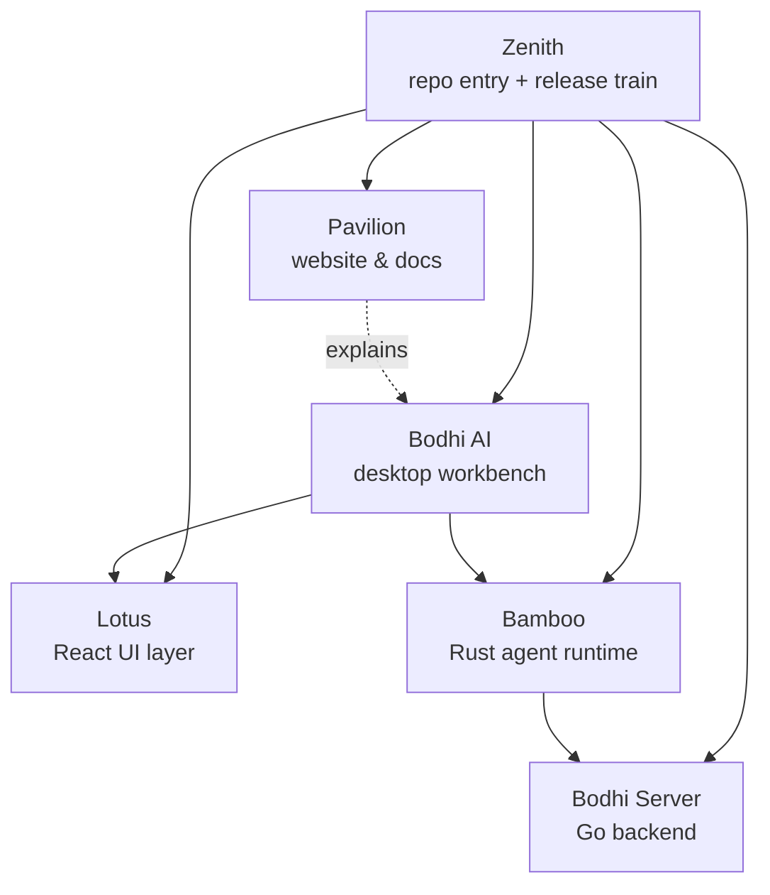

# Zenith

**Bodhi AI 是 Zenith 对外的产品门面：一个让 AI 真正推进工作的桌面工作台。**  
**Zenith 是这整套系统的总入口** —— 它把桌面产品、UI 层、Rust runtime、Go backend、官网文档和 release train 组织在一起。

[Start with Bodhi AI](https://github.com/bigduu/Bodhi-AI) · [Bamboo](https://github.com/bigduu/Bamboo-agent) · [Lotus](https://github.com/bigduu/Lotus) · [Bodhi Server](https://github.com/bigduu/bodhi-server) · [Pavilion](https://github.com/bigduu/Pavilion) · [Architecture Overview](https://github.com/bigduu/Pavilion/blob/main/articles/zenith-architecture-overview.md)

**第一次来到这里？先看 [Bodhi AI](https://github.com/bigduu/Bodhi-AI)。**

> **一句话理解这个仓库：**  
> 如果 Bodhi 是用户真正会打开使用的产品，那么 Zenith 就是把 **产品体验、执行引擎、服务端能力、文档叙事与发布流程** 串成一套完整系统的仓库入口。

## Why this repo is worth reading

- **Bodhi 是门面，不是 demo**：它想把 AI 从聊天窗口变成真正能推进工作的桌面系统
- **过程可见**：任务、工具、事件、状态变化都能被看见，而不是黑盒
- **边界清晰**：UI、runtime、server、docs 各自独立，但可以协同演进
- **能力会沉淀**：一次成功执行可以变成 workflow，再继续变成 schedule
- **Zenith 提供的是整套地图**：不只是告诉你代码在哪，还告诉你这套系统为什么这样组织

## The stack at a glance


```mermaid
graph TD
  Z[Zenith<br/>repo entry + release train]

  Z --> B[Bodhi AI<br/>desktop workbench]
  Z --> L[Lotus<br/>React UI layer]
  Z --> R[Bamboo<br/>Rust agent runtime]
  Z --> S[Bodhi Server<br/>Go backend]
  Z --> P[Pavilion<br/>website & docs]

  B --> L
  B --> R
  R --> S
  P -. explains .-> B
```

### What each module does

| Module | Role in the system | Start here |
|---|---|---|
| `bodhi/` | **对外产品门面**。桌面 AI 工作台，负责桌面壳、原生集成、打包发布与用户体验 | [Bodhi AI](https://github.com/bigduu/Bodhi-AI) |
| `lotus/` | **UI 交互层**。React + Vite 前端，负责实时事件流、界面状态、设置中心与 Web 交互 | [Lotus](https://github.com/bigduu/Lotus) |
| `bamboo/` | **执行引擎**。Rust Agent runtime，负责任务、工具、记忆、workflow、schedule 与 HTTP/SSE API | [Bamboo Agent](https://github.com/bigduu/Bamboo-agent) |
| `bodhi-server/` | **服务端能力**。Go backend，负责认证、持久化与服务端 API | [Bodhi Server](https://github.com/bigduu/bodhi-server) |
| `pavilion/` | **官网与文档面**。负责下载入口、文档中心、对外叙事与架构说明 | [Pavilion](https://github.com/bigduu/Pavilion) |
| Root `Zenith` | **协调仓库**。维护 submodule 指针、根级说明、跨仓库 release train | You are here |

## 从哪里开始

### 如果你是第一次了解这个项目

- 想先看产品是什么：从 **[Bodhi AI](https://github.com/bigduu/Bodhi-AI)** 开始
- 想先理解底层 runtime：从 **[Bamboo Agent](https://github.com/bigduu/Bamboo-agent)** 开始
- 想先看整套系统架构：看 **[Zenith Architecture Overview](https://github.com/bigduu/Pavilion/blob/main/articles/zenith-architecture-overview.md)**
- 想看官网/文档/对外叙事：看 **[Pavilion](https://github.com/bigduu/Pavilion)**

### 如果你想参与开发

- **桌面产品 / Tauri 壳**：进入 `bodhi/`
- **前端交互 / React UI**：进入 `lotus/`
- **Agent runtime / Rust 后端**：进入 `bamboo/`
- **服务端 / Go backend**：进入 `bodhi-server/`
- **官网 / 文档 / 对外内容**：进入 `pavilion/`

## Clone the full stack

```bash
git clone --recursive https://github.com/bigduu/Zenith.git
cd Zenith
```

如果你已经 clone 过但没有带 submodule：

```bash
git submodule update --init --recursive
```

## Local development entry points

```bash
cd bodhi
npm install
npm run tauri:dev
```

```bash
cd bamboo
cargo run -- serve --port 9562
```

```bash
cd lotus
npm install
npm run dev
```

## How work normally happens here

Zenith 根仓库主要负责三件事：

- **维护 submodule 指针**
- **提供整套系统的入口说明**
- **编排跨仓库 release train**

真正的功能开发通常发生在子模块里。推荐流程：

1. 在对应子模块里开发、提交、推送
2. 回到 Zenith 根仓库更新 submodule pointer
3. 提交 Zenith 根仓库中的指针变更

查看当前 submodule 指针：

```bash
git submodule status
```

拉取各子模块最新提交：

```bash
git submodule update --remote --recursive
```

在子模块完成工作后，回到 Zenith 提交指针更新：

```bash
git add .gitmodules bamboo bodhi lotus pavilion bodhi-server
git commit -m "chore: bump submodule pointers"
git push
```

## Coordinated Release Train

Zenith 根仓库负责统一发布节奏：

1. `bamboo` → publish crate
2. `lotus` → publish npm package
3. `bodhi` → build and publish desktop binaries
4. 根仓库同步更新 release 配置与 submodule 指针

相关文件：

- `.github/workflows/release-train.yml`
- `.github/release-train.config.json`

> **默认策略：** 正常发布优先走 Zenith 的 Release Train；子仓库独立发布流程只用于恢复或特殊情况。

---

如果你读完这份 README 只准备点开一个链接，建议先看 **[Bodhi AI](https://github.com/bigduu/Bodhi-AI)**。  
如果你想理解为什么这套系统会长成这样，再继续看 **[Zenith Architecture Overview](https://github.com/bigduu/Pavilion/blob/main/articles/zenith-architecture-overview.md)**。
