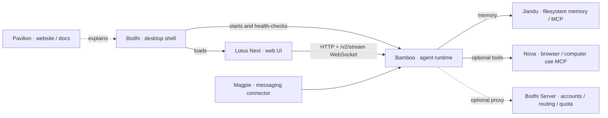

# Zenith

**A local AI agent harness toolkit: run agents with tools, project context and memory, in your browser or on your desktop.**

[简体中文](./README.zh-CN.md) · [Desktop downloads](https://github.com/bigduu/Bodhi-AI/releases) · [Bamboo runtime](https://github.com/bigduu/Bamboo-agent/blob/dev/README.md) · [Source and release audit](./docs/readme-refresh/README.md)

Bamboo is the core runtime. Lotus Next is its web interface; Bodhi wraps that experience in a desktop application and manages the Bamboo process. Nova adds computer and browser tools, Jiandu provides shared memory, and Magpie connects supported messaging platforms. Choose the pieces you need; the hosted account service is optional.

Local-first means you can run the harness and keep its state on your machine. Requests to a configured remote model, MCP server or messaging service still leave that machine. A model provider must be configured for agent responses.

## Choose your starting point

| You want to… | Start here |
|---|---|
| Try the desktop app | [Bodhi downloads and platform requirements](https://github.com/bigduu/Bodhi-AI/blob/main/README.md) |
| Run an agent service and open it in a browser | [Bamboo installation and quick start](https://github.com/bigduu/Bamboo-agent/blob/dev/README.md) |
| Work on the web experience | [Lotus Next development setup](https://github.com/bigduu/lotus-next/blob/main/README.md) |
| Let an agent use browser or desktop tools | [Nova: installation and platform boundaries](https://github.com/bigduu/Nova/blob/master/README.md) |
| Recall facts across sessions without an embedding service | [Jiandu: memory MCP](https://github.com/bigduu/Jiandu/blob/main/README.md) |
| Reach Bamboo through messaging platforms | [Magpie: connectors and configuration](https://github.com/bigduu/Magpie/blob/main/README.md) |
| Operate account, routing and quota services | [Bodhi Server](https://github.com/bigduu/bodhi-server/blob/main/README.md) |
| Contribute to the public website and guides | [Pavilion](https://github.com/bigduu/Pavilion/blob/main/README.md) |

## Watch the source in use


[Static image](docs/readme-refresh/demos/project-workspace.png) · [Memory and browser-tool recordings](docs/readme-refresh/README.md#recordings)

Real browser recording against the pinned Bamboo source, using disposable demo
data. It prepares project context without calling a model. All three recordings
show source capabilities; they are not claims about the latest desktop installer.

## Source checkout is not a released product version

Module links open the upstream documentation; recursive clones retain the source pins recorded here. This repository pins eight source repositories. Those pins, upstream development branches and published binaries/packages can differ. The READMEs describe the checked-out source and call out release boundaries; consult each module's release instructions before installing.

In the 2026-10-03 audit, Bamboo's published crate was `2026.9.20`, Bodhi's latest public desktop release was `app-v2026.9.20`, and the accepted Lotus Next package was `2026.9.22`. Nova's release was `v0.2.1` and Jiandu's `v0.2.0`; their checked-out source contains additional work. A release-train configuration value is not evidence that its release finished. See the [audit and demonstrations](./docs/readme-refresh/README.md) for exact revisions and limitations.

## Try the source locally

For a packaged installation, use the module links above. To develop the pinned source:

```bash
git clone --recursive https://github.com/bigduu/Zenith.git
cd Zenith
# If you cloned without --recursive:
git submodule update --init --recursive
```

Start Bamboo in one terminal (Rust 1.95+, Cargo and Node.js required):

```bash
cd bamboo
node scripts/frontend-package.cjs stage
cargo run --locked --bin bamboo -- init
cargo run --locked --bin bamboo -- serve --bind 127.0.0.1 --port 9562
```

Start Lotus Next in another (Node.js >= 22.12 required):

```bash
cd lotus-next
npm ci
npm run dev -- --host 127.0.0.1
```

Open `http://127.0.0.1:9563`. Vite proxies API and stream requests to Bamboo on port 9562. The interface needs that backend; configure a supported model provider in the app before asking an agent to work. See [Bamboo's configuration and access boundaries](https://github.com/bigduu/Bamboo-agent/blob/dev/README.md).

For the desktop development workflow, install the [Bodhi prerequisites](https://github.com/bigduu/Bodhi-AI/blob/main/README.md), install Lotus Next dependencies as above, then:

```bash
cd bodhi
npm ci
npm run tauri:dev
```

This command builds the local Bamboo sidecar and starts frontend HMR. It needs a supported graphical desktop and native build dependencies. Headless Linux browser verification is not verification of the macOS or Windows desktop app.

## How the pieces fit


```mermaid
graph LR
  Bodhi["Bodhi · desktop shell"] -->|starts and health-checks| Bamboo["Bamboo · agent runtime"]
  Lotus["Lotus Next · web UI"] -->|HTTP + /v2/stream WebSocket| Bamboo
  Bodhi -->|loads| Lotus
  Bamboo -->|memory| Jiandu["Jiandu · filesystem memory / MCP"]
  Bamboo -->|optional tools| Nova["Nova · browser / computer use MCP"]
  Magpie["Magpie · messaging connector"] --> Bamboo
  Bamboo -. optional proxy .-> Server["Bodhi Server · accounts / routing / quota"]
  Pavilion["Pavilion · website / docs"] -. explains .-> Bodhi
```

Packaged Bamboo and Bodhi builds consume a verified, locked Lotus Next artifact. The checkout of `lotus-next/` can be newer than that artifact. Legacy `@bigduu/lotus` remains a fixed registry rollback option, not a ninth submodule.

Nova's native capabilities depend on the operating system and granted permissions. Its source browser launcher and native desktop API are separate paths. Jiandu owns memory persistence and lexical recall; the host decides what to remember and when to generate Dream snapshots. Magpie needs separate platform credentials for live messaging.

## Contributing and release coordination

Zenith owns documentation, eight gitlinks and the release train; feature code lives in the modules. Use isolated branches and follow [AGENTS.md](./AGENTS.md). `git submodule status` shows the checked-out revisions; initialization preserves the recorded pins. Updating them is a separate reviewed change, not a prerequisite for trying this checkout.

The [release configuration](./.github/release-train.config.json) selects exact Bamboo/Bodhi revisions and the frontend artifact identity. The [release train](./.github/workflows/release-train.yml) verifies those inputs before publishing Bamboo and then Bodhi. Lotus Next publication is a separate producer step. Configuration and workflow presence do not guarantee a successful build or release; consult run results and published artifacts.

- [Release playbook](./AGENTS.md#release-playbook)
- [Bamboo architecture](https://github.com/bigduu/Bamboo-agent/blob/dev/docs/design/architecture-overview.md)
- [Pavilion architecture overview](https://github.com/bigduu/Pavilion/blob/main/articles/zenith-architecture-overview.md)
- [Documentation audit, recordings and known limitations](./docs/readme-refresh/README.md)
