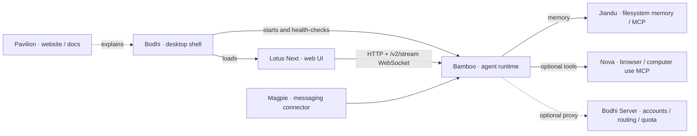

# Bodhi — your local-first AI agent workbench

[English](./README.md) · [简体中文](./README.zh-CN.md)

**Hand it a task. Watch every tool call. Keep the memory.** Bodhi is a desktop
agent built on a Rust runtime: it works on your projects with tools, asks before
risky actions and shows each step as it happens. This repository (codename
Zenith) is the index for the desktop app, the agent runtime and its MCP tools.

[Download](https://github.com/bigduu/Bodhi-AI/releases/latest) · [Bamboo runtime docs](https://github.com/bigduu/Bamboo-agent/blob/dev/README.md) · [MIT](./LICENSE)

- **Does the work, not just chat:** the Bamboo runtime has file, shell and web
  tools, skills, MCP servers, sub-agents, cron schedules and workflows.
- **Your choice of model:** Anthropic, OpenAI (and OpenAI-compatible endpoints),
  Gemini or GitHub Copilot.
- **Memory your other agents can share:** [Jiandu](https://github.com/bigduu/Jiandu)
  is a local MCP memory server (BM25 + CJK, no embeddings) that Claude Code,
  Codex and Cursor can use too.
- **Reaches beyond the terminal:** drive native macOS/Windows apps with
  [Nova](https://github.com/bigduu/Nova); send tasks from Feishu/Lark or Telegram
  with [Magpie](https://github.com/bigduu/Magpie).


Recorded in a browser against Bamboo source with disposable demo data; it
prepares project context without calling a model. [Static image](docs/readme-refresh/demos/project-workspace.png) · [More recordings](docs/readme-refresh/README.md#recordings)

## Get started

**macOS (Homebrew, recommended):**

```sh
brew tap bigduu/tap
brew trust bigduu/tap
brew install --cask bigduu/tap/bodhi
```

`brew trust` trusts this tap, including its future packages; the cask also
installs the Jiandu and Nova command-line tools. **Windows x64 / Linux x64 /
macOS (manual):** download the installer (`-setup.exe`, `.AppImage` / `.deb` /
`.rpm`, `.dmg`) from [Releases](https://github.com/bigduu/Bodhi-AI/releases/latest).

Then open **Settings → Provider** (shown as **设置 → 提供方** in the current release, whose settings screen is not translated yet), add a key for a model you can use, and try:
*"Explain this folder, then suggest one small improvement."*

> Local-first: the runtime and your data stay on your machine; requests to the
> model provider you configure still go to that provider. macOS builds are not
> notarized yet (the Homebrew cask re-signs the app locally; direct `.dmg`
> installs can use the [self-sign script](https://github.com/bigduu/Bodhi-AI/blob/main/scripts/self-sign-macos-app.sh)),
> and the Windows installer is unsigned. See [Bodhi #75](https://github.com/bigduu/Bodhi-AI/issues/75).

## Just want one piece?

| I want to… | Use | Install today |
|---|---|---|
| Let Claude Desktop, Cursor, Codex or Claude Code use my Mac or Windows apps | [Nova](https://github.com/bigduu/Nova/blob/master/README.md) | `brew install bigduu/tap/nova` (macOS) or the Windows zip |
| Give my coding agents one shared memory | [Jiandu](https://github.com/bigduu/Jiandu/blob/main/README.md) | `brew install bigduu/tap/jiandu` or `cargo install jiandu-mcp --locked` |
| Embed an agent loop in my own app (HTTP/WS or Rust SDK) | [Bamboo](https://github.com/bigduu/Bamboo-agent/blob/dev/README.md) | `cargo install bamboo-agent` |
| Send tasks from Feishu/Lark or Telegram | [Magpie](https://github.com/bigduu/Magpie/blob/main/README.md) | Bamboo plugin from [Releases](https://github.com/bigduu/Magpie/releases/latest) |
| Work on the web interface | [Lotus Next](https://github.com/bigduu/lotus-next/blob/main/README.md) | From source |
| Run accounts, routing and quotas for a team (optional) | [Bodhi Server](https://github.com/bigduu/bodhi-server/blob/main/README.md) | From source / Docker |
| Contribute to the website and guides | [Pavilion](https://github.com/bigduu/Pavilion/blob/main/README.md) | From source |

## For contributors

The sections below are for developers working on the source. Bamboo is the core
runtime; Lotus Next is its web interface; Bodhi wraps that experience in a
desktop application and manages the Bamboo process. Nova adds computer and
browser tools, Jiandu provides shared memory, and Magpie connects messaging
platforms. The hosted account service (Bodhi Server) is optional.

### Releases versus this checkout

Module links open the upstream documentation; recursive clones retain the source
pins recorded here. This repository pins eight source repositories. Those pins,
upstream development branches and published binaries/packages can differ.

Latest published releases as of 2026-10-04: Bodhi `app-v2026.9.20`, Bamboo crate
`2026.9.20`, Nova `v0.2.1`, Jiandu `v0.2.0` and Magpie `v0.1.1`. Nova `0.3.0`,
Jiandu `0.3.0` and Magpie `0.1.2` are version bumps merged on their default
branches and not yet released. Check each module's Releases page before relying
on a feature. A release-train configuration value is not evidence that its
release finished. See the [audit and demonstrations](./docs/readme-refresh/README.md)
for exact revisions and limitations.

### Try the source locally

For a packaged installation, use [Get started](#get-started). To develop the pinned source:

```bash
git clone --recursive https://github.com/bigduu/Zenith.git
cd Zenith
# If you cloned without --recursive:
git submodule update --init --recursive
```

Start Bamboo in one terminal (Rust 1.95+, Cargo and Node.js required):

```bash
cd bamboo
node scripts/frontend-package.cjs stage
cargo run --locked --bin bamboo -- init
cargo run --locked --bin bamboo -- serve --bind 127.0.0.1 --port 9562
```

Start Lotus Next in another (Node.js >= 22.12 required):

```bash
cd lotus-next
npm ci
npm run dev -- --host 127.0.0.1
```

Open `http://127.0.0.1:9563`. Vite proxies API and stream requests to Bamboo on port 9562. The interface needs that backend; configure a supported model provider in the app before asking an agent to work. See [Bamboo's configuration and access boundaries](https://github.com/bigduu/Bamboo-agent/blob/dev/README.md).

For the desktop development workflow, install the [Bodhi prerequisites](https://github.com/bigduu/Bodhi-AI/blob/main/README.md) and Lotus Next dependencies as above. From the `lotus-next/` directory, switch to its sibling desktop module:

```bash
cd ../bodhi
npm ci
npm run tauri:dev
```

This command builds the local Bamboo sidecar and starts frontend HMR. It needs a supported graphical desktop and native build dependencies. Headless Linux browser verification is not verification of the macOS or Windows desktop app.

### How the pieces fit


```mermaid
graph LR
  Bodhi["Bodhi · desktop shell"] -->|starts and health-checks| Bamboo["Bamboo · agent runtime"]
  Lotus["Lotus Next · web UI"] -->|HTTP + /v2/stream WebSocket| Bamboo
  Bodhi -->|loads| Lotus
  Bamboo -->|memory| Jiandu["Jiandu · filesystem memory / MCP"]
  Bamboo -->|optional tools| Nova["Nova · browser / computer use MCP"]
  Magpie["Magpie · messaging connector"] --> Bamboo
  Bamboo -. optional proxy .-> Server["Bodhi Server · accounts / routing / quota"]
  Pavilion["Pavilion · website / docs"] -. explains .-> Bodhi
```

Packaged Bamboo and Bodhi builds consume a verified, locked Lotus Next artifact. The checkout of `lotus-next/` can be newer than that artifact. Legacy `@bigduu/lotus` remains a fixed registry rollback option, not a ninth submodule.

Nova's native capabilities depend on the operating system and granted permissions. Its source browser launcher and native desktop API are separate paths. Jiandu owns memory persistence and lexical recall; the host decides what to remember and when to generate Dream snapshots. Magpie needs separate platform credentials for live messaging.

### Contributing and release coordination

Zenith owns documentation, eight gitlinks and the release train; feature code lives in the modules. Use isolated branches and follow [AGENTS.md](./AGENTS.md). `git submodule status` shows the checked-out revisions; initialization preserves the recorded pins. Updating them is a separate reviewed change, not a prerequisite for trying this checkout.

The [release configuration](./.github/release-train.config.json) selects exact Bamboo/Bodhi revisions and the frontend artifact identity. The [release train](./.github/workflows/release-train.yml) verifies those inputs before publishing Bamboo and then Bodhi. Lotus Next publication is a separate producer step. Configuration and workflow presence do not guarantee a successful build or release; consult run results and published artifacts.

- [Release playbook](./AGENTS.md#release-playbook)
- [Bamboo architecture](https://github.com/bigduu/Bamboo-agent/blob/dev/docs/design/architecture-overview.md)
- [Pavilion architecture overview](https://github.com/bigduu/Pavilion/blob/main/articles/zenith-architecture-overview.md)
- [Documentation audit, recordings and known limitations](./docs/readme-refresh/README.md)

## License

Project-owned code and documentation are licensed under the [MIT License](./LICENSE).
Third-party components retain their respective licenses and copyright notices.
