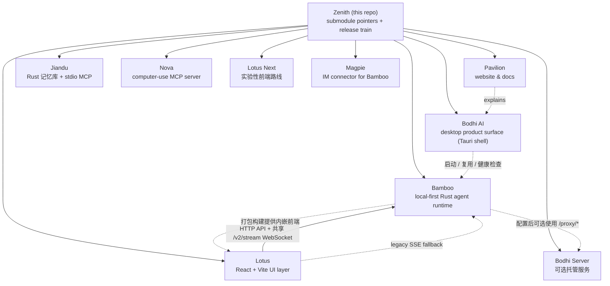

<div align="center">

# Zenith

### Bodhi AI —— 本地优先的桌面 agent，真正动手干活，而不只是聊天。

**它会用工具、有记忆、每一步都看得见 —— 给你的不只是一个最终答案。**
Zenith 是它的大本营：桌面产品、前端、Rust 运行时、可选托管服务、共享记忆、
电脑操作、IM 集成与文档，一次 `--recursive` clone 全到位。

[](https://github.com/bigduu/Zenith/actions/workflows/submodule-guard.yml)
[](https://github.com/bigduu/Zenith/actions/workflows/release-train.yml)
[](https://github.com/bigduu/Zenith/actions/workflows/nightly-release.yml)
[](./README.md)

**[▶ 先看 Bodhi AI](https://github.com/bigduu/Bodhi-AI)** · [Lotus](https://github.com/bigduu/Lotus) · [Bamboo](https://github.com/bigduu/Bamboo-agent) · [Bodhi Server](https://github.com/bigduu/bodhi-server) · [Pavilion](https://github.com/bigduu/Pavilion) · [架构总览](https://github.com/bigduu/Pavilion/blob/main/articles/zenith-architecture-overview.md)

</div>

> Bodhi AI 想把 AI 从一个只会聊天的窗口，变成一个真正能推进工作的桌面工作台：你交代任务，它使用工具、留下记忆、把结果做出来，整个过程你都看得见。**Zenith** 把产品、界面、执行引擎、可选托管服务和文档组织在一起，并统一它们的发布节奏。

---

## 核心能力速览

| 能力 | 说明 |
|---|---|
| **整套系统的地图** | 一个仓库就能看清产品、UI、runtime、backend、文档如何分工与协作 |
| **9 个 submodule 一键拉取** | `--recursive` 一次拉取产品栈与配套服务 |
| **协调发布列车** | Lotus → Bamboo → Bodhi 按依赖顺序发布，版本号从一份配置统一驱动 |
| **每日 Nightly 自动版本** | 按 `YYYY.M.N` 日历版本自动递增并触发发布 |
| **指针守护** | CI 在 push 到 `main` 及目标为 `main` 的 PR 中校验 submodule 指针 |
| **明确的“从哪开始”** | 无论你想看产品、写前端还是改 runtime，都有明确入口 |

---

## 架构地图

Zenith 本身几乎不放业务代码，它是一个“薄壳”monorepo：维护 9 个 Git submodule 的指针、根级说明文档，以及跨仓库的发布编排。真正的功能都活在子模块里。



> **重要** —— Bodhi 负责原生桌面壳和 Bamboo sidecar 生命周期：启动或复用 `bamboo serve`，并等待健康检查通过。打包构建加载由 Bamboo 提供的 Lotus 界面；开发模式保持使用 Lotus Vite dev server，同时在旁运行 Bamboo。Lotus 用 HTTP 发请求，实时事件默认走共享 `/v2/stream` WebSocket；只有显式关闭 WebSocket 或首次建连失败时才回退到 legacy SSE。Bodhi Server 对本地运行不是必需依赖；配置使用时，它提供账号/认证、凭据存储、配额/计费、模型路由与 provider proxy。

### 各模块职责

| 模块 | 路径 | 角色 | 从哪开始 |
|---|---|---|---|
| **Bodhi AI** | `bodhi/` | 对外产品门面：Tauri 桌面壳、原生集成、打包发布与受管 Bamboo sidecar 生命周期 | [Bodhi AI](https://github.com/bigduu/Bodhi-AI) |
| **Lotus** | `lotus/` | UI 交互层：React + Vite、HTTP 请求、共享 WebSocket 实时事件、legacy SSE fallback、界面状态与设置 | [Lotus](https://github.com/bigduu/Lotus) |
| **Bamboo** | `bamboo/` | 执行引擎与生产 Lotus host：本地优先 Rust runtime，提供 HTTP、WebSocket 与 legacy SSE API | [Bamboo Agent](https://github.com/bigduu/Bamboo-agent) |
| **Bodhi Server** | `bodhi-server/` | 可选托管 Go 服务：账号/认证、API key、加密 provider 凭据、模型路由、配额/计费与 provider proxy | [Bodhi Server](https://github.com/bigduu/bodhi-server) |
| **Pavilion** | `pavilion/` | 官网与文档：下载入口、文档中心与对外叙事 | [Pavilion](https://github.com/bigduu/Pavilion) |
| **Jiandu** | `jiandu/` | 权威共享记忆：独立文件系统 Rust store、无 embedding 的词法检索、宿主生成的 Dream 快照持久化，以及单 `memory` tool 的 stdio MCP | [Jiandu](https://github.com/bigduu/Jiandu) · [agent 使用指南](./AGENTS.md#shared-memory-via-jiandu-mcp) · [便携 Skill](./jiandu/skills/jiandu-memory/SKILL.md) |
| **Nova** | `nova/` | 电脑操作：通过 MCP 暴露原生桌面交互能力 | [Nova](https://github.com/bigduu/Nova) |
| **Lotus Next** | `lotus-next/` | 实验性并行界面：响应式 React + Vite 重构，当前不声明功能等价或生产就绪 | [Lotus Next](https://github.com/bigduu/lotus-next) |
| **Magpie** | `magpie/` | IM 集成：独立连接器与 Bamboo service plugin | [Magpie](https://github.com/bigduu/Magpie) |
| **Zenith (root)** | `.` | 协调仓库：submodule 指针、根级文档、release train | 你在这里 |

---

## 旗舰能力详解

### 1. “从哪里开始”路由

Zenith 最大的价值，是让任何一个人都能快速找到正确的入口。

**如果你只想了解产品**
- 看产品本身 → [Bodhi AI](https://github.com/bigduu/Bodhi-AI)
- 看整体设计为什么这样组织 → [Zenith 架构总览](https://github.com/bigduu/Pavilion/blob/main/articles/zenith-architecture-overview.md)
- 看官网 / 下载 / 文档叙事 → [Pavilion](https://github.com/bigduu/Pavilion)

**如果你想参与开发**
- 桌面产品 / Tauri 壳 → `bodhi/`
- 前端交互 / React UI → `lotus/`
- Agent runtime / Rust 后端 → `bamboo/`
- 可选托管账号 / 凭据 / 路由 / 计费服务 → `bodhi-server/`
- 官网 / 文档 / 对外内容 → `pavilion/`
- 共享记忆 MCP → `jiandu/`
- 电脑操作 MCP → `nova/`
- 实验性下一代界面 → `lotus-next/`
- IM 连接器 / Bamboo service plugin → `magpie/`

### 2. 这套栈为什么这样分

核心产品链路按层拆分，让每一层都能独立演进，又能在发布时收敛成一个产品：

- **界面与体验** 放在 Lotus（React/Vite）；请求走 HTTP，实时事件默认复用一条共享 WebSocket，并保留 legacy SSE fallback。
- **执行逻辑与生产界面托管** 放在 Bamboo（Rust），本地优先、可单独运行。
- **可选托管账号、凭据、模型路由、配额/计费与 provider proxy** 在配置使用时由 Bodhi Server（Go）提供；本地 Bodhi + Bamboo 链路不依赖它。
- **桌面壳** 放在 Bodhi：负责原生集成、打包发布与受管 Bamboo sidecar 生命周期；release 构建中的 Lotus 由 Bamboo 提供。
- **对外叙事** 放在 Pavilion，与代码解耦。

另外四个 submodule 保持独立边界：Jiandu 拥有唯一权威的文件系统记忆根、
确定性的无 embedding 词法检索、宿主生成的 Dream 快照字节，以及单工具
stdio MCP server。宿主负责选择 query terms、可选 rerank、prompt 位置与预算，
以及 Dream 的生成和节奏；可选便携 Skill 只教授这份契约，并由宿主显式启用。
Nova 通过 MCP 提供电脑操作；Lotus Next 是与 Lotus 并行的实验性前端路线，
并非当前 Bodhi 默认界面；Magpie 负责把 IM 平台连接到 Bamboo。

### 3. 协调发布列车

多个仓库要同时升级版本、按依赖顺序发布，很容易出错。Zenith 用一份配置 + 一条 workflow 把它变成一次点击。

发布顺序由依赖关系固定为：

1. **Lotus** → 发布 npm 包 `@bigduu/lotus`（`bigduu/Lotus` 的 `publish-npm.yml`）
2. **Bamboo** → 发布 crate，并把当天这个 Lotus 嵌入为 web 前端（`bigduu/Bamboo-agent` 的 `publish-crate.yml`）
3. **Bodhi** → 构建并发布桌面产物，消费前两者（`bigduu/Bodhi-AI` 的 `release.yml`）

每一步之间，release train 会**等待制品在 crates.io / npm 上真正可见**后再进入下一步（见 `release-train.yml` 中的 `wait_for_crates_version` / `wait_for_npm_version`）。所有版本与 ref 默认从 `.github/release-train.config.json` 读取（`from_manifest`），也可在手动触发时覆盖。

列车也支持**部分发车**：手动触发时传 `targets`（如 `bamboo,bodhi`）只发布子集——未选中的仓库固定使用配置中记录的最近已发布版本；预检会拒绝复用已发布过的版本号（重跑半途失败的列车请传 `resume=true`）。列车成功后会把实际发布的版本写回配置，nightly 定版时还会扫描 registry 取当月最大序号，保证计数器不会与临时发布撞号。

当前使用的 ref、发布版本与选项统一维护在
[`.github/release-train.config.json`](./.github/release-train.config.json)；
README 不再复制一份会过期的版本快照。

相关 workflow (位于 `.github/workflows/`):

| Workflow | 作用 |
|---|---|
| `release-train.yml` | 协调发布（全量或用 `targets` 部分发车）：Lotus → Bamboo → Bodhi |
| `nightly-release.yml` | 每天 UTC 04:00（北京时间 12:00）按 `YYYY.M.N` 自动递增版本并触发 |
| `submodule-guard.yml` | 在 push 到 `main` 及目标为 `main` 的 PR 中校验 submodule 指针 |

> **默认策略** —— 正常发布走 Zenith 的 release train；子仓库的独立发布流程仅用于恢复或特殊情况。

---

## 快速开始与开发

### 拉取全栈

```bash
git clone --recursive https://github.com/bigduu/Zenith.git
cd Zenith
```

已经 clone 但没带 submodule:

```bash
git submodule update --init --recursive
```

### 运行桌面产品

```bash
cd lotus
npm install
cd ../bodhi
npm install
npm run tauri:dev
```

> `tauri:dev` 会把 `../bamboo` 构建为受管 debug sidecar，启动 `../lotus` 的 Vite HMR，再启动 Bodhi。Bodhi 会启动或复用 Bamboo 并等待健康检查，开发界面继续由 Vite 提供；打包构建则加载 Bamboo 提供的 Lotus 前端。脚本定义见 `bodhi/package.json`，运行边界见 [Bodhi README](https://github.com/bigduu/Bodhi-AI)。

### 单独跑前端

```bash
cd lotus
npm install
npm run dev
```

> Vite 界面可以单独启动；实时 agent 数据仍需要另行运行 Bamboo 服务。

### 运行执行引擎

```bash
cd bamboo
cargo run -- serve --port 9562
```

> `bamboo serve` 接受 `--port` / `--bind` / `--data-dir` / `--static-dir` / `--workers` 等可选参数覆盖配置文件；不传 `--port` 时使用配置文件中的端口。当前完整命令以 `bamboo --help` 和 [Bamboo README](https://github.com/bigduu/Bamboo-agent#quick-start--development) 为准。

### 维护 submodule 指针

```bash
# 查看当前指针
git submodule status

# 拉取各子模块最新提交
git submodule update --remote --recursive

# 子模块改动后，回到根仓库提交指针
git add .gitmodules bamboo bodhi bodhi-server jiandu lotus lotus-next magpie nova pavilion
git commit -m "chore: bump submodule pointers"
git push
```

> 推荐流程：先在子模块里开发、提交、push，再回 Zenith 更新并提交对应的 submodule 指针。完整发布步骤见 [`AGENTS.md`](./AGENTS.md) 的 Release Playbook。

---

## 其余模块与文档

| 模块 | Repository |
|---|---|
| Bodhi AI — 桌面产品门面 | https://github.com/bigduu/Bodhi-AI |
| Lotus — React UI 层 | https://github.com/bigduu/Lotus |
| Bamboo — Rust agent runtime | https://github.com/bigduu/Bamboo-agent |
| Bodhi Server — 可选托管账号、凭据、路由、配额/计费与 provider proxy | https://github.com/bigduu/bodhi-server |
| Pavilion — 官网与文档 | https://github.com/bigduu/Pavilion |
| Jiandu — 文件系统持久化 Rust 记忆库 + stdio MCP server | https://github.com/bigduu/Jiandu |
| Nova — 电脑操作 MCP 服务 | https://github.com/bigduu/Nova |
| Lotus Next — 实验性并行前端路线，并非当前 Bodhi 默认界面 | https://github.com/bigduu/lotus-next |
| Magpie — Bamboo 的 IM 连接器 | https://github.com/bigduu/Magpie |

**关键文档**
- [Zenith 架构总览](https://github.com/bigduu/Pavilion/blob/main/articles/zenith-architecture-overview.md) — 整套系统为什么这样组织
- [`AGENTS.md`](./AGENTS.md) — 贡献规范、多 agent 协作与完整 Release Playbook

---

读完只准备点开一个链接？先看 **[Bodhi AI](https://github.com/bigduu/Bodhi-AI)**。
想理解这套系统为什么长成这样？再看 **[Zenith 架构总览](https://github.com/bigduu/Pavilion/blob/main/articles/zenith-architecture-overview.md)**。
