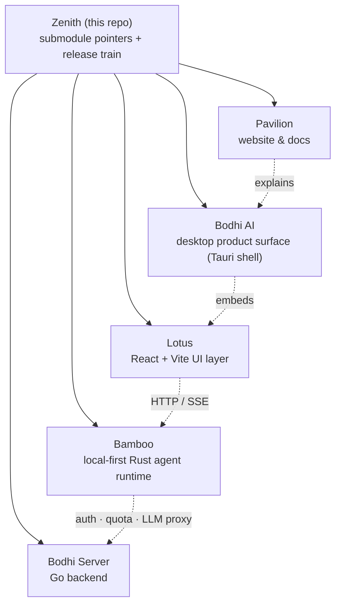

<div align="center">

# Zenith

### Bodhi AI —— 本地优先的桌面 agent，真正动手干活，而不只是聊天。

**它会用工具、有记忆、每一步都看得见 —— 给你的不只是一个最终答案。**
Zenith 是它的大本营：桌面产品、UI、Rust 运行时、Go 后端与文档，
一次 `--recursive` clone 全到位，并同步发布。

[](https://github.com/bigduu/Zenith/actions/workflows/submodule-guard.yml)
[](https://github.com/bigduu/Zenith/actions/workflows/release-train.yml)
[](https://github.com/bigduu/Zenith/actions/workflows/nightly-release.yml)
[](./README.md)

**[▶ 先看 Bodhi AI](https://github.com/bigduu/Bodhi-AI)** · [Lotus](https://github.com/bigduu/Lotus) · [Bamboo](https://github.com/bigduu/Bamboo-agent) · [Bodhi Server](https://github.com/bigduu/bodhi-server) · [Pavilion](https://github.com/bigduu/Pavilion) · [架构总览](https://github.com/bigduu/Pavilion/blob/main/articles/zenith-architecture-overview.md)

</div>

<!-- TODO(readme): 这里放一张 Bodhi AI 的产品演示 GIF/截图，是最大的点击/star 驱动（参考 aider 的录屏）。
     素材就绪后从 Pavilion/Bodhi 借用：
     <p align="center"></p> -->

> Bodhi AI 想把 AI 从一个只会聊天的窗口，变成一个真正能推进工作的桌面工作台：你交代任务，它使用工具、留下记忆、把结果做出来，整个过程你都看得见。**Zenith** 把产品、界面、执行引擎、服务端和文档组织在一起，并统一它们的发布节奏。

---

## 核心能力速览

| 能力 | 说明 |
|---|---|
| **整套系统的地图** | 一个仓库就能看清产品、UI、runtime、backend、文档如何分工与协作 |
| **5 个 submodule 一键拉取** | `--recursive` 一次拉全栈，不用手动跑五个仓库 |
| **协调发布列车** | Lotus → Bamboo → Bodhi 按依赖顺序发布，版本号从一份配置统一驱动 |
| **每日 Nightly 自动版本** | 按 `YYYY.M.N` 日历版本自动递增并触发发布 |
| **指针守护** | CI 在每次 push / PR 校验 submodule 指针的健康 |
| **明确的“从哪开始”** | 无论你想看产品、写前端还是改 runtime，都有明确入口 |

---

## 架构地图

Zenith 本身几乎不放业务代码，它是一个“薄壳”monorepo：维护 5 个 Git submodule 的指针、根级说明文档，以及跨仓库的发布编排。真正的功能都活在子模块里。



> **重要** —— Bodhi 桌面壳负责承载界面与原生集成；Lotus 是真正的界面层；Lotus 通过 **HTTP / SSE** 与 Bamboo runtime 通信（不是 Tauri IPC）。Bamboo 把需要账号、配额、计费与 LLM 代理的能力交给 Go 后端 Bodhi Server。

### 各模块职责

| 模块 | 路径 | 角色 | 从哪开始 |
|---|---|---|---|
| **Bodhi AI** | `bodhi/` | 对外产品门面：Tauri 桌面壳，承载 UI、原生集成与打包发布 | [Bodhi AI](https://github.com/bigduu/Bodhi-AI) |
| **Lotus** | `lotus/` | UI 交互层：React + Vite 前端，实时事件流、界面状态与设置 | [Lotus](https://github.com/bigduu/Lotus) |
| **Bamboo** | `bamboo/` | 执行引擎：本地优先的 Rust agent runtime，任务、工具、记忆与 HTTP/SSE API | [Bamboo Agent](https://github.com/bigduu/Bamboo-agent) |
| **Bodhi Server** | `bodhi-server/` | 服务端能力：Go 后端，认证、持久化、配额/计费与 LLM 代理 | [Bodhi Server](https://github.com/bigduu/bodhi-server) |
| **Pavilion** | `pavilion/` | 官网与文档：下载入口、文档中心与对外叙事 | [Pavilion](https://github.com/bigduu/Pavilion) |
| **Zenith (root)** | `.` | 协调仓库：submodule 指针、根级文档、release train | 你在这里 |

---

## 旗舰能力详解

### 1. “从哪里开始”路由

Zenith 最大的价值，是让任何一个人都能快速找到正确的入口。

**如果你只想了解产品**
- 看产品本身 → [Bodhi AI](https://github.com/bigduu/Bodhi-AI)
- 看整体设计为什么这样组织 → [Zenith 架构总览](https://github.com/bigduu/Pavilion/blob/main/articles/zenith-architecture-overview.md)
- 看官网 / 下载 / 文档叙事 → [Pavilion](https://github.com/bigduu/Pavilion)

**如果你想参与开发**
- 桌面产品 / Tauri 壳 → `bodhi/`
- 前端交互 / React UI → `lotus/`
- Agent runtime / Rust 后端 → `bamboo/`
- 服务端 / Go backend → `bodhi-server/`
- 官网 / 文档 / 对外内容 → `pavilion/`

### 2. 这套栈为什么这样分

拆成五块不是为了好看，而是为了让每一层都能独立演进，又能在发布时收敛成一个产品：

- **界面与体验** 放在 Lotus（React/Vite），可以独立迭代、独立测试。
- **执行逻辑** 放在 Bamboo（Rust），本地优先、可单独跑成 HTTP 服务。
- **账号、配额、计费、LLM 代理** 放在 Bodhi Server（Go），把需要服务端信任的能力集中起来。`bodhi-server/internal/` 下能看到 `auth`、`quota`、`pricing`、`proxy`、`database` 等真实模块。
- **桌面壳** 放在 Bodhi，只负责“把界面装进一个可安装的桌面 App”。
- **对外叙事** 放在 Pavilion，与代码解耦。

### 3. 协调发布列车

多个仓库要同时升级版本、按依赖顺序发布，很容易出错。Zenith 用一份配置 + 一条 workflow 把它变成一次点击。

发布顺序由依赖关系固定为：

1. **Lotus** → 发布 npm 包 `@bigduu/lotus`（`bigduu/Lotus` 的 `publish-npm.yml`）
2. **Bamboo** → 发布 crate，并把当天这个 Lotus 嵌入为 web 前端（`bigduu/Bamboo-agent` 的 `publish-crate.yml`）
3. **Bodhi** → 构建并发布桌面产物，消费前两者（`bigduu/Bodhi-AI` 的 `release.yml`）

每一步之间，release train 会**等待制品在 crates.io / npm 上真正可见**后再进入下一步（见 `release-train.yml` 中的 `wait_for_crates_version` / `wait_for_npm_version`）。所有版本与 ref 默认从 `.github/release-train.config.json` 读取（`from_manifest`），也可在手动触发时覆盖。

列车也支持**部分发车**：手动触发时传 `targets`（如 `bamboo,bodhi`）只发布子集——未选中的仓库固定使用配置中记录的最近已发布版本；预检会拒绝复用已发布过的版本号（重跑半途失败的列车请传 `resume=true`）。列车成功后会把实际发布的版本写回配置，nightly 定版时还会扫描 registry 取当月最大序号，保证计数器不会与临时发布撞号。

当前配置 (`.github/release-train.config.json`):

```json
{
  "refs":     { "bamboo": "main", "lotus": "main", "bodhi": "main" },
  "versions": { "release": "2026.6.2", "bamboo": "2026.6.2", "lotus": "2026.6.2", "bodhi": "2026.6.2" },
  "options":  { "lotus_skip_tests": false }
}
```

相关 workflow (位于 `.github/workflows/`):

| Workflow | 作用 |
|---|---|
| `release-train.yml` | 协调发布（全量或用 `targets` 部分发车）：Lotus → Bamboo → Bodhi |
| `nightly-release.yml` | 每天 UTC 04:00（北京时间 12:00）按 `YYYY.M.N` 自动递增版本并触发 |
| `submodule-guard.yml` | 每次 push / PR 校验 submodule 指针 |

> **默认策略** —— 正常发布走 Zenith 的 release train；子仓库的独立发布流程仅用于恢复或特殊情况。

---

## 快速开始与开发

### 拉取全栈

```bash
git clone --recursive https://github.com/bigduu/Zenith.git
cd Zenith
```

已经 clone 但没带 submodule:

```bash
git submodule update --init --recursive
```

### 运行桌面产品

```bash
cd bodhi
npm install
npm run tauri:dev
```

> Bodhi 的 `web:dev` / `tauri:dev` 会驱动 `../lotus` 的 Vite 前端；脚本定义见 `bodhi/package.json`。

### 单独跑前端

```bash
cd lotus
npm install
npm run dev
```

### 运行执行引擎

```bash
cd bamboo
cargo run -- serve --port 9562
```

> `bamboo serve` 接受 `--port` / `--bind` / `--data-dir` / `--static-dir` / `--workers` 等可选参数覆盖配置文件；定义见 `bamboo/src/bin/bamboo.rs`。不传 `--port` 时使用配置文件中的端口。（其余子命令见 `bamboo --help`：`config`、`-p` headless、`actor`、`broker`、`broker-agent`。）

### 维护 submodule 指针

```bash
# 查看当前指针
git submodule status

# 拉取各子模块最新提交
git submodule update --remote --recursive

# 子模块改动后，回到根仓库提交指针
git add .gitmodules bamboo bodhi lotus pavilion bodhi-server
git commit -m "chore: bump submodule pointers"
git push
```

> 推荐流程：先在子模块里开发、提交、push，再回 Zenith 更新并提交对应的 submodule 指针。完整发布步骤见 [`AGENTS.md`](./AGENTS.md) 的 Release Playbook。

---

## 其余模块与文档

| 模块 | Repository |
|---|---|
| Bodhi AI — 桌面产品门面 | https://github.com/bigduu/Bodhi-AI |
| Lotus — React UI 层 | https://github.com/bigduu/Lotus |
| Bamboo — Rust agent runtime | https://github.com/bigduu/Bamboo-agent |
| Bodhi Server — Go backend | https://github.com/bigduu/bodhi-server |
| Pavilion — 官网与文档 | https://github.com/bigduu/Pavilion |

**关键文档**
- [Zenith 架构总览](https://github.com/bigduu/Pavilion/blob/main/articles/zenith-architecture-overview.md) — 整套系统为什么这样组织
- [`AGENTS.md`](./AGENTS.md) — 贡献规范、多 agent 协作与完整 Release Playbook

---

读完只准备点开一个链接？先看 **[Bodhi AI](https://github.com/bigduu/Bodhi-AI)**。
想理解这套系统为什么长成这样？再看 **[Zenith 架构总览](https://github.com/bigduu/Pavilion/blob/main/articles/zenith-architecture-overview.md)**。
