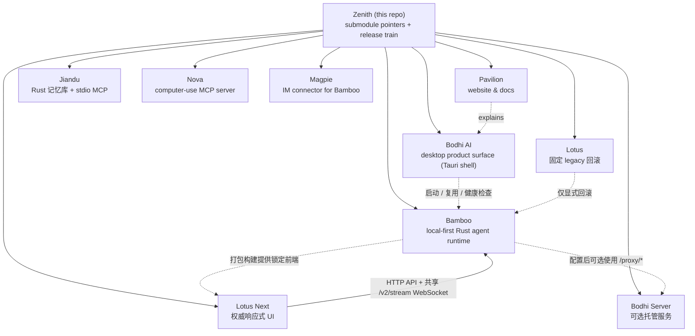

<div align="center">

# Zenith

### Bodhi AI —— 本地优先的桌面 agent，真正动手干活，而不只是聊天。

**它会用工具、有记忆、每一步都看得见 —— 给你的不只是一个最终答案。**
Zenith 是它的大本营：桌面产品、前端、Rust 运行时、可选托管服务、共享记忆、
电脑操作、IM 集成与文档，一次 `--recursive` clone 全到位。

[](https://github.com/bigduu/Zenith/actions/workflows/submodule-guard.yml)
[](https://github.com/bigduu/Zenith/actions/workflows/release-train.yml)
[](https://github.com/bigduu/Zenith/actions/workflows/nightly-release.yml)
[](./README.md)

**[▶ 先看 Bodhi AI](https://github.com/bigduu/Bodhi-AI)** · [Lotus Next](https://github.com/bigduu/lotus-next) · [Bamboo](https://github.com/bigduu/Bamboo-agent) · [Bodhi Server](https://github.com/bigduu/bodhi-server) · [Pavilion](https://github.com/bigduu/Pavilion) · [架构总览](https://github.com/bigduu/Pavilion/blob/main/articles/zenith-architecture-overview.md)

</div>

> Bodhi AI 想把 AI 从一个只会聊天的窗口，变成一个真正能推进工作的桌面工作台：你交代任务，它使用工具、留下记忆、把结果做出来，整个过程你都看得见。**Zenith** 把产品、界面、执行引擎、可选托管服务和文档组织在一起，并统一它们的发布节奏。

---

## 核心能力速览

| 能力 | 说明 |
|---|---|
| **整套系统的地图** | 一个仓库就能看清产品、UI、runtime、backend、文档如何分工与协作 |
| **9 个 submodule 一键拉取** | `--recursive` 一次拉取产品栈与配套服务 |
| **协调发布列车** | 一个已验证的 Lotus Next 制品按依赖顺序供给 Bamboo → Bodhi，由一份 fail-closed 配置统一驱动 |
| **每日 Nightly 自动版本** | 按 `YYYY.M.N` 日历版本自动递增并触发发布 |
| **指针守护** | CI 在 push 到 `main` 及目标为 `main` 的 PR 中校验 submodule 指针 |
| **明确的“从哪开始”** | 无论你想看产品、写前端还是改 runtime，都有明确入口 |

---

## 架构地图

Zenith 本身几乎不放业务代码，它是一个“薄壳”monorepo：维护 9 个 Git submodule 的指针、根级说明文档，以及跨仓库的发布编排。真正的功能都活在子模块里。



> **重要** —— Bodhi 负责原生桌面壳和 Bamboo sidecar 生命周期：启动或复用 `bamboo serve`，并等待健康检查通过。打包构建默认使用 Bamboo、Bodhi 与 Zenith 发布策略共同锁定的同一份 Lotus Next npm 制品；legacy Lotus 只保留一个固定版本的显式回滚入口。Lotus Next 通过 HTTP 发请求，实时事件走共享 `/v2/stream` WebSocket。Bodhi Server 对本地运行不是必需依赖；配置使用时，它提供账号/认证、凭据存储、配额/计费、模型路由与 provider proxy。

### 各模块职责

| 模块 | 路径 | 角色 | 从哪开始 |
|---|---|---|---|
| **Bodhi AI** | `bodhi/` | 对外产品门面：Tauri 桌面壳、原生集成、打包发布与受管 Bamboo sidecar 生命周期 | [Bodhi AI](https://github.com/bigduu/Bodhi-AI) |
| **Lotus** | `lotus/` | 已冻结的 legacy React + Vite UI；迁移验收与退役门禁完成前，仅作为固定回滚包保留 | [Lotus](https://github.com/bigduu/Lotus) |
| **Bamboo** | `bamboo/` | 执行引擎与生产 Lotus Next host：本地优先 Rust runtime，提供 HTTP、WebSocket 与 legacy SSE API | [Bamboo Agent](https://github.com/bigduu/Bamboo-agent) |
| **Bodhi Server** | `bodhi-server/` | 可选托管 Go 服务：账号/认证、API key、加密 provider 凭据、模型路由、配额/计费与 provider proxy | [Bodhi Server](https://github.com/bigduu/bodhi-server) |
| **Pavilion** | `pavilion/` | 官网与文档：下载入口、文档中心与对外叙事 | [Pavilion](https://github.com/bigduu/Pavilion) |
| **Jiandu** | `jiandu/` | 权威共享记忆：独立文件系统 Rust store、无 embedding 的词法检索、宿主生成的 Dream 快照持久化，以及单 `memory` tool 的 stdio MCP | [Jiandu](https://github.com/bigduu/Jiandu) · [agent 使用指南](./AGENTS.md#shared-memory-via-jiandu-mcp) · [便携 Skill](https://github.com/bigduu/Jiandu/blob/v0.2.0/skills/jiandu-memory/SKILL.md) |
| **Nova** | `nova/` | 电脑操作：通过 MCP 暴露原生桌面交互能力 | [Nova](https://github.com/bigduu/Nova) |
| **Lotus Next** | `lotus-next/` | 权威响应式 React + Vite UI，也是 Bamboo 与 Bodhi 发布默认消费的前端制品 | [Lotus Next](https://github.com/bigduu/lotus-next) |
| **Magpie** | `magpie/` | IM 集成：独立连接器与 Bamboo service plugin | [Magpie](https://github.com/bigduu/Magpie) |
| **Zenith (root)** | `.` | 协调仓库：submodule 指针、根级文档、release train | 你在这里 |

---

## 旗舰能力详解

### 1. “从哪里开始”路由

Zenith 最大的价值，是让任何一个人都能快速找到正确的入口。

**如果你只想了解产品**
- 看产品本身 → [Bodhi AI](https://github.com/bigduu/Bodhi-AI)
- 看整体设计为什么这样组织 → [Zenith 架构总览](https://github.com/bigduu/Pavilion/blob/main/articles/zenith-architecture-overview.md)
- 看官网 / 下载 / 文档叙事 → [Pavilion](https://github.com/bigduu/Pavilion)

**如果你想参与开发**
- 桌面产品 / Tauri 壳 → `bodhi/`
- 权威前端交互 / React UI → `lotus-next/`
- 固定 legacy 回滚 → `lotus/`
- Agent runtime / Rust 后端 → `bamboo/`
- 可选托管账号 / 凭据 / 路由 / 计费服务 → `bodhi-server/`
- 官网 / 文档 / 对外内容 → `pavilion/`
- 共享记忆 MCP → `jiandu/`
- 电脑操作 MCP → `nova/`
- IM 连接器 / Bamboo service plugin → `magpie/`

### 2. 这套栈为什么这样分

核心产品链路按层拆分，让每一层都能独立演进，又能在发布时收敛成一个产品：

- **界面与体验** 放在 Lotus Next（React/Vite）；请求走 HTTP，实时事件复用一条共享 WebSocket。
- **执行逻辑与生产界面托管** 放在 Bamboo（Rust），本地优先、可单独运行。
- **可选托管账号、凭据、模型路由、配额/计费与 provider proxy** 在配置使用时由 Bodhi Server（Go）提供；本地 Bodhi + Bamboo 链路不依赖它。
- **桌面壳** 放在 Bodhi：负责原生集成、打包发布与受管 Bamboo sidecar 生命周期；release 构建与 Bamboo 消费同一份精确锁定的 Lotus Next 制品。
- **对外叙事** 放在 Pavilion，与代码解耦。

另外三个 submodule 保持独立边界：Jiandu 拥有唯一权威的文件系统记忆根、
确定性的无 embedding 词法检索、宿主生成的 Dream 快照字节，以及单工具
stdio MCP server。宿主负责选择 query terms、可选 rerank、prompt 位置与预算，
以及 Dream 的生成和节奏；可选便携 Skill 只教授这份契约，并由宿主显式启用。
Nova 通过 MCP 提供电脑操作；Magpie 负责把 IM 平台连接到 Bamboo。legacy
Lotus 在剩余迁移验收与退役门禁完成前，继续作为有界的固定回滚保留。

### 3. 协调发布列车

多个仓库要按依赖顺序发布，很容易出错。Zenith 用一份经过 review 的权威配置 + 一条 workflow 把它收敛起来。

Lotus Next 的发布是独立、受保护的 producer 步骤；只有源码审核、制品发布和下游 lock 刷新完成后，release train 才消费它，并且不会在列车里重新发布或改写前端。下游顺序固定为：

1. **Bamboo** → 发布 crate，并暂存所选的精确前端包（`bigduu/Bamboo-agent` 的 `publish-crate.yml`）
2. **Bodhi** → 用同一个前端 package/version 和被接受的精确 Bamboo revision 构建并发布桌面产物（`bigduu/Bodhi-AI` 的 `release.yml`）

任何跨仓库 dispatch 之前，列车都会验证配置 schema、根 gitlink、当前被接受的 Bamboo/Bodhi ref、Lotus Next 制品源码指针、package name/version、registry tarball SHA-1 与 integrity。选择 Lotus Next 时，还会逐项验证 canonical universal manifest、所有资源的 size/hash、合并资源摘要、源码 revision、clean 状态与 entrypoint；任一不一致都会提前停止，而 Lotus Next 后续开发提交不会让已经验收的不可变制品失效。

列车支持 `targets=bamboo` 或 `targets=bodhi` 的**部分发车**。Bamboo 未入列时固定使用配置里记录的最近已发布版本；碰撞检查拒绝复用下游版本，只有对同一趟半途失败列车显式传 `resume=true` 才会跳过已经存在的制品。手动调用者可以覆盖下游版本，但前端只能解析为已提交的 Lotus Next 制品，或唯一固定的 legacy rollback。

nightly 在生成下一个 `YYYY.M.N` 时扫描 Bamboo、Bodhi 与 Lotus Next registry，只更新下游版本字段，永远不改写已提交的前端身份。被接受的源码 ref/revision、下游版本以及精确前端字节统一维护在
[`.github/release-train.config.json`](./.github/release-train.config.json)；
README 不复制会过期的具体值。

相关 workflow (位于 `.github/workflows/`):

| Workflow | 作用 |
|---|---|
| `release-policy.yml` | 在相关变更上测试策略语义，并从公共 registry 重验两份锁定 npm 制品 |
| `release-train.yml` | fail-closed 发布（全量或用 `targets` 部分发车）：锁定前端 → Bamboo → Bodhi |
| `nightly-release.yml` | 每天 UTC 04:00（北京时间 12:00）仅递增下游 `YYYY.M.N` 并触发 |
| `submodule-guard.yml` | 在 push 到 `main` 及目标为 `main` 的 PR 中校验 submodule 指针 |

> **默认策略** —— 正常发布走 Zenith 的 release train；子仓库的独立发布流程仅用于恢复或特殊情况。

---

## 快速开始与开发

### 拉取全栈

```bash
git clone --recursive https://github.com/bigduu/Zenith.git
cd Zenith
```

已经 clone 但没带 submodule:

```bash
git submodule update --init --recursive
```

### 运行桌面产品

```bash
cd lotus
npm install
cd ../bodhi
npm install
npm run tauri:dev
```

> `tauri:dev` 会把 `../bamboo` 构建为受管 debug sidecar，启动 `../lotus` 的 Vite HMR，再启动 Bodhi。Bodhi 会启动或复用 Bamboo 并等待健康检查，开发界面继续由 Vite 提供；打包构建则加载 Bamboo 提供的 Lotus 前端。脚本定义见 `bodhi/package.json`，运行边界见 [Bodhi README](https://github.com/bigduu/Bodhi-AI)。

### 单独跑前端

```bash
cd lotus
npm install
npm run dev
```

> Vite 界面可以单独启动；实时 agent 数据仍需要另行运行 Bamboo 服务。

### 运行执行引擎

```bash
cd bamboo
cargo run -- serve --port 9562
```

> `bamboo serve` 接受 `--port` / `--bind` / `--data-dir` / `--static-dir` / `--workers` 等可选参数覆盖配置文件；不传 `--port` 时使用配置文件中的端口。当前完整命令以 `bamboo --help` 和 [Bamboo README](https://github.com/bigduu/Bamboo-agent#quick-start--development) 为准。

### 维护 submodule 指针

```bash
# 查看当前指针
git submodule status

# 拉取各子模块最新提交
git submodule update --remote --recursive

# 子模块改动后，回到根仓库提交指针
git add .gitmodules bamboo bodhi bodhi-server jiandu lotus lotus-next magpie nova pavilion
git commit -m "chore: bump submodule pointers"
git push
```

> 推荐流程：先在子模块里开发、提交、push，再回 Zenith 更新并提交对应的 submodule 指针。完整发布步骤见 [`AGENTS.md`](./AGENTS.md) 的 Release Playbook。

---

## 其余模块与文档

| 模块 | Repository |
|---|---|
| Bodhi AI — 桌面产品门面 | https://github.com/bigduu/Bodhi-AI |
| Lotus — 已冻结的固定版本 legacy 回滚 | https://github.com/bigduu/Lotus |
| Bamboo — Rust agent runtime | https://github.com/bigduu/Bamboo-agent |
| Bodhi Server — 可选托管账号、凭据、路由、配额/计费与 provider proxy | https://github.com/bigduu/bodhi-server |
| Pavilion — 官网与文档 | https://github.com/bigduu/Pavilion |
| Jiandu — 文件系统持久化 Rust 记忆库 + stdio MCP server | https://github.com/bigduu/Jiandu |
| Nova — 电脑操作 MCP 服务 | https://github.com/bigduu/Nova |
| Lotus Next — 权威响应式前端与默认发布制品 | https://github.com/bigduu/lotus-next |
| Magpie — Bamboo 的 IM 连接器 | https://github.com/bigduu/Magpie |

**关键文档**
- [Zenith 架构总览](https://github.com/bigduu/Pavilion/blob/main/articles/zenith-architecture-overview.md) — 整套系统为什么这样组织
- [`AGENTS.md`](./AGENTS.md) — 贡献规范、多 agent 协作与完整 Release Playbook

---

读完只准备点开一个链接？先看 **[Bodhi AI](https://github.com/bigduu/Bodhi-AI)**。
想理解这套系统为什么长成这样？再看 **[Zenith 架构总览](https://github.com/bigduu/Pavilion/blob/main/articles/zenith-architecture-overview.md)**。
