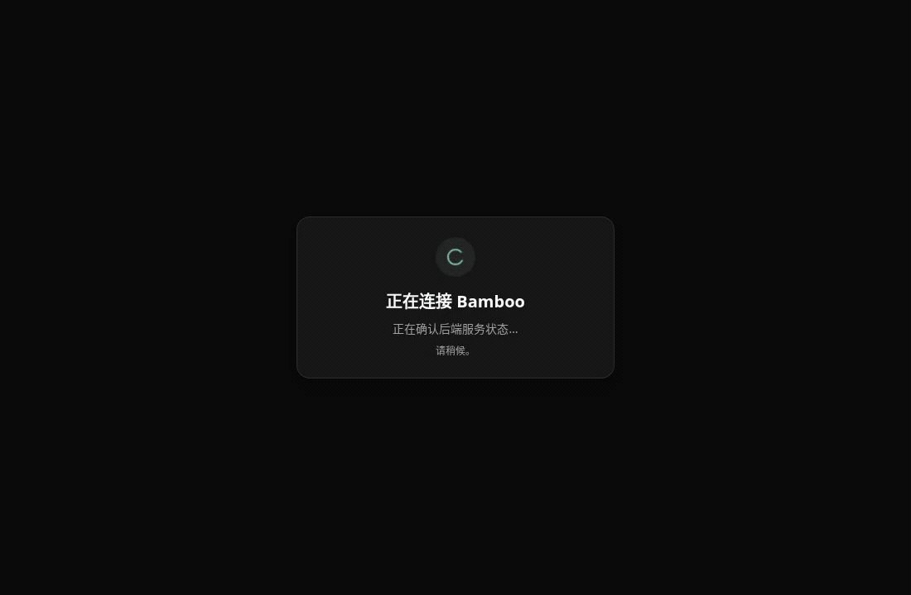
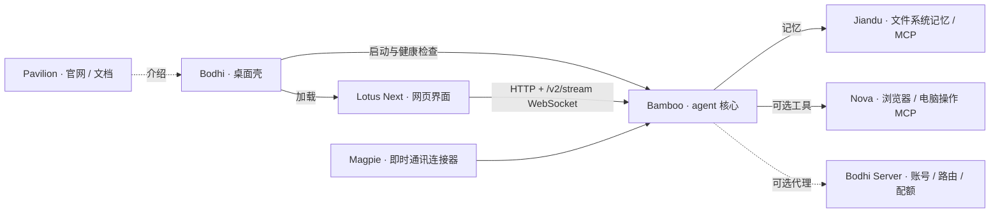

# Zenith

**本地 AI agent harness 套件：让 agent 带着工具、项目上下文和记忆，在浏览器或桌面中工作。**

[English](./README.md) · [桌面版下载](https://github.com/bigduu/Bodhi-AI/releases) · [Bamboo 核心](https://github.com/bigduu/Bamboo-agent/blob/dev/README.zh-CN.md) · [源码与发布核对](./docs/readme-refresh/README.md)

Bamboo 是核心运行时；Lotus Next 提供网页界面；Bodhi 将这套体验装进桌面应用，并管理 Bamboo 进程。Nova 扩展电脑与浏览器工具，Jiandu 提供共享记忆，Magpie 连接受支持的即时通讯平台。按场景选择组件即可，本地运行不要求部署托管账号服务。

“本地优先”指 harness 与状态可以留在本机。调用配置的远程模型、MCP 或即时通讯服务时，请求仍会离开本机。要获得 agent 回复，需要配置模型 provider。

## 从你的场景开始

| 你想做什么 | 入口 |
|---|---|
| 直接试用桌面应用 | [Bodhi 下载与平台要求](https://github.com/bigduu/Bodhi-AI/blob/main/README.md) |
| 启动 agent 服务，用浏览器操作 | [Bamboo 安装与快速开始](https://github.com/bigduu/Bamboo-agent/blob/dev/README.zh-CN.md) |
| 开发网页交互体验 | [Lotus Next 开发配置](https://github.com/bigduu/lotus-next/blob/main/README.md) |
| 让 agent 使用浏览器或桌面工具 | [Nova 安装与平台边界](https://github.com/bigduu/Nova/blob/master/README.md) |
| 跨会话召回事实，无需 embedding 服务 | [Jiandu 记忆 MCP](https://github.com/bigduu/Jiandu/blob/main/README.md) |
| 通过即时通讯平台连接 Bamboo | [Magpie 连接器与配置](https://github.com/bigduu/Magpie/blob/main/README.md) |
| 运营账号、模型路由和配额服务 | [Bodhi Server](https://github.com/bigduu/bodhi-server/blob/main/README.md) |
| 贡献官网和使用指南 | [Pavilion](https://github.com/bigduu/Pavilion/blob/main/README.zh-CN.md) |

## 看源码实际运行



[静态图片](docs/readme-refresh/demos/project-workspace.png) · [记忆与浏览器工具录屏](docs/readme-refresh/README.md#recordings)

真实浏览器录屏，连接固定源码的 Bamboo 后端，使用独立演示数据准备项目上下文，
没有调用模型。三段演示均展示源码能力，不表示最新桌面安装包已包含这些能力。

## 源码检出不等于已发布版本

模块链接打开上游文档，递归 clone 仍保留本仓库记录的源码 pin。Zenith 固定了八个源码仓库的提交。这里的 pin、上游开发分支和已发布二进制或包可能不同。各 README 说明当前源码并标注发布边界；安装时请按对应模块的发布说明操作。

2026-10-03 核对时，Bamboo 已发布 crate 为 `2026.9.20`，Bodhi 最新公开桌面 release 为 `app-v2026.9.20`，已接受的 Lotus Next 包为 `2026.9.22`。Nova release 为 `v0.2.1`，Jiandu 为 `v0.2.0`，两者的当前源码均有后续变更。发布配置中的版本号不代表发布已经成功。精确提交和限制见[核对记录与演示](./docs/readme-refresh/README.md)。

## 本地试用源码

安装已打包产品请使用上方各模块入口。开发当前固定源码：

```bash
git clone --recursive https://github.com/bigduu/Zenith.git
cd Zenith
# 如果 clone 时没有 --recursive：
git submodule update --init --recursive
```

在一个终端启动 Bamboo（需要 Rust 1.95+、Cargo 和 Node.js）：

```bash
cd bamboo
node scripts/frontend-package.cjs stage
cargo run --locked --bin bamboo -- init
cargo run --locked --bin bamboo -- serve --bind 127.0.0.1 --port 9562
```

在另一终端启动 Lotus Next（需要 Node.js >= 22.12）：

```bash
cd lotus-next
npm ci
npm run dev -- --host 127.0.0.1
```

打开 `http://127.0.0.1:9563`。Vite 将 API 和实时流请求代理给 9562 端口的 Bamboo。界面依赖后端服务；让 agent 工作前，先在应用中配置受支持的模型 provider。详见 [Bamboo 配置与访问边界](https://github.com/bigduu/Bamboo-agent/blob/dev/README.zh-CN.md)。

桌面开发需安装 [Bodhi 原生依赖](https://github.com/bigduu/Bodhi-AI/blob/main/README.md)，按上方步骤安装 Lotus Next 依赖。然后从 `lotus-next/` 目录切换到同级的桌面模块：

```bash
cd ../bodhi
npm ci
npm run tauri:dev
```

该命令构建本地 Bamboo sidecar 并启动前端 HMR，需要受支持的图形桌面与原生编译依赖。无界面 Linux 的浏览器验证不代表 macOS 或 Windows 桌面验证。

## 组件如何协作


```mermaid
graph LR
  Bodhi["Bodhi · 桌面壳"] -->|启动与健康检查| Bamboo["Bamboo · agent 核心"]
  Lotus["Lotus Next · 网页界面"] -->|HTTP + /v2/stream WebSocket| Bamboo
  Bodhi -->|加载| Lotus
  Bamboo -->|记忆| Jiandu["Jiandu · 文件系统记忆 / MCP"]
  Bamboo -->|可选工具| Nova["Nova · 浏览器 / 电脑操作 MCP"]
  Magpie["Magpie · 即时通讯连接器"] --> Bamboo
  Bamboo -. 可选代理 .-> Server["Bodhi Server · 账号 / 路由 / 配额"]
  Pavilion["Pavilion · 官网 / 文档"] -. 介绍 .-> Bodhi
```

打包的 Bamboo 与 Bodhi 消费经过验证、精确锁定的 Lotus Next 制品。`lotus-next/` 的检出源码可能比该制品更新。旧 `@bigduu/lotus` 仅保留固定 registry 回滚入口，不是第九个 submodule。

Nova 的原生能力取决于操作系统和权限，源码中的浏览器启动器与原生桌面 API 是不同路径。Jiandu 负责记忆持久化和词法检索；宿主决定保存什么、何时生成 Dream 快照。Magpie 的真实消息收发需要另行配置平台凭据。

## 贡献与发布协调

Zenith 维护文档、八个 gitlink 和发布列车，功能代码位于各模块。请使用隔离分支并遵循 [AGENTS.md](./AGENTS.md)。`git submodule status` 可查看检出提交，初始化会遵守已记录的 pin。更新 pin 是单独审核的改动，不是试用当前源码的前置步骤。

[发布配置](./.github/release-train.config.json) 选择精确 Bamboo/Bodhi 提交和前端制品身份。[发布列车](./.github/workflows/release-train.yml) 验证输入后，依次发布 Bamboo 和 Bodhi；Lotus Next 是独立的制品生产步骤。配置或工作流存在并不保证构建和发布成功，应核对运行结果及实际制品。

- [发布手册](./AGENTS.md#release-playbook)
- [Bamboo 架构](https://github.com/bigduu/Bamboo-agent/blob/dev/docs/design/architecture-overview.md)
- [Pavilion 架构总览](https://github.com/bigduu/Pavilion/blob/main/articles/zenith-architecture-overview.md)
- [文档核对、录屏与已知限制](./docs/readme-refresh/README.md)

## 许可证

项目自有代码和文档采用 [MIT 许可证](./LICENSE)。第三方组件保留各自的许可证和版权声明。
