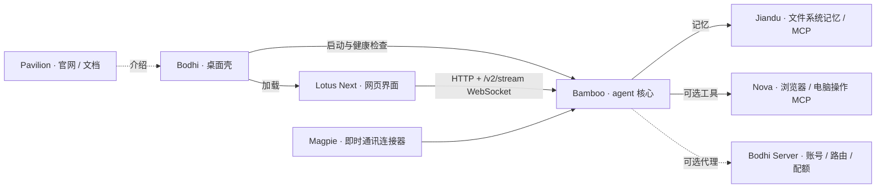

# Bodhi — 跑在你电脑上的 AI Agent 工作台

[English](./README.md) · [简体中文](./README.zh-CN.md)

**交给它任务，看清每一步工具调用，记忆一直留着。** Bodhi 是基于 Rust 运行时的桌面
agent：它用工具处理你的项目，高风险操作前先征求你的同意，每一步都实时展示出来。本仓库
（内部代号 Zenith）是桌面应用、agent 运行时和配套 MCP 工具的总入口。

[下载](https://github.com/bigduu/Bodhi-AI/releases/latest) · [Bamboo 运行时文档](https://github.com/bigduu/Bamboo-agent/blob/dev/README.zh-CN.md) · [MIT 开源](./LICENSE)

- **真干活，不只聊天**：Bamboo 运行时内置文件、命令行和网页工具，支持 Skills、MCP 服务、
  子 agent、定时任务和工作流。
- **模型自己选**：Anthropic、OpenAI（以及兼容 OpenAI 接口的服务）、Gemini 或 GitHub Copilot。
- **记忆能和其他 agent 共享**：[简牍 Jiandu](https://github.com/bigduu/Jiandu/blob/main/README.zh-CN.md)
  是本地 MCP 记忆服务（BM25 + 中文分词，不需要向量库），Claude Code、Codex、Cursor 也能接入。
- **不止在终端里**：用 [Nova](https://github.com/bigduu/Nova/blob/master/README.zh-CN.md) 操作
  macOS / Windows 原生应用；用 [Magpie 鹊](https://github.com/bigduu/Magpie/blob/main/README.zh-CN.md)
  在飞书 / Lark 或 Telegram 里派活。


在浏览器中连接 Bamboo 源码录制，使用一次性的演示数据；只准备项目上下文，没有调用模型。
[静态图片](docs/readme-refresh/demos/project-workspace.png) · [更多录屏](docs/readme-refresh/README.md#recordings)

## 开始使用

**macOS（推荐用 Homebrew）：**

```sh
brew tap bigduu/tap
brew trust bigduu/tap
brew install --cask bigduu/tap/bodhi
```

`brew trust` 会信任这个 tap，包括它以后发布的包；这个 cask 还会一起安装简牍和 Nova 命令行工具。
**Windows x64 / Linux x64 / macOS（手动）：**到 [Releases](https://github.com/bigduu/Bodhi-AI/releases/latest)
下载安装包（`-setup.exe`、`.AppImage` / `.deb` / `.rpm`、`.dmg`）。

装好后打开 **设置 → 提供方**，填入你能用的模型的 Key，然后试试：*“解释一下这个文件夹，再提一个小改进。”*

> 本地优先：运行时和数据都在你的电脑上；调用你配置的模型时，请求仍会发给对应的模型服务商。
> macOS 版本暂未公证（Homebrew cask 会在本机重新签名；直接安装 `.dmg` 可以用
> [自签脚本](https://github.com/bigduu/Bodhi-AI/blob/main/scripts/self-sign-macos-app.sh)），
> Windows 安装包也没有签名。进度见 [Bodhi #75](https://github.com/bigduu/Bodhi-AI/issues/75)。

## 只想用其中一个组件？

| 我想… | 用这个 | 现在怎么装 |
|---|---|---|
| 让 Claude Desktop、Cursor、Codex 或 Claude Code 操作我 Mac / Windows 上的应用 | [Nova](https://github.com/bigduu/Nova/blob/master/README.zh-CN.md) | `brew install bigduu/tap/nova`（macOS），或下载 Windows zip |
| 让多个编程 agent 共用一份记忆 | [简牍 Jiandu](https://github.com/bigduu/Jiandu/blob/main/README.zh-CN.md) | `brew install bigduu/tap/jiandu` 或 `cargo install jiandu-mcp --locked` |
| 把 agent 循环嵌进自己的产品（HTTP/WS 或 Rust SDK） | [Bamboo](https://github.com/bigduu/Bamboo-agent/blob/dev/README.zh-CN.md) | `cargo install bamboo-agent` |
| 在飞书 / Lark 或 Telegram 里给 agent 派活 | [Magpie 鹊](https://github.com/bigduu/Magpie/blob/main/README.zh-CN.md) | 从 [Releases](https://github.com/bigduu/Magpie/releases/latest) 安装 Bamboo 插件 |
| 开发网页界面 | [Lotus Next](https://github.com/bigduu/lotus-next/blob/main/README.zh-CN.md) | 从源码 |
| 为团队提供账号、模型路由和配额（可选） | [Bodhi Server](https://github.com/bigduu/bodhi-server/blob/main/README.zh-CN.md) | 从源码 / Docker |
| 贡献官网和使用指南 | [Pavilion](https://github.com/bigduu/Pavilion/blob/main/README.zh-CN.md) | 从源码 |

## 开发者

以下内容面向参与源码开发的人。Bamboo 是核心运行时；Lotus Next 是它的网页界面；Bodhi 把这套
体验装进桌面应用，并管理 Bamboo 进程。Nova 提供电脑和浏览器工具，简牍提供共享记忆，Magpie 连接
即时通讯平台。托管账号服务（Bodhi Server）是可选的。

### 已发布版本与当前源码

模块链接打开上游文档，递归 clone 仍保留本仓库记录的源码 pin。本仓库固定了八个源码仓库的提交。
这些 pin、上游开发分支和已发布的二进制或包可能不同。

截至 2026-10-04 的最新发布版本：Bodhi `app-v2026.9.20`、Bamboo crate `2026.9.20`、Nova `v0.2.1`、
简牍 `v0.2.0`、Magpie `v0.1.1`。Nova `0.3.0`、简牍 `0.3.0` 和 Magpie `0.1.2` 只是已经合并到各自
默认分支的版本号变更，还没有发布。依赖某个功能之前，请先查看对应模块的 Releases 页面。发布配置中的
版本号不代表发布已经成功。精确提交和限制见[核对记录与演示](./docs/readme-refresh/README.md)。

### 本地试用源码

安装已打包产品请看[开始使用](#开始使用)。开发当前固定源码：

```bash
git clone --recursive https://github.com/bigduu/Zenith.git
cd Zenith
# 如果 clone 时没有 --recursive：
git submodule update --init --recursive
```

在一个终端启动 Bamboo（需要 Rust 1.95+、Cargo 和 Node.js）：

```bash
cd bamboo
node scripts/frontend-package.cjs stage
cargo run --locked --bin bamboo -- init
cargo run --locked --bin bamboo -- serve --bind 127.0.0.1 --port 9562
```

在另一终端启动 Lotus Next（需要 Node.js >= 22.12）：

```bash
cd lotus-next
npm ci
npm run dev -- --host 127.0.0.1
```

打开 `http://127.0.0.1:9563`。Vite 将 API 和实时流请求代理给 9562 端口的 Bamboo。界面依赖后端服务；让 agent 工作前，先在应用中配置受支持的模型 provider。详见 [Bamboo 配置与访问边界](https://github.com/bigduu/Bamboo-agent/blob/dev/README.zh-CN.md)。

桌面开发需安装 [Bodhi 原生依赖](https://github.com/bigduu/Bodhi-AI/blob/main/README.md)，按上方步骤安装 Lotus Next 依赖。然后从 `lotus-next/` 目录切换到同级的桌面模块：

```bash
cd ../bodhi
npm ci
npm run tauri:dev
```

该命令构建本地 Bamboo sidecar 并启动前端 HMR，需要受支持的图形桌面与原生编译依赖。无界面 Linux 的浏览器验证不代表 macOS 或 Windows 桌面验证。

### 组件如何协作


```mermaid
graph LR
  Bodhi["Bodhi · 桌面壳"] -->|启动与健康检查| Bamboo["Bamboo · agent 核心"]
  Lotus["Lotus Next · 网页界面"] -->|HTTP + /v2/stream WebSocket| Bamboo
  Bodhi -->|加载| Lotus
  Bamboo -->|记忆| Jiandu["Jiandu · 文件系统记忆 / MCP"]
  Bamboo -->|可选工具| Nova["Nova · 浏览器 / 电脑操作 MCP"]
  Magpie["Magpie · 即时通讯连接器"] --> Bamboo
  Bamboo -. 可选代理 .-> Server["Bodhi Server · 账号 / 路由 / 配额"]
  Pavilion["Pavilion · 官网 / 文档"] -. 介绍 .-> Bodhi
```

打包的 Bamboo 与 Bodhi 消费经过验证、精确锁定的 Lotus Next 制品。`lotus-next/` 的检出源码可能比该制品更新。旧 `@bigduu/lotus` 仅保留固定 registry 回滚入口，不是第九个 submodule。

Nova 的原生能力取决于操作系统和权限，源码中的浏览器启动器与原生桌面 API 是不同路径。Jiandu 负责记忆持久化和词法检索；宿主决定保存什么、何时生成 Dream 快照。Magpie 的真实消息收发需要另行配置平台凭据。

### 贡献与发布协调

Zenith 维护文档、八个 gitlink 和发布列车，功能代码位于各模块。请使用隔离分支并遵循 [AGENTS.md](./AGENTS.md)。`git submodule status` 可查看检出提交，初始化会遵守已记录的 pin。更新 pin 是单独审核的改动，不是试用当前源码的前置步骤。

[发布配置](./.github/release-train.config.json) 选择精确 Bamboo/Bodhi 提交和前端制品身份。[发布列车](./.github/workflows/release-train.yml) 验证输入后，依次发布 Bamboo 和 Bodhi；Lotus Next 是独立的制品生产步骤。配置或工作流存在并不保证构建和发布成功，应核对运行结果及实际制品。

- [发布手册](./AGENTS.md#release-playbook)
- [Bamboo 架构](https://github.com/bigduu/Bamboo-agent/blob/dev/docs/design/architecture-overview.md)
- [Pavilion 架构总览](https://github.com/bigduu/Pavilion/blob/main/articles/zenith-architecture-overview.md)
- [文档核对、录屏与已知限制](./docs/readme-refresh/README.md)

## 许可证

项目自有代码和文档采用 [MIT 许可证](./LICENSE)。第三方组件保留各自的许可证和版权声明。
