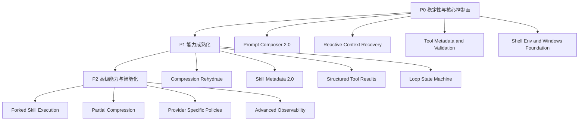

# Bamboo 强化路线图与分阶段 Backlog

> 目标：在 **不牺牲 Bamboo 工程化优势** 的前提下，系统吸收 Claude Code 在 runtime、prompt、tools、skill、shell、compression 等方面的成熟经验。
>
> 核心原则：
>
> - **学习能力，不复制形态**
> - **保留 Bamboo 的分层后端架构**
> - **优先补齐会影响稳定性和上限的关键短板**
> - **先路线图/backlog，再启动 P0 实施**

---

## 0. 我们已经形成的共识

### Bamboo 不应放弃的工程化优势

1. **分层后端 runtime**
   - 不回退到单体 giant query loop
2. **tool registry / executor / orchestrator / policy 分离**
   - 保持能力注册、执行、审批、策略分层
3. **skill governance**
   - global/project/mode/allowlist 是优势，不是负担
4. **tool guide system**
   - 集中管理工具使用语义，适合服务端演进
5. **archival compression model**
   - `compressed flag + conversation_summary + compression_events` 非常适合平台化产品
6. **prompt composer observability**
   - prompt fingerprint/version/component lengths 是很好的基础

### Bamboo 最值得吸收的 Claude Code 思路

1. richer tool metadata / validation / result mapping
2. role-specific prompt families + static/dynamic boundary
3. shell env/session overlay + Windows/PowerShell 更细支持
4. multi-layer context compression + reactive recovery
5. 更显式的 loop transition / execution state machine
6. skill richer metadata + optional fork execution

---

## 1. 路线图总览

---

# 2. P0：先解决稳定性、控制面和上限问题

P0 的标准不是“看起来最酷”，而是：

- 能显著提升 Bamboo 长会话稳定性
- 能显著提升模型行为一致性
- 能作为后续 P1/P2 的架构基础
- 不要求先重构整个系统

---

## P0-1 Prompt Composer 2.0

### 目标

把当前 prompt assembly 进化成真正的 **layered prompt composer**，明确：

- static / dynamic 边界
- role prompt families
- section-level metadata
- prompt cache / observability 友好结构

### 当前基础

已有：
- `prompt_setup.rs`
- prompt fingerprint/version
- tool guide context
- skill metadata context
- Lotus enhancement pipeline

### 要做什么

#### 1. 定义 Prompt Layer
建议至少拆成 5 层：

1. `CoreStatic`
2. `CapabilityTool`
3. `SkillMetadata`
4. `EnvironmentWorkspace`
5. `SessionRuntime`

#### 2. 引入 static / dynamic boundary
明确记录：
- `static_hash`
- `dynamic_hash`
- `full_hash`

#### 3. 引入 prompt families
先支持：
- `root_session`
- `child_session`
- `reviewer`
- `researcher`

#### 4. 把 Lotus enhancement 映射成 typed sections
- OS info
- Mermaid
- Task enhancement
- Copilot conclusion enhancement
- workspace context

#### 5. 增强 observability
- section ids
- section lengths
- enabled flags
- prompt assembly report

### 产出

- `PromptSection` / `PromptLayer` / `PromptAssemblyReport` 数据模型
- Prompt Composer 2.0 实现
- 兼容现有 tool guide / skill context / Lotus enhancement
- 调试日志/metrics

### 风险

- prompt 行为回归
- 现有增强规则顺序变化引起行为漂移

### 风险控制

- 先做兼容模式
- 先用旧 prompt 结果作 golden snapshot
- 先让新 composer 输出 report，不马上切默认路径

---

## P0-2 Reactive Context Recovery

### 目标

为 Bamboo 增加真正的 **prompt-too-long / overflow recovery path**，而不是只依赖 proactive compression + hard-fit。

### 当前基础

已有：
- budget trigger/target
- host-driven compression
- conversation summary
- hard-limit fitting
- prompt-side tool output compaction

### 要做什么

#### 1. 定义 overflow recovery state
例如：
- `NoRecoveryAttempted`
- `ForcedCompressionRetried`
- `RecoveryExhausted`

#### 2. 在 provider error path 中识别
- prompt too long
- request too large
- maybe media/input too large（后续）

#### 3. 增加 forced compression retry
流程：
- 捕获 overflow
- 构建 forced compression plan
- apply summary compression
- rebuild prepared context
- retry 当前 round 一次

#### 4. 增加 anti-spiral guard
- 每 round 最多 reactive recovery 1 次
- session 级 consecutive failure 计数
- stop hook / clarification / compression 不要互相打架

### 产出

- overflow recovery state model
- loop 中的 recovery path
- metrics / logs / events

### 风险

- 反复压缩/重试导致循环
- summary 质量不稳导致行为飘

### 风险控制

- 单轮单次恢复 guard
- session 级 circuit breaker
- summary 失败回退 heuristic summarizer

---

## P0-3 Tool Metadata and Validation Upgrade

### 目标

在不破坏 Bamboo 当前 tool trait 简洁性的前提下，为核心工具增加更强的元信息和 validation 语义。

### 为什么是 P0

因为这件事会直接影响：
- 工具调用正确率
- prompt/tool guide 质量
- 并发调度正确性
- 未来 classifier / permission / UX 提示能力

### 要做什么

#### 1. 为核心工具引入可选 metadata
建议先补：
- `read_only`
- `concurrency_safe`
- `destructive`
- `search_hint`
- `activity_description`
- `classifier_input_hint`

#### 2. 补 richer descriptions
优先补：
- `Read`
- `Grep`
- `Glob`
- `Edit`
- `Bash`

#### 3. 核心工具 validation 升级
优先做：
- `Read` 特殊路径/device guard
- `Read` unchanged/dedup stub
- `Grep` pagination/continuation metadata
- `Edit` richer result / diff summary

#### 4. structured result envelope（最小版）
不是所有工具都要重做，但可以从核心工具开始加 machine-readable metadata。

### 产出

- Tool metadata 扩展模型
- 核心工具 richer descriptions
- 核心工具 validation 增强
- 部分 structured result fields

### 风险

- schema 变动导致调用漂移
- 工具描述变动影响模型稳定性

### 风险控制

- 先保证 tool name / core args 不变
- description 与 tool guide 联调
- 对高频工具做 golden transcript 对比

---

## P0-4 Shell Env and Windows Foundation

### 目标

把 shell/session env/Windows 支持补到“稳定可用、后续可扩展”的程度。

### 要做什么

#### 1. Session env overlay
- 支持 session 级 env var 叠加
- 不只依赖 config env_vars

#### 2. Hook-derived env continuation
- 允许 setup / session 阶段生成的环境影响后续 Bash

#### 3. Subprocess scrub baseline
- 至少在 CI / remote / untrusted mode 中做 secrets scrub

#### 4. PowerShell foundation
- 把 PowerShell support 从 process utils 特例推进为更正式路径

### 产出

- session env overlay model
- subprocess env policy
- Windows/PowerShell foundation design

### 风险

- env 行为变化引起兼容性问题

### 风险控制

- feature flag
- 只先在 Bamboo 内部路径启用
- 对 injected env / config env 做优先级清晰定义

---

# 3. P1：把核心能力做成熟

---

## P1-1 Post-Compression Rehydrate

### 目标

压缩后不只是留 summary，而是重建“继续工作的上下文壳”。

### 内容

建议优先恢复：
- task list snapshot
- selected / loaded skill state
- workspace context snapshot
- recent critical file refs
- active clarification state

### 原因

这是 Claude Code 在 compact 之后最成熟的一点之一，而 Bamboo 当前还偏“只给 summary + recent window”。

---

## P1-2 Skill Metadata 2.0

### 目标

扩充 skill frontmatter，同时保持 Bamboo 的治理模式。

### 内容

建议新增：
- `execution_context`
- `effort`
- `model`
- `shell`
- `hooks`
- `paths`

### 原则

不是要把 skill 变成随意脚本，而是让 skill 更能描述自己的 runtime 需求。

---

## P1-3 Structured Tool Results

### 目标

把高频工具的结果从“只有字符串”升级到“字符串 + 可消费 metadata”。

### 优先工具
- Read
- Grep
- Glob
- Edit
- Bash

### 价值

- 更好地支持模型 continuation
- 更好地支持 UI 展示
- 更好地支持 session replay / analysis

---

## P1-4 Loop State Machine

### 目标

把 Bamboo 当前分层 loop 进一步显式化为状态机。

### 建议状态

- `PreparingContext`
- `SamplingLLM`
- `ExecutingTools`
- `AwaitingClarification`
- `EvaluatingTasks`
- `CompressingContext`
- `RecoveringOverflow`
- `Completed`
- `Failed`

### 价值

- 更利于 recovery 建模
- 更利于 telemetry / UI
- 更利于后续 sub-session / scheduler / skill fork 扩展

---

# 4. P2：做高级能力，不急着最先上

---

## P2-1 Optional Forked Skill Execution

### 目标

让复杂 skill 可以选择：
- inline
- fork

### 前提

必须先完成：
- role prompt families
- loop state model
- reactive recovery 基础

---

## P2-2 Partial Compression

### 目标

支持 prefix/suffix 局部压缩，而不是只做“旧历史统一归档”。

### 原因

这会更灵活，但也更复杂，适合作为 P2。

---

## P2-3 Provider/Model-specific Policies

### 目标

按 provider/model 调整：
- prompt policy
- compression thresholds
- tool description strategies
- output token recovery behavior

---

## P2-4 Advanced Observability

### 内容

- prompt section diff
- recovery path metrics
- tool usage quality metrics
- compression quality metrics
- skill selection telemetry

---

# 5. 建议的实施顺序

## 方案原则

先做那些：
- 对后续模块有基础性价值
- 不需要先大重构
- 风险可控
- 收益明确

---

## 推荐顺序

### Phase 1
1. **Prompt Composer 2.0**
2. **Reactive Context Recovery**

### Phase 2
3. **Tool Metadata and Validation Upgrade**
4. **Shell Env and Windows Foundation**

### Phase 3
5. **Post-Compression Rehydrate**
6. **Skill Metadata 2.0**
7. **Loop State Machine**

### Phase 4
8. **Structured Tool Results**
9. **Optional Forked Skill Execution**
10. **Partial Compression / Provider-specific Policies**

---

# 6. 为什么推荐先做 Prompt Composer 2.0？

这是当前最推荐的首个 P0。

## 原因 1：它是很多后续能力的基础层

后续这些都依赖它：
- role prompt families
- skill metadata richer injection
- better tool guidance
- compression-aware prompt behavior
- child session / reviewer / researcher prompts

## 原因 2：收益高，风险相对可控

相比直接改 loop 或 compression recovery：
- Prompt Composer 2.0 更容易做兼容模式
- 更容易做对照测试
- 不会立刻引入复杂 runtime 失败模式

## 原因 3：它能把现有 Lotus/Bamboo 的优势真正工程化

我们已经有：
- enhancement pipeline
- skill metadata context
- tool guide context
- prompt fingerprint

Prompt Composer 2.0 不是从 0 开始，而是把已有优势正式化。

---

# 7. 推荐首个 P0 模块

## 推荐：P0-1 Prompt Composer 2.0

### 范围控制

首轮不要做太大，先做：

1. 定义 `PromptSection` / `PromptLayer`
2. 实现 static/dynamic boundary
3. 把现有 skill context / tool guide context / Lotus enhancement 映射进新 composer
4. 产出 assembly report + hashes
5. 保持旧 prompt 兼容路径

### 首轮不做

- 不先做所有 role families
- 不先改动全部 prompt 文案
- 不先做 provider-specific branching
- 不先把整个 loop 都改掉

### 第一阶段完成标准

- 新旧 prompt 可并行输出/对比
- section metadata 可观测
- static/dynamic hash 可用
- 至少 root session prompt 完整迁移

---

# 8. 对应 backlog（可直接拆 issue）

## P0 Backlog

### P0-1 Prompt Composer 2.0
- 定义 PromptSection / PromptLayer 数据结构
- 引入 static/dynamic boundary
- 实现 PromptAssemblyReport
- 迁移 skill context 注入
- 迁移 tool guide 注入
- 迁移 Lotus enhancement 注入
- 输出 prompt section hashes / lengths / flags
- 建立旧新 composer 对照测试

### P0-2 Reactive Context Recovery
- 定义 overflow recovery state
- provider error 分类支持 prompt-too-long
- forced compression retry path
- per-round recovery guard
- session-level compression circuit breaker
- overflow metrics/events

### P0-3 Tool Metadata and Validation Upgrade
- 核心工具 metadata 扩展模型
- Read/Grep/Glob/Edit/Bash description 升级
- Read dedup / unchanged stub 设计
- Read special path/device guard
- Grep pagination metadata
- Edit richer diff/result summary

### P0-4 Shell Env and Windows Foundation
- session env overlay
- hook-derived env continuation
- subprocess scrub baseline
- PowerShell foundation design

---

## P1 Backlog

### P1-1 Post-Compression Rehydrate
- task snapshot rehydrate
- skill state rehydrate
- workspace snapshot rehydrate
- critical file refs rehydrate

### P1-2 Skill Metadata 2.0
- frontmatter 扩展
- selection/runtime 兼容
- prompt injection 兼容

### P1-3 Structured Tool Results
- Read result envelope
- Grep result envelope
- Glob result envelope
- Edit result envelope
- Bash result envelope

### P1-4 Loop State Machine
- 定义 loop state enum
- runner 状态迁移抽象
- telemetry / UI 对齐

---

## P2 Backlog

### P2-1 Optional Forked Skill Execution
### P2-2 Partial Compression
### P2-3 Provider-specific Policies
### P2-4 Advanced Observability

---

# 9. 最终建议

## 战略判断

Bamboo 现在最应该做的不是“重写”，而是：

> **以 Prompt Composer 2.0 为第一块基石，逐步把 prompt、tool、compression、skill、loop 的增强统一到一个可观测、可治理、可恢复的后端架构里。**

## 实施顺序建议

1. 先完成路线图与 backlog
2. 再启动 **P0-1 Prompt Composer 2.0** 设计
3. 设计完成后，再进入 Reactive Context Recovery

---

# 10. 下一步建议

下一步最合理的是：

1. **把 P0-1 Prompt Composer 2.0 拆成详细设计文档**
2. 或者 **把上面的 backlog 转成 GitHub Issues 草案**
3. 或者 **先把路线图里的 P0/P1 做 owner/module 分配**
