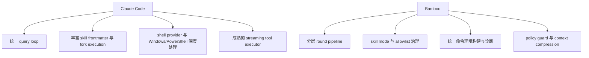

# Claude Code vs Bamboo Runtime Deep Dive

> 聚焦运行时内部机制，而不是产品层：
>
> 1. Skill 发现 / 选择 / 执行
> 2. Bash 工具与环境变量注入
> 3. Windows 特殊处理
> 4. 错误处理与 agent loop 深入机制
>
> 对比对象：
>
> - Claude Code: `/Users/bigduu/Workspace/TauriProjects/claude-code`
> - Bamboo runtime: `/Users/bigduu/Workspace/TauriProjects/zenith/bamboo`

---

## Executive Summary

### 总结一句话

Claude Code 的 runtime 更像一个 **单体化、工具/技能/子代理/权限/压缩深度耦合的统一执行内核**；Bamboo 的 runtime 更像一个 **后端服务化、分层明确、策略与执行相分离的 agent engine**。

### 深入结论

1. **Skill 体系**：Claude Code 更动态、更“生态化”，支持更丰富 frontmatter、更多来源和 forked execution；Bamboo 更可控、更适合服务端治理，并且已经把 skill 与 tool allowlist 绑定起来。
2. **Bash / 环境变量**：Claude Code 更重视“会话环境继承、shell snapshot、hook env、子进程 secret scrub、PowerShell provider”这类开发者工作流细节；Bamboo 更重视“后端统一构建命令环境、跨平台稳定执行、返回环境诊断”。
3. **Windows 特殊处理**：Claude Code 在 shell provider 级别处理 Bash/PowerShell 差异、snap/path/encoding/sandbox 细节；Bamboo 在后端 process utils 级别处理 Windows no-window、PATH/PATHEXT、Python discovery、Windows shell trace 等问题。
4. **错误处理与 agent loop**：Claude Code 的 query loop 更像一个大一统状态机，容纳 compact、tool orchestration、fallback、abort、budget；Bamboo 则把这些拆成 round driver / context prep / stream execution / tool execution / task evaluation / policy guard 多层模块，更利于后端维护和测试。
5. **最值得学习的不是“回到单体”**，而是把 Claude Code 在 shell/provider、skill metadata、worker protocol、loop state machine、error recovery 这些成熟经验，迁移成 Bamboo 的分层实现。

---

## 一、Skill：发现、选择、执行

## 1. Claude Code 的 Skill 体系：更像“运行时插件系统”

### 1.1 多来源技能发现

Claude Code 的 `loadSkillsDir.ts` 明确区分技能来源：

- `skills`
- `plugin`
- `managed`
- `bundled`
- `mcp`

证据：
- `claude-code/src/skills/loadSkillsDir.ts:67`

这说明 Claude Code 的 skill 不是单纯读本地目录，而是多来源聚合。

### 1.2 Skill frontmatter 更丰富

Claude Code 的 skill frontmatter 解析包含：

- `allowed-tools`
- `argument-hint`
- `arguments`
- `when_to_use`
- `version`
- `model`
- `disable-model-invocation`
- `hooks`
- `context` (`inline` / `fork`)
- `agent`
- `effort`
- `shell`
- `paths`

证据：
- `claude-code/src/skills/loadSkillsDir.ts:181-263`
- `claude-code/src/skills/loadSkillsDir.ts:317-400`

这已经非常接近“轻量插件 manifest”。

### 1.3 Skill 可以选择 inline 或 fork 执行

Claude Code 的 `SkillTool` 里有非常关键的实现：

- `executeForkedSkill(...)`
- skill 最终通过 `runAgent(...)` 在 forked sub-agent context 中执行

证据：
- `claude-code/src/tools/SkillTool/SkillTool.ts:118-123`
- `claude-code/src/tools/SkillTool/SkillTool.ts:221-236`

这意味着 Claude Code 的 skill 不只是“把 SKILL.md 拼到 prompt 里”，而是：

> 某些 skill 可以作为隔离子代理运行，拥有自己的消息轨迹、预算、模型配置和工具进度。

### 1.4 Skill discovery 是 runtime tracking 的一部分

Claude Code 的 `ToolUseContext` 里直接有：

- `dynamicSkillDirTriggers`
- `discoveredSkillNames`
- `loadedNestedMemoryPaths`

证据：
- `claude-code/src/Tool.ts:215-225`

而 `QueryEngine` 也维护：

- `discoveredSkillNames`
- `loadedNestedMemoryPaths`

证据：
- `claude-code/src/QueryEngine.ts:192-198`

说明 skill discovery 不只是静态加载，而是 turn-scoped runtime behavior。

---

## 2. Bamboo 的 Skill 体系：更像“后端策略治理系统”

### 2.1 Skill metadata 明确受控，且比 Claude Code 更简化

Bamboo 当前的 markdown skill frontmatter 主要包括：

- `name`
- `description`
- `license`
- `compatibility`
- `allowed-tools`
- `argument-hint`
- `metadata`

证据：
- `zenith/bamboo/src/agent/skill/store/parser.rs:9-30`

相比 Claude Code，Bamboo 的 metadata 设计更克制，但已经覆盖最核心的治理属性。

### 2.2 Skill ID / 命名规则更严格

Bamboo 强制：

- skill id 来源于目录名
- 要求 kebab-case
- 名称必须与目录名或 namespace:suffix 一致

证据：
- `zenith/bamboo/src/agent/skill/store/parser.rs:45-70`
- `zenith/bamboo/src/agent/skill/store/parser.rs:157-207`

这意味着 Bamboo 在 skill 资产治理上更偏规范化。

### 2.3 Skill discovery 支持 global / project / mode override

Bamboo 的 `SkillStore` 支持：

- 全局目录
- 项目目录
- `skills-<mode>` sibling 目录
- `.bamboo/skills-<mode>` 项目级模式目录
- project 覆盖 global
- mode skill 覆盖 generic skill

证据：
- `zenith/bamboo/src/agent/skill/store/mod.rs:132-180`
- `zenith/bamboo/src/agent/skill/store/mod.rs:183-253`

这是 Bamboo skill system 很强的地方：

> 它不是只做“发现”，还做了“层级覆盖规则”和“模式化优先级”。

### 2.4 Skill context 是 metadata-only，正文按需 load

Bamboo 的 `build_skill_context` 只把 skill metadata 注入系统 prompt：

- id
- name
- description
- allowed tools
- compatibility hint

但不会把 SKILL.md 正文塞进 prompt。

证据：
- `zenith/bamboo/src/agent/skill/context.rs:3-97`

然后再通过：
- `load_skill`
- `read_skill_resource`

按需拉正文和资源。

证据：
- `zenith/bamboo/src/server/tools/skill_runtime.rs:17-22`
- `zenith/bamboo/src/server/tools/skill_runtime.rs:145-177`

这是一种非常节省上下文窗口的设计。

### 2.5 Skill 选择与 tools allowlist 强绑定

Bamboo 会根据 session 的：

- `selected_skill_ids`
- `skill_mode`
- 全局 disabled skill IDs

计算允许的工具列表。

证据：
- `zenith/bamboo/src/server/handlers/skill/tools.rs:23-54`

这个设计比 Claude Code 更偏治理：

> skill 不只是“提示模板”，而是真正影响模型可见 tool surface 的上游策略层。

---

## 3. Skill 结论

### Claude Code 强在
- 来源多
- metadata 丰富
- runtime tracking 深
- skill 可 fork 执行
- 更像生态系统

### Bamboo 强在
- 模式化覆盖规则清楚
- 资产治理更严谨
- metadata-only prompt 更省 token
- skill 与 tool allowlist 绑定得更好

### Bamboo 最值得学习的 3 点

1. **补 richer frontmatter**
   - `effort`
   - `executionContext`
   - `shell`
   - `hooks`
   - `paths`
   - `model override`

2. **增加 forked skill execution 模式**
   - 不是全部都需要，但复杂 skill 可以支持 `inline` / `fork`

3. **增加 runtime-level discovery tracking**
   - 记录哪个 skill 是“自动发现”的、哪个是“显式选择”的

---

## 二、Bash：环境变量、命令环境构建、Shell Provider

## 1. Claude Code：更像“开发者工作流 shell runtime”

### 1.1 Shell 抽象是 provider-based

Claude Code 在 `Shell.ts` 里统一管理 shell 执行，并根据 shell type 选择 provider：

- `createBashShellProvider(...)`
- `createPowerShellProvider(...)`

证据：
- `claude-code/src/utils/Shell.ts:37-40`
- `claude-code/src/utils/Shell.ts:139-159`

这意味着 Bash 和 PowerShell 不是简单 if/else，而是两个独立 provider。

### 1.2 Bash provider 会恢复 shell snapshot + session env

在 `bashProvider.ts` 中：

- 会尝试创建并 source shell snapshot
- 会 source session environment script
- 会禁用 extglob 以避免安全问题
- 会对 Windows temp path 做 POSIX 转换
- 会把 hook / env 文件带来的环境拼进命令

证据：
- `claude-code/src/utils/shell/bashProvider.ts:63-66`
- `claude-code/src/utils/shell/bashProvider.ts:158-185`
- `claude-code/src/utils/shell/bashProvider.ts:167-178`

### 1.3 Session environment 不是简单 env map，而是脚本拼接

Claude Code 的 `sessionEnvironment.ts`：

- 从 `~/.claude/session-env/<session-id>/` 读取 hook env files
- 支持 `CLAUDE_ENV_FILE`
- 把多个脚本按顺序拼接成 sessionEnvScript
- Windows 上暂不支持这个能力

证据：
- `claude-code/src/utils/sessionEnvironment.ts:15-23`
- `claude-code/src/utils/sessionEnvironment.ts:60-144`
- `claude-code/src/utils/sessionEnvironment.ts:61-64`

这意味着 Claude Code 能把 setup hook / session start hook / cwd changed hook 带来的环境改动持续作用到后续 shell commands。

### 1.4 还有 session-scoped env vars map

除了脚本环境，Claude Code 还有 `/env` 风格的 session env vars：

- `getSessionEnvVars()`
- `setSessionEnvVar()`
- `deleteSessionEnvVar()`

证据：
- `claude-code/src/utils/sessionEnvVars.ts:1-22`

这些 env vars 会在 bashProvider / powershellProvider 里注入到 child process。

### 1.5 对子进程环境做 secret scrub

Claude Code 的 `subprocessEnv.ts` 在 GitHub Actions 等高风险环境下，会把敏感变量从 subprocess env 中删掉，例如：

- `ANTHROPIC_API_KEY`
- cloud provider secrets
- OTEL headers
- GitHub Actions OIDC/runtime tokens

证据：
- `claude-code/src/utils/subprocessEnv.ts:3-53`
- `claude-code/src/utils/subprocessEnv.ts:79-98`

这个点非常成熟，说明它不只是“给 Bash 跑命令”，而是认真考虑了 prompt injection 通过 shell expansion 窃取 secrets 的风险。

### 1.6 Bash tool 本身能力非常厚

Claude Code 的 BashTool 本身还耦合了：

- security parsing
- permission logic
- sandbox decision
- auto backgrounding
- file history tracking
- VS Code file update notify
- large output persistence
- structured output hints

证据：
- `claude-code/src/tools/BashTool/BashTool.tsx:13-50`
- `claude-code/src/tools/BashTool/BashTool.tsx:227-295`

换句话说，Claude Code 的 Bash tool 不只是“执行命令”，而是一个 **大型 shell workflow runtime**。

---

## 2. Bamboo：更像“后端统一命令环境构建器”

### 2.1 BashTool 先统一构造 PreparedCommandEnvironment

Bamboo 的 `BashTool` 并不是直接 `Command::new(...).spawn()`，而是先：

- `Config::current_env_vars()`
- `build_command_environment(&overrides)`

证据：
- `zenith/bamboo/src/agent/tools/tools/bash.rs:180-183`
- `zenith/bamboo/src/agent/tools/tools/bash_runtime.rs:135-142`

也就是说 Bamboo 的 shell 环境由后端统一构造，而不是散落在各个 provider 中。

### 2.2 命令结果会返回环境诊断

Bamboo 的 Bash foreground result 里不只是 stdout/stderr/exit code，还会回传：

- `environment.source`
- `import_shell`
- `import_error`
- `PATH`
- `path_entries`
- `python diagnostics`

证据：
- `zenith/bamboo/src/agent/tools/tools/bash.rs:111-136`
- `zenith/bamboo/src/agent/tools/tools/bash.rs:301-315`

这一点其实很强，因为它更利于在 GUI/日志里做诊断。

### 2.3 覆盖来源是 Bamboo config 的 env_vars

Bamboo 配置明确支持：

- `env_vars: Vec<EnvVarEntry>`
- 用户管理的环境变量会注入 Bash tool 进程

证据：
- `zenith/bamboo/src/core/config.rs:163-168`

这说明 Bamboo 的 env 注入是：

> 以后端配置为 source of truth，而不是 REPL 内存变量为主。

### 2.4 非 Windows 会尝试导入 Unix login shell 环境；Windows 直接继承 process env

在 `build_command_environment()` 里：

- Windows：`ImportedCommandEnvironment::from_process_env(None)`
- 非 Windows：`imported_unix_shell_environment_cached().await`

证据：
- `zenith/bamboo/src/core/process_utils.rs:158-183`

这点和 Claude Code 不一样：

- Claude Code 更像“每个 shell provider 自己拼环境”
- Bamboo 更像“统一环境导入器”

---

## 3. Bash/env 结论

### Claude Code 强在
- shell provider 细节成熟
- session env script / hooks integration 很强
- `/env` 会话变量与 provider 集成
- subprocess secret scrub 非常成熟
- PowerShell / Bash 双轨都产品化得很细

### Bamboo 强在
- 环境构建统一、后端化
- 返回环境诊断更清晰
- 配置驱动 env 注入更稳
- 对 UI/服务端调试更友好

### Bamboo 最值得学习的 4 点

1. **增加 session-scoped env overlay，而不只靠全局 config env_vars**
2. **支持 hook/script 级环境持续注入**
3. **增加 subprocess secret scrub 策略**
4. **把 shell provider 抽象再显式化（bash / powershell）**

---

## 三、Windows 特殊处理

## 1. Claude Code：在 shell provider 级别处理 Windows 差异

### 1.1 默认 shell 不会自动切到 PowerShell

Claude Code 明确：

- `defaultShell` 默认为 `bash`
- 即使在 Windows 也不会自动 flip 到 PowerShell

证据：
- `claude-code/src/utils/shell/resolveDefaultShell.ts:4-13`

这是一个很有意思的产品决策：保持跨平台 prompt 行为一致，避免 Windows 用户的 bash hooks/经验被打断。

### 1.2 PowerShell 有独立 provider

PowerShell provider 处理了：

- `-NoProfile -NonInteractive`
- `-EncodedCommand`（UTF-16LE base64）
- sandbox 情况下避免 quoting 污染
- `TMPDIR / CLAUDE_CODE_TMPDIR`
- session env vars

证据：
- `claude-code/src/utils/shell/powershellProvider.ts:8-24`
- `claude-code/src/utils/shell/powershellProvider.ts:35-121`

这说明 Claude Code 不只是“支持 PowerShell”，而是非常认真处理了 quoting / encoding / sandbox 兼容。

### 1.3 Bash provider 对 Windows 也做了 path/redirect 兼容处理

例如：

- Windows temp path 转成 POSIX path 给 Git Bash 用
- 把 `2>nul` 这类 CMD 风格重定向改写掉
- `${CLAUDE_SKILL_DIR}` 在 Windows 下替换为 `/` 风格路径

证据：
- `claude-code/src/utils/shell/bashProvider.ts:108-127`
- `claude-code/src/skills/loadSkillsDir.ts:356-363`

### 1.4 PowerShell detection 有平台和版本语义

- 优先 `pwsh`
- 回退 `powershell`
- 区分 `core` vs `desktop`
- Linux snap 还要规避 launcher hanging

证据：
- `claude-code/src/utils/shell/powershellDetection.ts:14-57`
- `claude-code/src/utils/shell/powershellDetection.ts:72-99`

这非常细。

---

## 2. Bamboo：在 process utils 级别处理 Windows 差异

### 2.1 Windows 使用 no-window 进程创建标志

Bamboo 在 Windows 下定义：

- `CREATE_NO_WINDOW`
- `hide_window_for_tokio_command(...)`

证据：
- `zenith/bamboo/src/core/process_utils.rs:15-16`
- `zenith/bamboo/src/agent/tools/tools/bash.rs:206-207`
- `zenith/bamboo/src/agent/tools/tools/bash_runtime.rs:137-142`

### 2.2 Windows 上环境来源直接用 process env

Bamboo 明确：
- Windows 不走 Unix login shell 导入
- 直接继承当前进程环境

证据：
- `zenith/bamboo/src/core/process_utils.rs:173-177`

### 2.3 Windows 上做 PATH / PATHEXT / Python discovery 处理

`process_utils.rs` 里有：
- `PATHEXT` 解析
- 可执行扩展名推断
- Python candidate / diagnostics
- Windows 路径提示与尝试列表

证据：
- `zenith/bamboo/src/core/process_utils.rs:241-260`
- `zenith/bamboo/src/core/process_utils.rs:199-239`

### 2.4 Windows command tracing

Bamboo 的 Bash tool/runtime 还支持：
- `trace_windows_command(...)`
- `windows_command_trace_enabled()`
- 把实际 shell program + arg + command 打到 token/event 里

证据：
- `zenith/bamboo/src/agent/tools/tools/bash.rs:192-201`
- `zenith/bamboo/src/agent/tools/tools/bash_runtime.rs:129-136`

这对于 Windows debug 非常实用。

---

## 3. Windows 结论

### Claude Code 更强在
- shell/provider abstraction
- PowerShell first-class 支持
- quoting / encoding / sandbox / redirect 的细粒度修补
- prompt 层也会根据 shell edition 区分语义

### Bamboo 更强在
- 统一后端 process utils
- 环境诊断返回给上层
- Windows 调试信息更后端可观测
- 更适合服务端排错

### Bamboo 最值得学习的 3 点

1. **引入 PowerShell provider 作为正式一等路径**
2. **补更细的 Windows quoting / redirect 兼容处理**
3. **让 prompt/tool schema 感知当前 shell edition / platform 差异**

---

## 四、错误处理与 Agent Loop 深入机制

## 1. Claude Code：统一 query loop，恢复逻辑集中

### 1.1 query loop 是真正的 runtime core

Claude Code 的 `query.ts` 统一管理：

- auto compact
- reactive compact
- context collapse
- token budget
- tool orchestration
- stop hooks
- pending tool use summary
- streaming fallback
- maxTurns / turnCount

证据：
- `claude-code/src/query.ts:8-20`
- `claude-code/src/query.ts:181-217`
- `claude-code/src/query.ts:219-307`

这是一个真正的大一统状态机。

### 1.2 tool orchestration 是 query loop 内建的一部分

`runTools(...)` 会：

- 按 `isConcurrencySafe` 把 tool calls 分 batch
- read-only/concurrency-safe 并发执行
- mutating 工具串行执行
- 保持 contextModifier 的顺序应用

证据：
- `claude-code/src/services/tools/toolOrchestration.ts:19-81`
- `claude-code/src/services/tools/toolOrchestration.ts:84-116`

### 1.3 StreamingToolExecutor 处理并行执行中的 abort / sibling error / interruption

它会处理：

- queued / executing / completed / yielded 状态
- sibling tool error 触发联动 abort
- user interrupted / streaming fallback synthetic error
- interruptBehavior = cancel/block

证据：
- `claude-code/src/services/tools/StreamingToolExecutor.ts:34-63`
- `claude-code/src/services/tools/StreamingToolExecutor.ts:126-151`
- `claude-code/src/services/tools/StreamingToolExecutor.ts:207-318`

这说明 Claude Code 的并发工具执行并不是简单 Promise.all，而是一个专门的执行器。

### 1.4 toolExecution.ts 对错误分类做得很细

`classifyToolError()` 会区分：
- TelemetrySafeError
- errno code
- stable name
- UnknownError

证据：
- `claude-code/src/services/tools/toolExecution.ts:139-170`

这对 telemetry 和调试很重要。

---

## 2. Bamboo：round-based pipeline + policy guard + context compression

### 2.1 AgentLoopConfig 已经很丰富

Bamboo 的 loop config 直接把这些东西放进 runtime：

- `max_rounds`
- `disabled_skill_ids`
- `selected_skill_ids`
- `selected_skill_mode`
- `tool_registry`
- `skill_manager`
- `reasoning_effort`
- `disabled_tools`
- `token_budget`
- `image_fallback`

证据：
- `zenith/bamboo/src/agent/loop_module/config.rs:33-78`

### 2.2 rounds driver 专门处理 retry 和 terminal failure

`run_rounds()`：

- 每轮最多重试 3 次 LLM round
- 通过 `should_retry_round_error()` 区分 retryable / non-retryable
- terminal error 记录 round failure metrics

证据：
- `zenith/bamboo/src/agent/loop_module/runner/loop_execution/rounds.rs:15-46`
- `zenith/bamboo/src/agent/loop_module/runner/loop_execution/rounds.rs:48-210`

### 2.3 LLM stream execution 里做 provider-specific 处理

Bamboo 的 `execute_llm_stream()` 会处理：

- `previous_response_id`
- provider 是否支持该能力
- `parallel_tool_calls: true`
- `reasoning_summary`
- token budget update event
- provider error 格式化

证据：
- `zenith/bamboo/src/agent/loop_module/runner/round_lifecycle/stream_execution.rs:34-38`
- `zenith/bamboo/src/agent/loop_module/runner/round_lifecycle/stream_execution.rs:101-105`
- `zenith/bamboo/src/agent/loop_module/runner/round_lifecycle/stream_execution.rs:141-158`
- `zenith/bamboo/src/agent/loop_module/runner/round_lifecycle/stream_execution.rs:175-253`

### 2.4 tool execution 有 policy guard

Bamboo 在工具执行前有明确的 policy 层：

- 每轮最大 tool call 数：80
- 单工具连续失败上限：3
- strict argument validation for risky tools
- `conclusion_with_options` 还会校验 narration/context

证据：
- `zenith/bamboo/src/agent/loop_module/runner/tool_execution/policy.rs:8-25`
- `zenith/bamboo/src/agent/loop_module/runner/tool_execution/policy.rs:76-140`
- `zenith/bamboo/src/agent/loop_module/runner/tool_execution/policy.rs:143-260`

这一层非常“产品化”，已经不只是 backend execute 了。

### 2.5 上下文压缩是 round lifecycle 的一部分

Bamboo 的 `context_preparation.rs` 会：

- 估算上下文暴露度
- 超阈值时自动做 host context compression
- 发 `ContextCompressionStatus` 事件
- 保存 summary 和压缩结果
- 再重新准备 prepared_context

证据：
- `zenith/bamboo/src/agent/loop_module/runner/round_lifecycle/context_preparation.rs:18-23`
- `zenith/bamboo/src/agent/loop_module/runner/round_lifecycle/context_preparation.rs:41-159`
- `zenith/bamboo/src/agent/loop_module/runner/round_lifecycle/context_preparation.rs:186-223`

### 2.6 还有 task evaluation 子循环

每轮工具执行后，Bamboo 还会触发 lightweight task evaluation：

- 只对 in-progress task items
- 会发 `TaskEvaluationStarted`
- 可以降级 reasoning effort
- 失败时不致命，返回 skipped evaluation

证据：
- `zenith/bamboo/src/agent/loop_module/task_evaluation/executor.rs:17-38`
- `zenith/bamboo/src/agent/loop_module/task_evaluation/executor.rs:40-126`

这说明 Bamboo 的 loop 已经不是“LLM -> tool -> LLM”这么简单，而是带任务治理的 pipeline。

---

## 3. Loop / error handling 结论

### Claude Code 强在
- 一个统一 query loop 管一切
- tool orchestration / abort / fallback 深度耦合
- StreamingToolExecutor 很成熟
- error telemetry 分类细致

### Bamboo 强在
- round-based 分层清晰
- policy guard 很强
- context compression 更后端可控
- task evaluation 明确集成到 loop 中
- provider-specific streaming 处理更干净

### Bamboo 最值得学习的 5 点

1. **把 loop transition state 再显式化**
2. **引入更统一的 tool execution state machine**
3. **增加 sibling error / interruption 的专门 runtime 抽象**
4. **提升错误分类用于 telemetry / UI 恢复提示**
5. **把 skill/runtime discovery tracking 嵌入 round loop**

---

## 最终判断

### 一句话总结

- **Claude Code 更像一个“成熟单体 runtime 内核”**
- **Bamboo 更像一个“清晰分层的 agent backend engine”**

### 如果只说最值得学什么

1. **Skill richer metadata + optional fork execution**
2. **Shell provider 抽象 + session env / secret scrub**
3. **PowerShell/Windows 更精细的一等支持**
4. **更统一的 tool execution state machine**
5. **更显式的 loop transition / recovery model**

### 如果只说不该学什么

不要为了学 Claude Code，把 Bamboo 重新做成一个巨型 `query.ts` 单体。对 Bamboo 来说，更好的路线是：

> 保持后端分层架构，同时吸收 Claude Code 在 shell/runtime/skill/loop 这些成熟实现细节上的经验。
