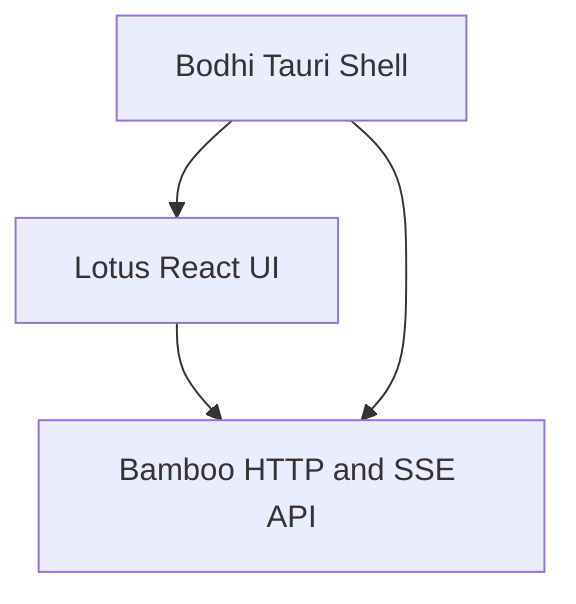
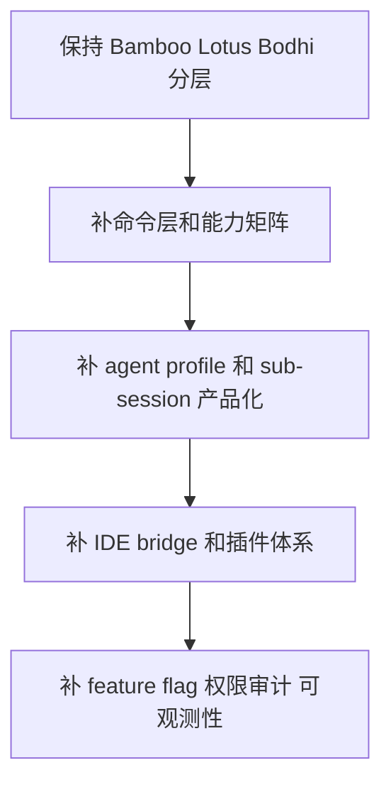

# Claude Code vs Zenith Agent 架构对比报告

> 对比对象说明：`zenith` 根仓本身只是一个 submodule wrapper；实际与 `claude-code` 对比的“我们的 agent”应理解为：
>
> - `bamboo`：Rust agent backend / tool runtime / server
> - `lotus`：React 前端 UI
> - `bodhi`：Tauri 桌面壳 + Bamboo 内嵌运行时

---

## Executive Summary

### 一句话结论

`claude-code` 更像一个**单体化、CLI-first、强内聚的本地 agent 产品**；而我们当前的 Zenith 体系更像一个**后端引擎（Bamboo）+ Web UI（Lotus）+ 桌面壳（Bodhi）的分层平台化产品**。

### 结论重点

1. **Claude Code 的优势在于“一个进程内完成一切”**：UI、tool loop、permissions、commands、plugins、bridge、skills 都在同一个 TypeScript/Bun 运行时里，功能密度极高。
2. **Zenith 的优势在于“天然分层、可嵌入、可替换”**：Bamboo 独立成 Rust backend，Lotus/Bodhi 只是消费方，因此更利于多端复用、HTTP API 暴露、桌面/网页共存。
3. **Claude Code 在产品完成度和工程成熟度上更领先**：启动优化、特性开关、插件系统、IDE bridge、命令生态、工作流/多 agent 编排都更完整。
4. **Zenith 在架构边界上其实更干净**：UI 与 agent loop 是明确跨进程/跨层通信，Bamboo 也已经具备 scheduler、sub-session、skill、task、SSE、同步保护等现代 agent 基础设施。
5. **最值得学习的不是“照搬 Claude Code 单体结构”**，而是学习它在**能力组织方式、启动性能、特性治理、插件化、命令层、IDE bridge、产品化细节**上的方法论，然后保留我们分层架构的优势。

---

## 1. 对比范围与证据来源

### Claude Code 关键证据

- 入口与启动：`/Users/bigduu/Workspace/TauriProjects/claude-code/src/main.tsx:1`
- 工具注册：`/Users/bigduu/Workspace/TauriProjects/claude-code/src/tools.ts:1`
- 命令注册：`/Users/bigduu/Workspace/TauriProjects/claude-code/src/commands.ts:1`
- Tool 类型系统：`/Users/bigduu/Workspace/TauriProjects/claude-code/src/Tool.ts:1`
- QueryEngine：`/Users/bigduu/Workspace/TauriProjects/claude-code/src/QueryEngine.ts:130`

### Zenith 关键证据

#### Bamboo
- 依赖与定位：`/Users/bigduu/Workspace/TauriProjects/zenith/bamboo/Cargo.toml:1`
- 内置工具模块：`/Users/bigduu/Workspace/TauriProjects/zenith/bamboo/src/agent/tools/tools/mod.rs:1`
- Tool executor / alias / registry：`/Users/bigduu/Workspace/TauriProjects/zenith/bamboo/src/agent/tools/executor.rs:35`
- Tool orchestrator：`/Users/bigduu/Workspace/TauriProjects/zenith/bamboo/src/agent/tools/orchestrator.rs:1`
- 并行工具运行时：`/Users/bigduu/Workspace/TauriProjects/zenith/bamboo/src/agent/tools/parallel.rs:1`
- agent execute handler：`/Users/bigduu/Workspace/TauriProjects/zenith/bamboo/src/server/handlers/agent/execute/handler/mod.rs:1`
- 子会话：`/Users/bigduu/Workspace/TauriProjects/zenith/bamboo/src/server/tools/spawn_session.rs:98`
- 子会话管理：`/Users/bigduu/Workspace/TauriProjects/zenith/bamboo/src/server/tools/sub_session_manager.rs:1`
- 定时调度：`/Users/bigduu/Workspace/TauriProjects/zenith/bamboo/src/server/tools/schedule_tasks.rs:13`

#### Lotus
- 前端入口：`/Users/bigduu/Workspace/TauriProjects/zenith/lotus/src/main.tsx:1`
- Agent service 类型与协议：`/Users/bigduu/Workspace/TauriProjects/zenith/lotus/src/services/chat/AgentService.ts:1`
- 事件订阅：`/Users/bigduu/Workspace/TauriProjects/zenith/lotus/src/hooks/useAgentEventSubscription.ts:1`
- API 客户端边界：`/Users/bigduu/Workspace/TauriProjects/zenith/lotus/src/services/api/client.ts:1`
- System prompt 增强管线：`/Users/bigduu/Workspace/TauriProjects/zenith/lotus/src/shared/utils/systemPromptEnhancement.ts:1`
- `conclusion_with_options` 强化：`/Users/bigduu/Workspace/TauriProjects/zenith/lotus/src/shared/utils/copilotConclusionWithOptionsEnhancementUtils.ts:1`
- 追问/确认 UI：`/Users/bigduu/Workspace/TauriProjects/zenith/lotus/src/components/QuestionDialog/QuestionDialog.tsx:1`

#### Bodhi
- Tauri 入口：`/Users/bigduu/Workspace/TauriProjects/zenith/bodhi/src-tauri/src/main.rs:1`
- Tauri 运行时与内嵌服务：`/Users/bigduu/Workspace/TauriProjects/zenith/bodhi/src-tauri/src/lib.rs:1`
- Bamboo 内嵌服务：`/Users/bigduu/Workspace/TauriProjects/zenith/bodhi/src-tauri/src/embedded/mod.rs:1`

---

## 2. 总体架构差异

### Claude Code：单体化、本地 CLI-first

Claude Code 的主入口 `main.tsx` 在一个 Bun/TypeScript 进程内完成：

- CLI 解析
- React + Ink 渲染
- tool registry 初始化
- command registry 初始化
- 权限模式设置
- mcp / lsp / analytics / auth / bridge / plugin / skill 初始化

从 `main.tsx` 的 import 规模和启动时副作用可以直接看出，它是一个**重单体入口**，但做了大量性能优化，例如：

- 顶层并发预取 MDM/Keychain：`claude-code/src/main.tsx:1-20`
- feature flag 条件装载：`claude-code/src/main.tsx:74-82`
- 运行时整合 commands / tools / bridge / plugins / skills：`claude-code/src/main.tsx:88-99`

其核心思想是：**把 Agent 产品所需的全部运行时能力尽量放在同一个进程和同一种语言里完成**。

### Zenith：后端引擎 + UI + Desktop Shell 分层

Zenith 当前明显是三层结构：

- **Bamboo**：负责模型调用、session、tool execution、skills、task、sub-session、scheduler、SSE 事件流
- **Lotus**：负责 chat UI、tool card、streaming、pending question、system prompt enhancement
- **Bodhi**：负责把 Bamboo 以 embedded web service 的形式运行在桌面端，并装载 Lotus 前端

Bodhi 明确把 Bamboo 当作内嵌 WebService 跑在 app 进程里，而不是 sidecar：
`zenith/bodhi/src-tauri/src/embedded/mod.rs:1-4,16-27,30-60`

这说明我们的体系本质上是：

- **Agent runtime 可以独立运行**
- **UI 只是消费 agent runtime 的一种客户端**
- **桌面壳只是部署与宿主层**

这与 Claude Code 的“单进程一体化产品”是很不一样的。

---

## 3. 核心定位差异

| 维度 | Claude Code | Zenith Agent |
|---|---|---|
| 形态 | CLI 产品为主 | 平台化 agent backend + UI + desktop |
| 技术栈 | TypeScript + Bun + Ink | Rust + Actix + React + Tauri |
| 架构风格 | 单体、高内聚 | 分层、可嵌入、可替换 |
| 运行边界 | 同进程 | 前后端边界清晰，HTTP/SSE 通信 |
| UI 载体 | Terminal UI | Web UI + Desktop WebView |
| 工具执行 | 本地进程内部直接调度 | Bamboo 后端集中执行 |
| 权限交互 | CLI/REPL 中原生处理 | Bamboo 判定 + Lotus/QuestionDialog 承载交互 |
| 多端复用 | 相对弱 | 很强，天然支持 Web/桌面/外部调用 |
| 插件/集成扩展 | 更成熟 | 有基础但产品化不如 Claude Code |

---

## 4. 运行时组织方式的差异

### Claude Code：QueryEngine 是中枢

Claude Code 的 `QueryEngine` 是整个对话/工具/权限/压缩流程的核心中心：

- `QueryEngineConfig` 同时接收 `cwd`、`tools`、`commands`、`mcpClients`、`agents`、`canUseTool`、`AppState` 等：`claude-code/src/QueryEngine.ts:130-173`
- `submitMessage()` 内部管理 conversation state、权限拒绝跟踪、session persistence、tool call、messages 等：`claude-code/src/QueryEngine.ts:175-212`

这意味着 Claude Code 的很多能力是**围绕 QueryEngine 聚合的统一运行时**。

### Bamboo：agent loop / tool runtime / server handler 分拆得更清楚

Bamboo 则把运行时拆得更干净：

- 工具注册：`bamboo/src/agent/tools/tools/mod.rs:1-54`
- 工具执行器：`bamboo/src/agent/tools/executor.rs:211-320`
- 工具 orchestration：`bamboo/src/agent/tools/orchestrator.rs:99-191`
- 工具并行 runtime：`bamboo/src/agent/tools/parallel.rs:25-145`
- 一轮工具调用执行：`bamboo/src/agent/loop_module/runner/tool_execution.rs:195-260`
- HTTP 执行入口：`bamboo/src/server/handlers/agent/execute/handler/mod.rs:167-259`

也就是说，Bamboo 当前是**服务化的 agent engine**，不是把所有 UI、状态、对话都绑死在一个 QueryEngine 类里。

### 评价

- Claude Code：更紧凑，产品体验路径更短
- Bamboo：更模块化，长期更利于独立演进、测试、替换 UI

**结论**：在长期架构上，我认为 Zenith/Bamboo 的分层方向是对的，不建议为了模仿 Claude Code 而回退成单体。

---

## 5. 工具系统差异

### Claude Code：工具面更广、特性开关更强

Claude Code 的 `tools.ts` 明确暴露非常多的 tool，并通过 feature flag / env 决定是否注册：

- 基础：Bash / Read / Edit / Write / Glob / Grep / WebFetch / WebSearch
- 高阶：AgentTool / SkillTool / LSPTool / MCP 资源工具 / WorkflowTool
- 编排：TaskCreate/Update/List / TeamCreate/Delete / SendMessage / EnterWorktree / ExitWorktree / ToolSearch / Sleep / Cron / RemoteTrigger

证据：`claude-code/src/tools.ts:1-135,193-250`

Claude Code 的工具组织有三个明显特点：

1. **工具总数大**
2. **功能覆盖面广**
3. **大量工具是 feature-gated 的**，同一份代码可以构建多个能力层次的产品

### Bamboo：工具更聚焦，但已有很好的基础层设计

Bamboo 当前内置工具模块包括：

- 文件/搜索：Read / Edit / Write / GetFileInfo / Glob / Grep
- 终端：Bash / BashOutput / KillShell
- 交互：Task / ExitPlanMode / conclusion_with_options / request_permissions
- 记忆与发现：memory_note / tool_search
- 环境：Workspace / WebFetch / WebSearch

证据：`bamboo/src/agent/tools/tools/mod.rs:1-54`

但 Bamboo 的亮点不是 tool 数量，而是**执行层设计已经非常现代**：

#### 1) 有 alias 兼容层
`apply_patch -> Edit`、`FileExists -> GetFileInfo`、`GetCurrentDir/SetWorkspace -> Workspace`：
`bamboo/src/agent/tools/executor.rs:64-78`

这很好，因为它在保留上层 prompt/tool calling 稳定性的同时，简化了底层实现。

#### 2) 有工具 guide registry
`ToolRegistry` 不只是存 tool，也能给 tool 绑定 guide：
`bamboo/src/agent/tools/tools/registry.rs:13-161`

这比普通 registry 更进一步，说明你们已经开始把“工具如何被模型正确使用”也系统化了。

#### 3) 有 orchestrator + retry + mutability classification
`ToolOrchestrator` 负责：
- 只读 / 变更工具分类
- 只读自动批准
- 瞬时错误重试
- 生命周期事件记录

证据：`bamboo/src/agent/tools/orchestrator.rs:17-191`

#### 4) 有并行工具执行运行时
`ToolCallRuntime` 用 `RwLock` 实现：
- 只读工具并行
- 变更工具串行

证据：`bamboo/src/agent/tools/parallel.rs:1-145`

这在 agent backend 里是非常值得肯定的设计。

### 结论

- **Claude Code 赢在工具生态厚度与产品完整度**
- **Bamboo 赢在工具执行抽象已经很干净，可持续演进**

---

## 6. 命令系统差异

### Claude Code：命令系统非常成熟

Claude Code 的 `/commands` 几乎是一个独立产品层：

- `/commit` `/review` `/compact` `/mcp` `/doctor` `/memory` `/skills` `/tasks` `/resume` `/share`
- 还有大量 feature-gated/internal-only command

证据：`claude-code/src/commands.ts:1-260`

换句话说，Claude Code 不只是“chat + tools”，而是**把大量高频 workflow 产品化成可发现、可复用、可组合的 command surface**。

### Zenith：目前更偏“聊天界面驱动”

Zenith 当前看起来主要是：

- Bamboo 提供 agent API + tool runtime
- Lotus 提供 chat-based UX
- 少量 structured UI，如 QuestionDialog、SkillManager、TaskList、SubSessionsPanel 等

这说明我们现在更偏向 **chat-first GUI agent**，而不是 **command-first power-user agent**。

### 可以学习什么

非常值得借鉴 Claude Code 的“command surface”思想：

- 把高频任务从 prompt 中剥离
- 做成显式命令/动作入口
- 让用户不用每次都重新描述意图

比如我们可以系统化出：

- `/review`
- `/fix`
- `/summarize_changes`
- `/trace_api`
- `/spawn_researcher`
- `/compact_context`
- `/export_session`
- `/schedule`

这会极大提升产品可发现性和稳定性。

---

## 7. 权限与安全模型差异

### Claude Code：权限是核心一等公民

从 `Tool.ts` 和 `main.tsx` 可看出 Claude Code 有非常完整的 permission mode 设计：

- default / plan / bypass / auto 等模式
- canUseTool 回调
- deny/allow/ask rules
- session 级权限上下文

证据：
- `claude-code/src/Tool.ts:122-148`
- `claude-code/src/main.tsx:120-123`

其权限体系是 deeply integrated 到 QueryEngine / REPL / tool lifecycle 里的。

### Bamboo：权限能力在后端更清楚，但 UI 交互仍可继续强化

Bamboo 目前有：

- `request_permissions` 工具
- `orchestrator` 中的只读自动批准逻辑：`bamboo/src/agent/tools/orchestrator.rs:58-85,121-190`
- executor 中的 permission checker：`bamboo/src/agent/tools/executor.rs:9-18`

与此同时，Lotus 还提供了 QuestionDialog 来承接 pending question / conclusion_with_options 等需要用户响应的场景：
`zenith/lotus/src/components/QuestionDialog/QuestionDialog.tsx:17-24,101-123,157-172`

### 差异总结

- Claude Code 的权限是**更深入、更一体化、更细颗粒**的
- Zenith 的权限是**后端中心化 + 前端交互式补充**

### 可以学习什么

1. 把权限模式显式产品化，例如：
   - Read-only
   - Ask on write
   - Auto in workspace only
   - Full trust
2. 把权限规则做成用户可见的 policy/profile
3. 提供更清晰的“本轮为什么允许/拒绝”解释与审计轨迹

---

## 8. 多 Agent / 子会话能力差异

### Claude Code：更偏 team / coordinator / swarm

Claude Code 在工具和 feature flag 层面已经明确具备：

- `AgentTool`
- `TeamCreateTool`
- `TeamDeleteTool`
- `SendMessageTool`
- `coordinator/`

证据：`claude-code/src/tools.ts:63-72,193-250`

这说明它的多 agent 编排已经不是附属能力，而是相对成熟的产品层能力。

### Bamboo：已经做到了“可用”，且服务化边界更好

Bamboo 的子会话设计实际上很不错：

- `SubSession` 负责创建并异步运行 child session：`bamboo/src/server/tools/spawn_session.rs:98-171`
- 禁止 child 递归再开 child：`bamboo/src/server/tools/spawn_session.rs:13-20`
- `sub_session_manager` 提供 list/get/update/run/send_message/delete：`bamboo/src/server/tools/sub_session_manager.rs:16-52`
- Lotus 端已经有 `SubSessionsPanel` 和子会话事件类型：`lotus/src/services/chat/AgentService.ts:27-30`

这套设计的优点是：

- 更可控
- 更容易被 UI 消费
- 更适合桌面/Web 产品呈现

### 评价

- Claude Code 的多 agent 更成熟、更丰富
- Bamboo 的多 session 机制更像“平台能力”，结构上并不差

### 可以学习什么

1. 给 SubSession 做**更明确的角色模板**（researcher / coder / reviewer / planner）
2. 给 parent-child 做**任务分解视图和汇总视图**
3. 做 child session 结果的自动聚合/投票/冲突合并
4. 引入更轻量的 team abstraction，而不是只有单 child session

---

## 9. 技能系统差异

### Claude Code：技能是原生一等能力

Claude Code 的 `main.tsx` 明确初始化 bundled skills：
`claude-code/src/main.tsx:93-99`

同时 `tools.ts` 中有 `SkillTool`：`claude-code/src/tools.ts:3-13,193-214`

命令层也直接支持 skills：`claude-code/src/commands.ts:43-45`

### Zenith：技能系统已经具备，而且和 UI/Prompt 增强结合得更紧

Zenith/Bamboo 里也已经有：

- `load_skill`
- `read_skill_resource`
- Skill handler / skill runtime / skill context
- 前端的 SkillManager / SkillSelector 组件

证据：
- `bamboo/src/server/handlers/skill/...`
- `lotus/src/components/Skill/SkillManager.tsx`
- `lotus/src/components/Skill/SkillSelector.tsx`

而且 Lotus 侧还有 system prompt enhancement pipeline：
`lotus/src/shared/utils/systemPromptEnhancement.ts:71-117`

这一点其实是 Zenith 的特色：**不只是有 skills，还把提示增强、操作规范、workspace context、Copilot completion rule 这些产品策略注入到 prompt pipeline 里**。

### 可以学习什么

Claude Code 值得学习的是：

- skill discovery 的产品化入口
- skill 与 command / tool 的更紧密联动
- 更强的 skill telemetry / evaluation / ranking

Zenith 当前更强的是：

- prompt enhancement pipeline 更显式
- 与 GUI 产品结合更自然

---

## 10. UI / 交互模式差异

### Claude Code：终端是主战场

Claude Code 的 UI 是 React + Ink。好处是：

- 开发者工作流天然贴近 terminal
- 权限确认、流式输出、tool progress 都能直接嵌在 REPL
- 不需要跨 HTTP/SSE 边界

但代价是：

- 桌面产品化、可视化交互、复杂卡片布局没有浏览器/WebView 容易
- 前后端逻辑天然更耦合

### Zenith：浏览器/桌面 UI 更强

Lotus 明显已经是一个完整 GUI agent 前端：

- SSE 订阅 streaming token / reasoning / tool events：`lotus/src/hooks/useAgentEventSubscription.ts:138-259`
- QuestionDialog 承接 pending question：`lotus/src/components/QuestionDialog/QuestionDialog.tsx:101-172`
- MessageCard / ToolCallCard / SubSessionsPanel / metrics dashboard 等组件齐全

这让 Zenith 在以下方面更有优势：

- 更容易做 rich card / chart / Mermaid / modal / structured input
- 更容易支持图片、附件、多面板、多窗口
- 更适合桌面级产品体验

### 结论

- Claude Code 更像 power-user 工具
- Zenith 更像完整 GUI 产品

---

## 11. 前后端边界与同步策略差异

### Claude Code：边界较少，状态多在同进程内

Claude Code 的很多状态就在同一个运行时里流转，因此不存在太多前后端 session snapshot mismatch 问题。

### Zenith：因为有前后端边界，所以做了显式同步保护

Bamboo 的 execute handler 会检查：

- message_count
- last_message_id
- pending_question 状态

来判断 client/server 是否一致：
`bamboo/src/server/handlers/agent/execute/handler/mod.rs:25-112`

如果不一致，直接返回 sync info，而不是盲目执行：
`bamboo/src/server/handlers/agent/execute/handler/mod.rs:192-204`

这实际上是一个很成熟的产品化设计，说明 Zenith 已经在认真处理：

- 多窗口/多面板
- 断线重连
- SSE 重订阅
- 前后端状态漂移

Lotus 端的 `useAgentEventSubscription` 也有 reconnect backoff / draft preservation：
`lotus/src/hooks/useAgentEventSubscription.ts:97-104,171-189`

### 评价

这一点是 Zenith 的一个**隐藏优势**。Claude Code 因为单体运行时不一定需要这么多同步保护；但 Zenith 由于是平台化/多端化架构，已经开始具备更适合复杂产品形态的同步治理。

---

## 12. 启动性能与特性治理差异

### Claude Code：非常重视 startup performance 和 feature gating

Claude Code 在 `main.tsx` 里做了明显的启动优化：

- 顶层预取：MDM / keychain / bootstrap
- 延迟导入重模块
- 使用 `bun:bundle` feature 做 dead code elimination

证据：
- `claude-code/src/main.tsx:1-20`
- `claude-code/src/main.tsx:74-82`
- `claude-code/src/commands.ts:59-123`
- `claude-code/src/tools.ts:14-53,104-135`

### Zenith：分层天然减轻了前端启动压力，但特性治理还可更强

Zenith 当前的优势是：

- 前端只负责 UI，不负责核心 agent runtime
- Bamboo / Bodhi / Lotus 可以各自独立演进

但还可以学习 Claude Code 的：

1. 更系统的 feature flag 体系
2. 更明确的构建裁剪策略
3. 更 aggressive 的 startup prefetch
4. 更细的 lazy import 策略

---

## 13. 扩展性差异

### Claude Code：插件 / MCP / LSP / Bridge 更成熟

Claude Code 在源码中已经明显具备：

- plugin system
- MCP integrations
- LSPTool
- IDE bridge
- remote/session/desktop/mobile handoff

证据：
- `claude-code/src/main.tsx:41-47,93-99,188-189`
- `claude-code/src/tools.ts:73-80,245-249`
- `claude-code/src/commands.ts:24-46,70-79`

### Zenith：扩展方向更开放，但产品层集成仍需补强

Bamboo 已经有 MCP/server tool/skill/tool_search/scheduler 等能力；Bodhi 也能嵌入 Bamboo，Lotus 也可以走 HTTP 调用。

但目前相对 Claude Code，缺少的是：

- 更完整的外部插件生态
- IDE bridge 体系
- command/plugin/skill 的统一扩展协议
- 更强的 tool marketplace / discovery 体验

---

## 14. Zenith 最值得保留的优点

不是所有地方都该向 Claude Code 靠。下面这些是 Zenith 当前**应该坚持甚至放大的优势**：

### 1. 分层架构清晰
Bamboo/Lotus/Bodhi 分层，让 agent runtime 不被 UI 绑死。

### 2. Rust backend 天然适合 agent infrastructure
并发、SSE、调度、tool runtime、持久化、权限、server lifecycle 这些事，Rust 做底座是非常合理的。

### 3. GUI 产品空间更大
Lotus 的 message card、question dialog、skill manager、metrics dashboard 这些都是 CLI 很难做好的。

### 4. Embedded service 模式很适合桌面端
Bodhi 把 Bamboo 当 embedded web service 启动：
`bodhi/src-tauri/src/embedded/mod.rs:1-60`

这比 sidecar 更统一，也更利于桌面产品发布。

### 5. 前后端同步治理已经开始成型
`client_sync` + pending question + SSE reconnect 这套机制，未来对多窗口、多端同步非常重要。

---

## 15. 最值得学习的地方（按优先级排序）

## P0：强烈建议优先学习

### 1. 把高频能力产品化为“命令层”
Claude Code 的 commands 是它产品完成度很高的关键之一。

**建议：**
在 Zenith 里建立 GUI + slash command 双入口：
- GUI按钮/面板供普通用户使用
- slash command 供高级用户和可组合工作流使用

优先做：
- `/review`
- `/summarize_changes`
- `/spawn_researcher`
- `/compact_context`
- `/schedule`
- `/export`

### 2. 建立更系统的 feature flag / capability gating
Claude Code 的 feature gating 非常成熟。

**建议：**
将 Bamboo / Lotus / Bodhi 的能力拆为：
- stable
- beta
- internal
- experimental

并贯穿到：
- 系统 prompt
- tool exposure
- UI 可见性
- menu/command registry
- 构建产物差异

### 3. 把“能力面”做成 capability matrix，而不是仅靠 prompt 注入
Claude Code 的 tools/commands 是强结构化暴露。

**建议：**
Zenith 继续保留 prompt enhancement，但同时建立：
- capability registry
- role-based tool bundles
- persona/agent profile
- session mode（plan / execute / review / safe）

---

## P1：中优先级，能显著提升产品成熟度

### 4. 做更强的 IDE / Editor Bridge
Claude Code 的 `bridge/` 是非常大的加分项。

**建议：**
Zenith 可以逐步做：
- VS Code extension -> Bamboo local server
- selection / diagnostics / file focus / apply patch bridge
- run-in-editor / open-file-at-line / diff preview

这会把 Zenith 从“桌面聊天工具”推向“开发者工作台”。

### 5. 强化 plugin / integration story
目前 Zenith 有 skill、MCP、tool_search 的基础，但还不够形成完整扩展生态。

**建议：**
补齐：
- 插件 manifest
- 插件 capability 权限声明
- 插件 UI 入口位置
- 插件生命周期 / 版本约束 / 沙箱策略

### 6. 强化 agent profile / subagent 模板
目前 `SubSession` 已经有 `subagent_type` 字段：
`bamboo/src/server/tools/spawn_session.rs:31-40,158-169`

**建议：**
把它系统化成可选 profile：
- researcher
- coder
- reviewer
- architect
- release-manager

并给每种 profile：
- tool allowlist
- prompt pack
- output contract
- risk policy

---

## P2：中长期优化

### 7. 做更激进的启动性能治理
学习 Claude Code 的：
- eager prefetch
- lazy import
- dead code elimination
- feature-gated bundle slicing

### 8. 做更细的权限模式和审计面板
把当前 request_permissions / pending question 继续扩展为：
- mode presets
- rule editor
- permission audit trail
- per-workspace trust profile

### 9. 建立更强的工程级 observability
Claude Code 在 telemetry / analytics / capability gating 上非常成熟。

Zenith 可以做：
- tool success/failure heatmap
- average round count
- context compression triggers
- sub-session completion rate
- permission prompt frequency
- task completion latency

---

## 16. 不建议盲目照搬的地方

### 1. 不建议把 Bamboo/Lotus/Bodhi 硬合并成单体
虽然 Claude Code 单体体验很顺，但 Zenith 当前多层架构更适合：
- Web + Desktop 共用
- 本地/远端后端切换
- API 开放
- 更清晰的系统边界

### 2. 不建议把所有产品交互都退回 CLI 思维
Claude Code 的终端产品很强，但 Zenith 的 GUI 是一个明确优势，不应削弱。

### 3. 不建议一开始就复制 Claude Code 的全部 feature surface
它的 command/tool/bridge/plugin 面太大，直接照搬会导致复杂度爆炸。

更好的做法是：
- 先补 P0 基础能力组织
- 再补 P1 开发者工作流
- 最后做 P2 规模化治理

---

## 17. 我给 Zenith 的落地建议路线图

### Phase 1：能力组织
- 建立 command registry
- 建立 capability matrix
- 建立 profile-based tool bundles
- 统一 tool / skill / command 暴露规则

### Phase 2：开发者工作流
- review / patch / summarize / schedule 等高频命令产品化
- 子会话模板化
- parent-child 汇总视图
- workspace trust / permission presets

### Phase 3：平台化扩展
- IDE bridge
- 插件 manifest
- 扩展生命周期管理
- 更强 telemetry / eval / ranking

---

## 18. 最终判断

### 如果问“谁更强？”
- **产品成熟度**：Claude Code 更强
- **平台化基础**：Zenith 不差，甚至有独特优势
- **长期架构弹性**：Zenith 的分层更健康

### 如果问“Zenith 应该学什么？”
最该学的是这 5 件事：

1. **Command surface**：把高频任务做成结构化入口
2. **Feature gating**：能力按层级控制和发布
3. **IDE bridge**：进入真正开发者工作流
4. **Agent profile**：让 sub-session 和 skill 更可产品化
5. **工程治理**：启动性能、权限模式、可观测性

### 如果问“Zenith 不该丢掉什么？”
不要丢掉：

- Bamboo 独立 backend 的定位
- Lotus 的 rich GUI 能力
- Bodhi 的 embedded desktop 模式
- SSE + sync protection + pending question 这类多端产品基础设施

---

## 19. 一句话建议给团队

**不要把 Zenith 做成 Claude Code 的“翻版”；要把它做成一个比 Claude Code 更适合 GUI、多端和平台化扩展的 agent operating layer。**
