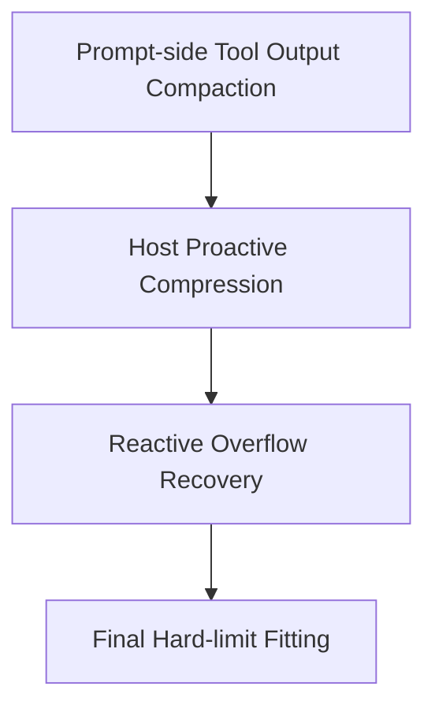

# Context Compression / Compact 对比：Claude Code vs Bamboo

> 这份文档只聚焦 **长会话上下文压缩 / compact / summary / overflow recovery**。
>
> 重点问题：
>
> 1. 什么时候触发压缩？
> 2. 压缩什么，不压缩什么？
> 3. 压缩后怎么继续工作？
> 4. 压缩失败时怎么恢复？
> 5. Claude Code 与 Bamboo 各自的优缺点是什么？
>
> 参考代码：
>
> - Claude Code
>   - `claude-code/src/services/compact/autoCompact.ts`
>   - `claude-code/src/services/compact/compact.ts`
>   - `claude-code/src/services/compact/microCompact.ts`
>   - `claude-code/src/services/compact/prompt.ts`
>   - `claude-code/src/services/compact/sessionMemoryCompact.ts`
>   - `claude-code/src/services/compact/postCompactCleanup.ts`
>   - `claude-code/src/query.ts`
>
> - Bamboo
>   - `zenith/bamboo/src/agent/core/budget/types.rs`
>   - `zenith/bamboo/src/agent/core/budget/compression_tooling.rs`
>   - `zenith/bamboo/src/agent/core/budget/preparation.rs`
>   - `zenith/bamboo/src/agent/core/budget/summarizer.rs`
>   - `zenith/bamboo/src/agent/loop_module/runner/round_lifecycle/context_preparation.rs`
>   - `zenith/bamboo/src/agent/loop_module/runner/session_setup/compaction.rs`

---

## Executive Summary

### 一句话结论

Claude Code 的上下文压缩体系是 **多层次、带恢复路径、和主 query loop 深度耦合的 compact stack**；Bamboo 当前的体系是 **更后端化、更清晰、更可控的 budget/compression pipeline**，但在“多层压缩策略、失败恢复、压缩后上下文重建”上还没有 Claude Code 那么成熟。

### 更细的判断

Claude Code 不是只有一种 compact，而是至少有三层：

1. **Microcompact**：先尽量压缩大 tool outputs / prompt cache 内容
2. **Autocompact**：达到阈值时主动做 full conversation compaction
3. **Reactive compact / context collapse**：当真的 prompt-too-long 时，再做异常恢复

Bamboo 当前分两层：

1. **Prompt-side tool output compaction**：旧 tool outputs 先做 excerpt/cache 化
2. **Host-driven conversation compression**：达到阈值后，总结旧历史并把历史消息标记为 compressed

所以结构上：

- **Claude Code 更像“分层缓存 + 主动压缩 + 异常恢复”的完整体系**
- **Bamboo 更像“预算驱动 + 摘要归档 + prompt 侧缓存”的后端治理体系**

---

# 一、Claude Code 的 Context Compression：一个分层 compact stack

## 1. 它不是一种 compact，而是多种策略叠加

从 `autoCompact.ts`、`compact.ts`、`microCompact.ts`、`sessionMemoryCompact.ts`、`query.ts` 来看，Claude Code 实际上有几条并行/串联的路径。

### 1.1 Microcompact：先压工具结果，不急着整段总结

`microCompact.ts` 里最核心的目标不是总结整段对话，而是优先压缩 **大 tool outputs**。

例如它会针对：
- `Read`
- `Bash`
- `Grep`
- `Glob`
- `WebFetch`
- `WebSearch`
- `Edit`
- `Write`

等工具结果做压缩候选。

证据：
- `claude-code/src/services/compact/microCompact.ts:40-50`
- `claude-code/src/services/compact/microCompact.ts:223-241`

它还会：
- 计算 tool result token 量
- 在 cached microcompact 路径里只删掉“高收益”的旧 tool result
- 优先 compact 那些最能节省 token 的候选

证据：
- `claude-code/src/services/compact/microCompact.ts:137-205`
- `claude-code/src/services/compact/microCompact.ts:295-320`

### 1.2 Time-based microcompact：利用 cache 过期时机清理

它还有 time-based MC 配置，会在 cache 过期时主动把旧工具结果内容清空/替换。

这说明 Claude Code 很在意一个点：

> 历史大 tool output 不应该长期原样占用 prompt 预算。

---

## 2. Autocompact：接近阈值时主动压整段历史

### 2.1 触发阈值

Claude Code 的 autocompact 不是等到真正爆掉才触发，而是有提前缓冲：

- 从 model context window 中先保留 compaction summary 输出预算
- 再用 buffer 计算 autocompact threshold

证据：
- `claude-code/src/services/compact/autoCompact.ts:28-49`
- `claude-code/src/services/compact/autoCompact.ts:62-91`

关键参数：
- `AUTOCOMPACT_BUFFER_TOKENS = 13_000`
- warning/error/blocking 都有不同 buffer

证据：
- `claude-code/src/services/compact/autoCompact.ts:62-65`

### 2.2 触发前有多个 guard

Claude Code 的 `shouldAutoCompact()` 会跳过这些情况：

- `querySource === session_memory`
- `querySource === compact`
- context collapse 模式开启时，autocompact 会被抑制
- reactive-only mode 时，主动 autocompact 也可被抑制

证据：
- `claude-code/src/services/compact/autoCompact.ts:160-239`

这说明 Claude Code 的 compact 策略并不是“逢高就压”，而是：

> 哪个 context management subsystem 当前拥有控制权，谁来接管。

---

## 3. Session Memory Compact：优先走更轻量的会话记忆压缩

`autoCompactIfNeeded()` 里不是一上来就 full compact，而是先试：

- `trySessionMemoryCompaction(...)`

证据：
- `claude-code/src/services/compact/autoCompact.ts:287-310`

这意味着 Claude Code 还有一条更轻量的路径：

> 先尝试通过已有 session memory 机制，把历史消息替换成更轻的总结，再决定要不要 full compact。

`sessionMemoryCompact.ts` 里还能看到：
- 保证最少 token 保留量
- 保证最少文本消息数
- 保护 tool_use/tool_result 对
- 保护 thinking blocks 的 API invariant

证据：
- `claude-code/src/services/compact/sessionMemoryCompact.ts:44-61`
- `claude-code/src/services/compact/sessionMemoryCompact.ts:188-314`

这很成熟，因为它不是简单按条数裁剪，而是知道 API 结构有哪些不能断裂的边界。

---

## 4. Full Compact：生成 summary + 重建 post-compact context

### 4.1 Summary prompt 非常强约束

Claude Code 的 compact prompt 不是一句“请总结一下”，而是明确要求：

- 分 section 输出
- 包含所有用户消息
- 包含文件/代码片段
- 包含错误和修复
- 包含 pending tasks
- 包含 current work
- 包含 optional next step
- 必须先写 `<analysis>` 再写 `
`
- 明确禁止 tool calls

证据：
- `claude-code/src/services/compact/prompt.ts:19-26`
- `claude-code/src/services/compact/prompt.ts:61-143`
- `claude-code/src/services/compact/prompt.ts:145-204`
- `claude-code/src/services/compact/prompt.ts:269-303`

这说明 Claude Code 非常清楚 summary 对“继续工作”的重要性，不是只做短摘要，而是做 **continuation-grade summary**。

### 4.2 压缩后不是只留 summary，还会重建工作上下文

Claude Code 的 `buildPostCompactMessages()` 返回顺序是：

1. `boundaryMarker`
2. `summaryMessages`
3. `messagesToKeep`
4. `attachments`
5. `hookResults`

证据：
- `claude-code/src/services/compact/compact.ts:326-337`

这说明它压缩后不是只剩“总结文本”，而是还会保留/重建：

- preserved tail messages
- 文件附件恢复
- plan mode 信息
- invoked skills attachment
- deferred tools delta attachment
- agent listing delta
- MCP instructions delta
- SessionStart hooks

证据：
- `claude-code/src/services/compact/compact.ts:531-585`
- `claude-code/src/services/compact/compact.ts:596-642`
- `claude-code/src/services/compact/compact.ts:557-561`

换句话说，Claude Code 认为 compact 后必须做的是：

> **重新搭出一个能立刻继续工作的上下文壳。**

这非常关键。

---

## 5. Reactive Compact / Context Collapse：异常恢复链

虽然本地仓库里 `reactiveCompact.ts` / `contextCollapse/index.ts` 文件本体没有直接展开到工具结果里，但从 `query.ts` 的接线逻辑已经足够看出它们的角色。

### 5.1 Prompt-too-long 后先尝试 context collapse drain

`query.ts` 里，若收到 withheld 413/prompt-too-long：

- 先尝试 `contextCollapse.recoverFromOverflow(...)`
- 如果 drain 成功，就走 `collapse_drain_retry`

证据：
- `claude-code/src/query.ts:1065-1117`

### 5.2 如果 collapse 不够，再走 reactive compact

如果 413 还在，或媒体错误触发恢复：

- 调 `reactiveCompact.tryReactiveCompact(...)`
- 成功后生成 `postCompactMessages`
- 进入 `reactive_compact_retry`

证据：
- `claude-code/src/query.ts:1119-1165`

### 5.3 失败恢复 guard 很成熟

Claude Code 还显式维护：
- `hasAttemptedReactiveCompact`
- 防止 stop hook blocking 导致无限重试
- max_output_tokens 也有单独恢复路径

证据：
- `claude-code/src/query.ts:1292-1299`
- `claude-code/src/query.ts:1185-1255`

也就是说 Claude Code 的压缩体系不仅有 proactive path，还有：

> **异常后恢复 path + 防 spiral guard**。

这是非常成熟的地方。

---

## 6. Autocompact 失败时有 circuit breaker

Claude Code 不会在 irrecoverable context overflow 情况下无限重试 autocompact。

- `MAX_CONSECUTIVE_AUTOCOMPACT_FAILURES = 3`
- 超过就停止继续自动尝试

证据：
- `claude-code/src/services/compact/autoCompact.ts:67-70`
- `claude-code/src/services/compact/autoCompact.ts:257-265`
- `claude-code/src/services/compact/autoCompact.ts:338-349`

这是很重要的反雪崩设计。

---

# 二、Bamboo 的 Context Compression：预算驱动 + 摘要归档 + prompt 侧缓存

## 1. Bamboo 的设计思想：先预算治理，再决定压缩

Bamboo 的 `budget` 模块很明确：

- `TokenBudget`
- `compression_trigger_percent`
- `compression_target_percent`
- `prepare_hybrid_context()`
- `summarizer`
- `compression_tooling`

证据：
- `zenith/bamboo/src/agent/core/budget/mod.rs:1-38`
- `zenith/bamboo/src/agent/core/budget/types.rs:31-71`

默认配置：
- proactive compression trigger: `85%`
- target after compression: `40%`

证据：
- `zenith/bamboo/src/agent/core/budget/types.rs:12-19`
- `zenith/bamboo/src/agent/core/budget/types.rs:147-184`

Claude Code 用绝对 buffer（如 13k）表达；Bamboo 用百分比阈值表达。各有优点：

- Claude Code 更贴近“实际 headroom”
- Bamboo 更容易跨模型统一治理

---

## 2. Bamboo 也有 prompt-side tool output compaction

这是很多人容易忽视的一点：Bamboo 并不只是 full summary。

在 `prepare_hybrid_context()` 里会先调用：

- `maybe_compact_old_tool_outputs_for_prompt(...)`

证据：
- `zenith/bamboo/src/agent/core/budget/preparation.rs:67-80`

这条路径会：
- 保护最近 user turns
- 保护最近 tool call chains
- 只对 cacheable tool names 生效：`Read`, `Grep`, `Bash`, `BashOutput`, `WebFetch`
- 只 compact 足够长的旧 tool outputs
- 用 head/tail excerpt 代替完整内容

证据：
- `zenith/bamboo/src/agent/core/budget/preparation.rs:346-455`
- `zenith/bamboo/src/agent/core/budget/preparation.rs:458-525`
- `zenith/bamboo/src/agent/core/budget/preparation.rs:593-617`

这其实和 Claude Code 的 microcompact 思想是相通的：

> 先压历史大工具结果，再决定是否需要整体压历史。

这一点是 Bamboo 的强项之一。

---

## 3. Bamboo 的 full compression 更“后端归档化”

### 3.1 压缩触发逻辑

`context_preparation.rs` 里：

- 先估算 context exposure
- 达到 trigger 或 critical threshold 才尝试 host compression
- critical fallback 为 `98%`

证据：
- `zenith/bamboo/src/agent/loop_module/runner/round_lifecycle/context_preparation.rs:18`
- `zenith/bamboo/src/agent/loop_module/runner/round_lifecycle/context_preparation.rs:41-58`

### 3.2 用 fast model / current model 做 summarization

它会：
- 选 `fast_model_name` 优先做 summary
- 传入 existing summary
- 传入 current task list prompt
- 用 `LlmSummarizer` 生成增量总结

证据：
- `zenith/bamboo/src/agent/loop_module/runner/round_lifecycle/context_preparation.rs:74-95`
- `zenith/bamboo/src/agent/core/budget/summarizer.rs:223-251`

### 3.3 不是替换消息数组，而是把旧消息标记为 compressed

这点和 Claude Code 的实现哲学很不一样。

Bamboo 的 `apply_compression_plan()`：
- 找到被压缩消息 id
- `message.compressed = true`
- 记录 `CompressionEvent`
- 更新 `conversation_summary`
- 保留原 messages 在 session 中

证据：
- `zenith/bamboo/src/agent/core/budget/compression_tooling.rs:355-450`

这意味着 Bamboo 的压缩是：

> **逻辑归档（archival）而不是物理替换。**

这是一个很后端、很服务端的设计。

---

## 4. Bamboo 的摘要质量目标很高，而且比很多系统都更接近 continuation-grade

### 4.1 摘要 prompt 不是简单摘要

Bamboo 的 `build_summary_prompt()` 明确要求：

- 先写 pre-compression in-flight work
- current active objective
- requirement checklist
- active tasks
- completed tasks
- obsolete tasks
- constraints
- files/code/tool findings
- open issues and next step

证据：
- `zenith/bamboo/src/agent/core/budget/compression_tooling.rs:484-555`

这其实已经非常接近 Claude Code 的 continuation summary 设计，而且更贴合“后端 agent + task list”体系。

### 4.2 LlmSummarizer 明确使用 existing summary + task list 作为 source of truth

证据：
- `zenith/bamboo/src/agent/core/budget/summarizer.rs:223-251`
- `zenith/bamboo/src/agent/core/budget/summarizer.rs:255-347`

### 4.3 失败时 fallback 到 heuristic summarizer

如果 LLM summary 失败或为空：
- fallback 到 `HeuristicSummarizer`

证据：
- `zenith/bamboo/src/agent/core/budget/summarizer.rs:429-447`

这比很多系统只要 summary fail 就直接炸掉要稳很多。

---

## 5. Bamboo 的 hard-limit fitting 是独立于 host compression 的第二层

`prepare_hybrid_context()` 里有一个很重要的架构思想：

- proactive compression 是 host-side pipeline 的事
- 但真正发给模型前，仍然会做 hard-limit fit

证据：
- `zenith/bamboo/src/agent/core/budget/preparation.rs:97-104`

也就是说 Bamboo 有两层：

1. **host compression**：主动压旧历史
2. **final hard fit**：无论如何都保证 prepared_context 不越界

这很合理，也更适合后端服务。

---

## 6. Bamboo 在“保留哪些上下文”上非常清楚

### 6.1 full compression 时保护最近 3 个 user turns

`build_compression_plan_with_summary_internal()`：
- 默认保留最近 3 个 user turns
- 如果还超，就继续挪非 protected 消息到 summarize 集

证据：
- `zenith/bamboo/src/agent/core/budget/compression_tooling.rs:255-309`

### 6.2 final hard fit 时保护关键 anchor

`prepare_hybrid_context()` 的 segment 选择策略会优先保护：
- first user
- last user
- last assistant text

然后：
- 先丢 oldest tool chains
- 再丢 oldest non-tool segments
- skill tool chain 优先保留

证据：
- `zenith/bamboo/src/agent/core/budget/preparation.rs:238-317`

这个策略很合理，也很适合 tool-heavy agent。

---

# 三、Claude Code vs Bamboo：核心差异

## 1. 架构层面

### Claude Code
- 多层 compact stack
- 微压缩 / 主动压缩 / 异常恢复并存
- 和 query loop 深度耦合
- 更像“runtime context manager”

### Bamboo
- 预算治理中心化
- prompt-side cache compaction + host compression + hard fit
- 和后端 session storage / task list / summary 更深整合
- 更像“service-side context budget engine”

---

## 2. 触发方式

### Claude Code
- 更偏 absolute buffer/headroom 思路
- auto compact、reactive compact、collapse 之间有 ownership 切换
- querySource 和 feature gate 会影响是否触发

### Bamboo
- 更偏 percentage-based budget policy
- `85%` 开始压，目标压到 `40%`
- `98%` critical fallback
- trigger/target 可配置、可统一治理

---

## 3. 压缩对象

### Claude Code
会压：
- 历史 tool outputs
- 历史会话消息
- partial compact（prefix/suffix）
- session memory

并且 post-compact 会重建：
- file attachments
- plan state
- skills attachment
- tools delta
- mcp instructions delta
- hook results

### Bamboo
会压：
- 旧 tool outputs（prompt 侧 excerpt）
- compressed 历史消息（标记 compressed）
- summary 写入 conversation_summary

但目前不会像 Claude Code 那样在 compact 后显式重建那么多“工作壳层”。

---

## 4. 失败恢复

### Claude Code
有很完整的 recovery chain：
- collapse drain retry
- reactive compact retry
- max output tokens escalation/recovery
- autocompact circuit breaker
- stop-hook death spiral guard

### Bamboo
当前更稳在：
- summary fail -> heuristic fallback
- host compression fail -> 进入 hard-fit 阶段
- final context 一定做 hard limit trim

但在 “prompt-too-long 后如何分阶段恢复” 这条链上，还没有 Claude Code 那么细。

---

# 四、我们最该学习什么？

## 1. 最该学的第一点：把 compression 做成多层系统，而不是单一路径

Bamboo 当前其实已经有两层：
- prompt-side tool output compaction
- host compression
- final hard fit

建议进一步明确成四层：

### 现在缺的是哪一层？

最缺的是：
- **Reactive overflow recovery**

也就是：
> 如果这轮真的被 provider 以 prompt-too-long 打回，不要只报错，要有恢复路径。

---

## 2. 引入 reactive compression / overflow recovery

建议 Bamboo 增加一条类似 Claude Code 的异常恢复路径：

### P0 设计目标
当 provider 返回：
- context too long
- prompt too long
- maybe media/input too large

则：
1. 尝试立即生成 forced compression plan
2. 应用 summary compression
3. 重新准备 prepared_context
4. retry 当前 round 一次
5. 用 guard 防止无限循环

### 为什么重要
现在 Bamboo 虽然 proactive compression 很干净，但如果压缩阈值判断失误、或 provider/token estimation 不准，就仍然可能在 sampling 阶段炸掉。

这时如果没有 reactive path，用户体验会比 Claude Code 弱很多。

---

## 3. 压缩后要重建“工作上下文壳”，而不是只插一个 summary

这是 Claude Code 非常值得学的点。

Bamboo 现在压缩后主要是：
- 给 summary
- 保留 recent window

但还可以更进一步：

### 建议 post-compression rehydrate 的内容
- 当前 task list snapshot
- active skill state / loaded skill ids
- workspace context snapshot
- recent important file references
- maybe selected tool deltas / capability changes
- maybe current unresolved clarification state

也就是说：

> 压缩后不只是给模型历史摘要，还要给它“继续工作的壳”。

---

## 4. 给 compression 增加 circuit breaker / anti-spiral guard

Claude Code 这点非常成熟。

Bamboo 建议补：
- consecutive compression failures counter
- reactive retry only once per round
- stop-hook / clarification / compression 互相重试防 spiral
- 标记 recovery attempted

这能避免在坏状态下疯狂烧 token。

---

## 5. 继续保留并加强 Bamboo 现有优势：compressed flag + archival session

这个我认为不要学 Claude Code 改成“直接替换 message array”。

Bamboo 当前的：
- `message.compressed = true`
- `conversation_summary`
- `compression_events`
- 原消息仍在 session storage 中

这是非常适合服务端的。

### 为什么我建议保留
因为它支持：
- audit / timeline 可追踪
- UI 做压缩前后回放
- future resume/rehydrate 更强
- debug 更容易

Claude Code 的方式更偏 CLI runtime；Bamboo 的方式更适合平台化产品。

---

# 五、如果要给 Bamboo 一个明确的改进路线

## P0
1. **增加 reactive overflow recovery path**
2. **给 compression 增加 retry guard / circuit breaker**
3. **压缩后增加 post-compression context rehydrate**

## P1
4. **把 prompt-side tool output compaction 提升成正式策略层**
5. **让 compression policy 支持按 provider / model 调参**
6. **增加 compression observability：reason / path / retry / saved_tokens / rehydrate state**

## P2
7. **支持 partial compression（prefix/suffix）**
8. **把 task/skill/workspace 变成可重放的 compression anchors**
9. **支持 child session / subagent 的独立 compression policy**

---

# 六、最终判断

## Claude Code 更强在

1. 多层 compact stack
2. 压缩失败后的恢复路径完整
3. 压缩后上下文重建很成熟
4. 对 prompt-too-long / max-output-tokens / media errors 都有恢复设计
5. anti-spiral guard 很强

## Bamboo 更强在

1. budget policy 清晰
2. 压缩策略更后端化、可治理
3. prompt-side tool output compaction 已经很合理
4. summary 设计和 task list 对齐得很好
5. 历史归档/压缩事件建模更适合平台化产品

## 最重要的一句话

**Claude Code 更像一个“runtime compact stack”，Bamboo 更像一个“budget-driven context archive system”。**

最好的方向不是二选一，而是：

> **保留 Bamboo 的归档式后端设计，同时补上 Claude Code 那套 multi-layer compression + reactive recovery 能力。**
