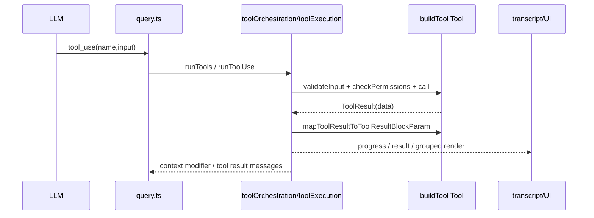

# Core Tools 对比：Claude Code vs Bamboo

> 本文聚焦几个最核心的本地工具：
>
> - `Read`
> - `Grep`
> - `Glob`
> - `Edit`
>
> 对比维度：
>
> 1. 工具定义与 schema
> 2. description / prompt 暴露方式
> 3. 具体实现差异
> 4. 从 LLM tool call 到实际执行的调用链
> 5. 哪些设计值得 Zenith / Bamboo 学习
>
> 参考代码：
>
> - Claude Code
>   - `claude-code/src/Tool.ts`
>   - `claude-code/src/services/tools/toolExecution.ts`
>   - `claude-code/src/services/tools/toolOrchestration.ts`
>   - `claude-code/src/tools/FileReadTool/prompt.ts`
>   - `claude-code/src/tools/FileReadTool/FileReadTool.ts`
>   - `claude-code/src/tools/GlobTool/prompt.ts`
>   - `claude-code/src/tools/GlobTool/GlobTool.ts`
>   - `claude-code/src/tools/GrepTool/prompt.ts`
>   - `claude-code/src/tools/GrepTool/GrepTool.ts`
>   - `claude-code/src/tools/FileEditTool/prompt.ts`
>   - `claude-code/src/tools/FileEditTool/types.ts`
>   - `claude-code/src/tools/FileEditTool/FileEditTool.ts`
>
> - Bamboo
>   - `zenith/bamboo/src/agent/core/tools/types.rs`
>   - `zenith/bamboo/src/agent/core/tools/registry.rs`
>   - `zenith/bamboo/src/agent/core/tools/executor.rs`
>   - `zenith/bamboo/src/agent/tools/orchestrator.rs`
>   - `zenith/bamboo/src/agent/loop_module/runner/tool_execution/per_call.rs`
>   - `zenith/bamboo/src/agent/tools/tools/read.rs`
>   - `zenith/bamboo/src/agent/tools/tools/read_tracker.rs`
>   - `zenith/bamboo/src/agent/tools/tools/glob.rs`
>   - `zenith/bamboo/src/agent/tools/tools/grep.rs`
>   - `zenith/bamboo/src/agent/tools/tools/edit.rs`
>   - `zenith/bamboo/src/agent/tools/guide/mod.rs`
>   - `zenith/bamboo/src/agent/tools/guide/builtin_guides.rs`
>   - `zenith/bamboo/src/agent/loop_module/runner/session_setup/tool_schemas.rs`

---

## Executive Summary

### 一句话结论

Claude Code 的核心工具系统更像 **“产品化的 rich tool abstraction + per-tool validation/permission/UI/result mapping framework”**；Bamboo 的核心工具系统更像 **“后端简洁 Tool trait + registry + orchestrator + tool guide 注入”**。

### 更准确的判断

- **Claude Code 强在工具抽象层**：每个工具不仅有 schema，还有 prompt、permission hook、validation、UI render、search text extraction、classifier input、group rendering、result mapping 等大量行为面。
- **Bamboo 强在执行链清晰**：Tool trait、registry、executor、orchestrator、policy、per-call runner 分层更干净，适合后端长期演进。
- **Claude Code 的工具更像“前后端合一的产品单元”**。
- **Bamboo 的工具更像“后端能力单元”**。

所以不要简单说谁更好，而是：

> Claude Code 更强在 tool productization，Bamboo 更强在 runtime layering。

---

# 一、最底层抽象：Tool 是什么？

## 1. Claude Code：Tool 是一个 rich behavioral object

Claude Code 的 `Tool` 抽象非常厚。

从 `Tool.ts` 可以看出，一个工具不只是：
- name
- description
- inputSchema
- call

它还可能带有：
- `prompt(...)`
- `validateInput(...)`
- `checkPermissions(...)`
- `preparePermissionMatcher(...)`
- `isConcurrencySafe(...)`
- `isReadOnly(...)`
- `isDestructive(...)`
- `toAutoClassifierInput(...)`
- `mapToolResultToToolResultBlockParam(...)`
- `renderToolUseMessage(...)`
- `renderToolResultMessage(...)`
- `renderToolUseErrorMessage(...)`
- `renderGroupedToolUse(...)`
- `extractSearchText(...)`
- `getActivityDescription(...)`
- `inputsEquivalent(...)`

证据：
- `claude-code/src/Tool.ts:501-694`

再加上：
- `buildTool(def)` 会补默认值
- 默认 fail-closed：`isConcurrencySafe=false`, `isReadOnly=false`

证据：
- `claude-code/src/Tool.ts:703-792`

### 结论

Claude Code 的 Tool 更像：

> **一个完整的工具产品对象**

它同时承担：
- 模型接口
- 权限接口
- UI 接口
- telemetry 接口
- 结果序列化接口

---

## 2. Bamboo：Tool 是后端执行接口

Bamboo 的 `Tool` trait 很简洁：

- `name()`
- `description()`
- `parameters_schema()`
- `execute()`
- `execute_with_context()`
- `to_schema()`

证据：
- `zenith/bamboo/src/agent/core/tools/registry.rs:102-137`

而工具 schema 是标准的：
- `ToolSchema`
- `FunctionSchema`
- `ToolCall`
- `ToolResult`

证据：
- `zenith/bamboo/src/agent/core/tools/types.rs:39-172`

### 结论

Bamboo 的 Tool 更像：

> **纯后端 executable capability**

UI/permission/hints/prompt 增强更多是在工具外围层完成，而不是都塞进 Tool trait 本身。

---

# 二、description / prompt 怎么暴露给模型？

## 1. Claude Code：description 和 prompt 是分开的

Claude Code 的工具通常同时定义：

- `description()`
- `prompt()`

例如：

### FileReadTool
- `description()` 返回简短 DESCRIPTION
- `prompt()` 返回更详细的使用说明模板

证据：
- `claude-code/src/tools/FileReadTool/prompt.ts:12-48`
- `claude-code/src/tools/FileReadTool/FileReadTool.ts:344-359`

### GrepTool
- `description()` 返回 विस्तारित usage guidance
- `prompt()` 直接用 `getDescription()`

证据：
- `claude-code/src/tools/GrepTool/prompt.ts:6-18`
- `claude-code/src/tools/GrepTool/GrepTool.ts:166-167`
- `claude-code/src/tools/GrepTool/GrepTool.ts:241-243`

### FileEditTool
- `description()` 其实很短：`A tool for editing files`
- 但真正关键的是 `prompt()` 返回的 edit usage 说明

证据：
- `claude-code/src/tools/FileEditTool/FileEditTool.ts:91-95`
- `claude-code/src/tools/FileEditTool/prompt.ts:20-27`

### 这说明什么？

Claude Code 的工具暴露是两层：

1. **Schema/description 给函数调用接口**
2. **Prompt 给模型更细的工具使用语义**

这点很重要，因为纯 description 往往不够表达复杂使用规则。

---

## 2. Bamboo：description 更短，但用 tool guide system 补语义

Bamboo 的工具本体 description 往往比较短，比如：

- `Read`: `Read a local file or directory with line-numbered output...`
- `Glob`: `Fast file pattern matching tool`
- `Grep`: `Search file contents using ripgrep-style regex parameters`
- `Edit`: `Edit existing files via exact replacements ... call Read first ...`

证据：
- `zenith/bamboo/src/agent/tools/tools/read.rs:115-117`
- `zenith/bamboo/src/agent/tools/tools/glob.rs:71-73`
- `zenith/bamboo/src/agent/tools/tools/grep.rs:300-302`
- `zenith/bamboo/src/agent/tools/tools/edit.rs:408-409`

但 Bamboo 用另一种方式补足语义：

### tool guide system
`builtin_guides.rs` 给每个核心工具单独定义：
- when_to_use
- when_not_to_use
- examples
- related_tools
- category

证据：
- `zenith/bamboo/src/agent/tools/guide/mod.rs:194-250`
- `zenith/bamboo/src/agent/tools/guide/builtin_guides.rs:103-174`

然后这个 tool guide 会被拼进系统 prompt：
- `prompt_setup.rs` -> `build_tool_guide_context()`

证据：
- `zenith/bamboo/src/agent/loop_module/runner/session_setup/prompt_setup.rs:32-50`

### 这说明什么？

Bamboo 不是把每个工具自己的 prompt 挂在 Tool trait 上，而是：

> **把工具语义集中整理成一个 tool guide 层，再统一注入 system prompt。**

这是很后端、也很整洁的做法。

---

# 三、Read：实现差异

## 1. Claude Code 的 Read 更“产品化”

Claude Code FileReadTool 能读：
- 普通文本文件
- 图片
- PDF
- Jupyter notebook
- file unchanged stub

证据：
- `claude-code/src/tools/FileReadTool/FileReadTool.ts:227-335`
- `claude-code/src/tools/FileReadTool/FileReadTool.ts:652-717`

它还有很多额外能力：
- device path 防 hang
- macOS screenshot thin-space path 兼容
- binary extension 识别
- file dedup（重复读返回 unchanged stub）
- conditional skill activation from file path
- permission check
- token size / file size 限制

证据：
- `claude-code/src/tools/FileReadTool/FileReadTool.ts:96-127`
- `claude-code/src/tools/FileReadTool/FileReadTool.ts:417-495`
- `claude-code/src/tools/FileReadTool/FileReadTool.ts:523-571`
- `claude-code/src/tools/FileReadTool/FileReadTool.ts:575-591`

### 结论

Claude Code 的 Read 已经不是“read text file”了，而是：

> **多模态统一读取工具**

---

## 2. Bamboo 的 Read 更简单，但很稳

Bamboo 的 ReadTool：
- 支持 file / directory
- 支持 offset / limit
- 返回行号
- 自动附加 `[TRUNCATED] Continue with offset=...`
- 读取 binary 文件时返回 `[Binary file omitted]`
- 对 session 标记“该文件已读”

证据：
- `zenith/bamboo/src/agent/tools/tools/read.rs:32-88`
- `zenith/bamboo/src/agent/tools/tools/read.rs:90-107`
- `zenith/bamboo/src/agent/tools/tools/read.rs:161-221`

它还有配套的 `read_tracker.rs`：
- `mark_read(session_id, path)`
- `has_read(...)`
- `read_state(...) -> Unread/Stale/Fresh`

证据：
- `zenith/bamboo/src/agent/tools/tools/read_tracker.rs:76-136`

### 结论

Bamboo 的 Read 更像：

> **纯文本/目录读取工具 + 写前 freshness gate 的基础设施**

---

## 3. Read 对比总结

### Claude Code 强在
- 多模态
- device/path corner cases 多
- token/file size guard 成熟
- dedup 与 cache 友好
- 可触发 skill discovery

### Bamboo 强在
- 输出格式简单清晰
- directory read 很自然
- read tracker 更后端稳定
- 与 Edit/Write 的 freshness gate 连接更直接

### Bamboo 最值得学的点
1. Read dedup stub
2. 更强的 path/device/special-file guard
3. 多模态读取能力分层接入，而不一定都塞进一个工具

---

# 四、Glob：实现差异

## 1. Claude Code 的 Glob：更偏 UI/permission/integration 完整性

Claude Code GlobTool：
- schema 简洁：`pattern`, optional `path`
- `isConcurrencySafe = true`
- `isReadOnly = true`
- 带 permission check
- 带 validateInput
- 输出结构化：`durationMs`, `numFiles`, `filenames`, `truncated`
- mapToolResultToToolResultBlockParam 会输出人类友好文本

证据：
- `claude-code/src/tools/GlobTool/GlobTool.ts:26-52`
- `claude-code/src/tools/GlobTool/GlobTool.ts:57-198`

它的 description 也不是一句话，而是明确告诉模型：
- 适合文件名 pattern 匹配
- 开放式搜索多轮时用 Agent tool

证据：
- `claude-code/src/tools/GlobTool/prompt.ts:1-7`

---

## 2. Bamboo 的 Glob：更强调 scope control

Bamboo GlobTool：
- 支持 `pattern`, `path`, `limit`
- 默认 100，硬上限 200
- 扫描文件最多 50,000
- 跳过 `.git`, `node_modules`, `target` 等重目录
- 对 unbounded root glob 直接报错
- 返回匹配文件按 modification time 排序

证据：
- `zenith/bamboo/src/agent/tools/tools/glob.rs:11-26`
- `zenith/bamboo/src/agent/tools/tools/glob.rs:43-49`
- `zenith/bamboo/src/agent/tools/tools/glob.rs:137-214`

### 结论

Bamboo 的 Glob 非常强调：

> **不要让模型随手打一枪把整个仓库扫爆。**

这是一个很实用的后端保护。

---

## 3. Glob 对比总结

### Claude Code 强在
- 工具抽象完整
- permission / validation / UI 一体
- 对模型的 usage 指导更清楚

### Bamboo 强在
- scope 限制更强
- 扫描上限更明确
- 默认跳过大目录
- 输出更可预测

### Bamboo 最值得学习 / 保留
- 保留当前 scope guard
- 可借鉴 Claude Code 的 structured output + richer description

---

# 五、Grep：实现差异

## 1. Claude Code 的 Grep：ripgrep 一等包装，模型指导非常强

Claude Code GrepTool 的 prompt 非常强势：
- ALWAYS use Grep for search tasks
- NEVER 用 Bash grep/rg
- 明确 output modes
- 明确 multiline 参数
- 明确正则语法与 Agent tool 使用场景

证据：
- `claude-code/src/tools/GrepTool/prompt.ts:6-18`

实现上：
- schema 很丰富
- `head_limit` + `offset`
- `content/files_with_matches/count`
- `-A/-B/-C/-n/-i`
- `type`
- `multiline`
- 内部直接用 `ripGrep()` 工具
- 自动排除版本控制目录
- 有 permission check
- map result 时会把 pagination 信息回写给模型

证据：
- `claude-code/src/tools/GrepTool/GrepTool.ts:33-108`
- `claude-code/src/tools/GrepTool/GrepTool.ts:160-309`
- `claude-code/src/tools/GrepTool/GrepTool.ts:310-360`

### 一个很好的点
Claude Code GrepTool 明确把“分页信息”回给模型：
- appliedLimit
- appliedOffset

这有助于模型自己继续翻页，而不是重复查。

---

## 2. Bamboo 的 Grep：更像安全版内建 ripgrep

Bamboo GrepTool 也很强：
- output_mode
- `-A/-B/-C/-n/-i`
- `type`
- `head_limit`
- `multiline`
- broad search scope guard
- multiline 必须 narrowed path
- binary/oversized file 跳过
- 扫描文件数上限 50,000
- 总匹配数上限 2,000
- 结果字节数上限 256 KB

证据：
- `zenith/bamboo/src/agent/tools/tools/grep.rs:13-31`
- `zenith/bamboo/src/agent/tools/tools/grep.rs:247-285`
- `zenith/bamboo/src/agent/tools/tools/grep.rs:377-467`

它的 design 明显更偏：

> **搜索必须可控，结果不能无限膨胀。**

这是 Bamboo 的典型风格。

---

## 3. Grep 对比总结

### Claude Code 强在
- 对模型的 usage instruction 极清楚
- internal schema / permission / UI 组织更成熟
- pagination 语义更清楚
- ripgrep wrapper 更产品化

### Bamboo 强在
- 更强的 broad-search 防爆设计
- 明确多重上限（matches / bytes / files）
- multiline 限制更保守

### Bamboo 最值得学习的点
1. 像 Claude Code 一样，把“必须优先用 Grep，不要用 Bash grep”表达得更强
2. 把 pagination / continuation 语义结构化暴露给模型
3. 保留当前 scope/multiline guard，不要丢

---

# 六、Edit：实现差异

## 1. Claude Code 的 Edit：rich validation + UX-heavy

Claude Code FileEditTool 有几个很成熟的点：

### 1.1 prompt 层明确要求先 Read
`FileEditTool/prompt.ts` 明确写：
- 必须先用 Read tool 至少一次
- old_string 必须唯一
- 建议用最小但足够唯一的 old_string
- replace_all 的用途

证据：
- `claude-code/src/tools/FileEditTool/prompt.ts:4-27`

### 1.2 validateInput 非常厚
它会检查：
- path deny rules
- file too large
- file exists / not exists
- old_string == new_string
- notebook file redirect
- readFileState freshness
- file modified since read
- actual string normalization
- 多重匹配但未 replace_all
- settings file edit validation

证据：
- `claude-code/src/tools/FileEditTool/FileEditTool.ts:137-360`

### 1.3 call 阶段还有更多 runtime behavior
它会：
- 再次做 read-modify-write 原子性保护
- file history backup
- discover/activate skills by file path
- notify LSP didChange/didSave
- notify VSCode diff
- update readFileState
- 记录 git diff / telemetry

证据：
- `claude-code/src/tools/FileEditTool/FileEditTool.ts:387-595`

这说明 Claude Code 的 Edit 已经不只是编辑工具，而是：

> **一个和 IDE / permission / history / skill activation / analytics 深度整合的编辑事务。**

---

## 2. Bamboo 的 Edit：更偏后端 patch engine + read gate

Bamboo EditTool 也很扎实：
- 支持 legacy `old_string/new_string`
- 支持 `replace_all`
- 支持 `line_number`
- 支持 patch mode `SEARCH/REPLACE`
- patch size / block count / block size 都有限制
- 会检测唯一性问题
- 会给出 candidate line summary
- 会强制 Read first

证据：
- `zenith/bamboo/src/agent/tools/tools/edit.rs:15-27`
- `zenith/bamboo/src/agent/tools/tools/edit.rs:266-334`
- `zenith/bamboo/src/agent/tools/tools/edit.rs:408-416`

再加上 `read_tracker`：
- `Unread / Fresh / Stale`

证据：
- `zenith/bamboo/src/agent/tools/tools/read_tracker.rs:9-18`
- `zenith/bamboo/src/agent/tools/tools/read_tracker.rs:115-136`

### 结论

Bamboo 的 Edit 更像：

> **纯后端 patch/replacement engine + session read freshness enforcement**

它没有 Claude Code 那种 IDE/LSP/UI 周边整合，但内核已经很稳。

---

## 3. Edit 对比总结

### Claude Code 强在
- validation 特别厚
- read freshness 和 write safety 做得很细
- 与 IDE/LSP/file history 深度整合
- inputsEquivalent / observable input / user modified 等产品细节成熟

### Bamboo 强在
- patch mode 明确
- line hint + ambiguity handling 做得不错
- read-before-edit 明确写在 description 里
- 工具行为更后端纯粹

### Bamboo 最值得学习的点
1. 增加更完整的 file modified since read 检测语义暴露
2. 增加 structured result / diff summary
3. 如果以后和 Lotus/Bodhi 编辑器联动，可以学 Claude Code 的 LSP/IDE notification 模式

---

# 七、调用链：从 tool call 到执行的流程差异

## 1. Claude Code 的调用链

大致是：



关键点：
- `runToolUse()` 先找 tool
- 做 permission/checkPermissions
- 支持 streamed progress
- 最后由 tool 自己把 output 映射成 `tool_result`

证据：
- `claude-code/src/services/tools/toolExecution.ts:337-489`
- `claude-code/src/services/tools/toolExecution.ts:492-560`
- `claude-code/src/services/tools/toolOrchestration.ts:19-81`

### 结论

Claude Code 的工具调用链中，**工具对象自己承担了很多执行前后的责任**。

---

## 2. Bamboo 的调用链

大致是：

```mermaid
sequenceDiagram
  participant LLM
  participant Loop as loop runner
  participant PerCall as per_call.rs
  participant Exec as core executor
  participant Registry as ToolRegistry/ToolExecutor
  participant Tool as Tool impl
  participant Orch as Orchestrator/policy

  LLM->>Loop: ToolCall(name,args)
  Loop->>PerCall: execute_tool_call_only
  PerCall->>Orch: policy validation / tool start events
  PerCall->>Exec: execute_tool_call_with_context
  Exec->>Registry: find tool / execute_with_context
  Registry->>Tool: execute_with_context(args)
  Tool-->>PerCall: ToolResult
  PerCall->>Loop: apply outcome / compress output / persist metadata
```

关键点：
- `per_call.rs` 先做 policy validate
- 发 `ToolStart`
- 组装 `ToolExecutionContext`
- 调 `execute_tool_call_with_context`
- 再统一做 output compression / metadata persist

证据：
- `zenith/bamboo/src/agent/core/tools/executor.rs:128-172`
- `zenith/bamboo/src/agent/loop_module/runner/tool_execution/per_call.rs:62-168`
- `zenith/bamboo/src/agent/loop_module/runner/tool_execution/per_call.rs:171-255`

### 结论

Bamboo 的工具调用链中，**工具本体更轻，外围执行层更强**。

---

# 八、description / 调用流程 / 实现层，最值得学习什么？

## 1. Bamboo 最该学 Claude Code 的 5 个点

### 1) 工具定义对象可以更 rich
当前 Bamboo Tool trait 太纯后端，优点是简单，缺点是很多语义只能散落在外面。

可以考虑给工具定义增加 optional metadata：
- read_only
- concurrency_safe
- search_hint
- classifier_input_hint
- activity_description
- output mapping hint

不一定要全学 Claude Code 的 UI 部分，但 runtime 元信息值得加。

### 2) description / usage guidance 应更靠近工具本身
Bamboo 现在靠 tool guide system 补语义是对的，但对于特别关键的工具（Read/Grep/Edit/Bash），建议：
- tool description 更具体
- tool guide 保留全局 best practice
- 两者结合

### 3) 结构化 pagination / continuation 语义
Claude Code 在 Read/Grep 上会明确把：
- unchanged stub
- pagination info
- content mode hints
- head_limit/offset 语义

更自然地暴露给模型。这个值得学。

### 4) 更强的特殊路径/设备/编码保护
尤其是 Read：
- device file
- UNC path
- screenshot weird path
- binary/media corner cases

Claude Code 在这些产品坑上踩得更多，所以处理也更细。

### 5) 让工具结果映射更明确
Bamboo 现在 `ToolResult.result: String` 比较通用，但也比较弱。可以考虑逐步增强：
- structured result envelope
- richer display hints
- optional machine-readable fields

---

## 2. Bamboo 当前值得保留、不要乱改的 5 个点

### 1) Tool trait 简洁
这对后端长期维护非常重要。

### 2) Registry + executor + orchestrator + policy 分层清楚
这个比 Claude Code 更适合平台化。

### 3) Tool guide 集中注入 system prompt
这在后端是更干净的方式。

### 4) Read tracker / stale/fresh gate
这个设计很好，尤其适合 Edit/Write 安全性。

### 5) Grep/Glob 的 scope 防爆策略
这是必须保留的，不要为了模仿 Claude Code 放松。

---

# 九、最终判断

## Claude Code 的 core tools 更强在

1. tool abstraction 丰富
2. per-tool validation/permission 更成熟
3. description + prompt 设计更利于模型正确调用
4. 工具结果/UI/result mapping 非常完整
5. 产品级 corner cases 处理很多

## Bamboo 的 core tools 更强在

1. 工具执行链路清晰
2. 工具本体和 runtime 分层更合理
3. tool guide 系统更适合后端统一治理
4. scope guard/read gate/patch safety 都做得很不错
5. 更容易继续做服务端演进

## 一句话建议

**不要把 Bamboo 的工具系统改成 Claude Code 那种全栈大对象；但非常值得把 Claude Code 在工具元信息、description、validation、结果映射、corner-case 处理上的成熟经验吸收进来。**
