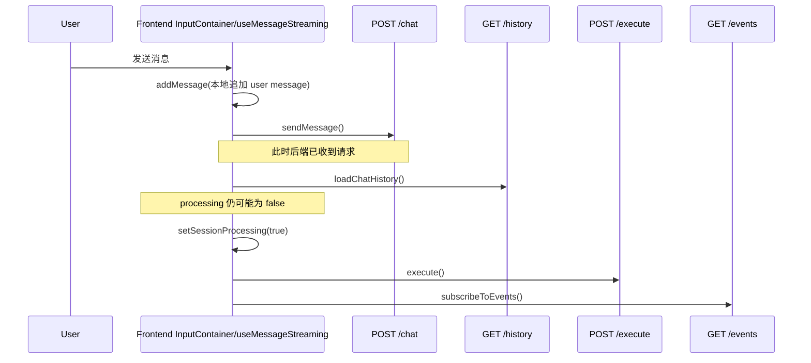
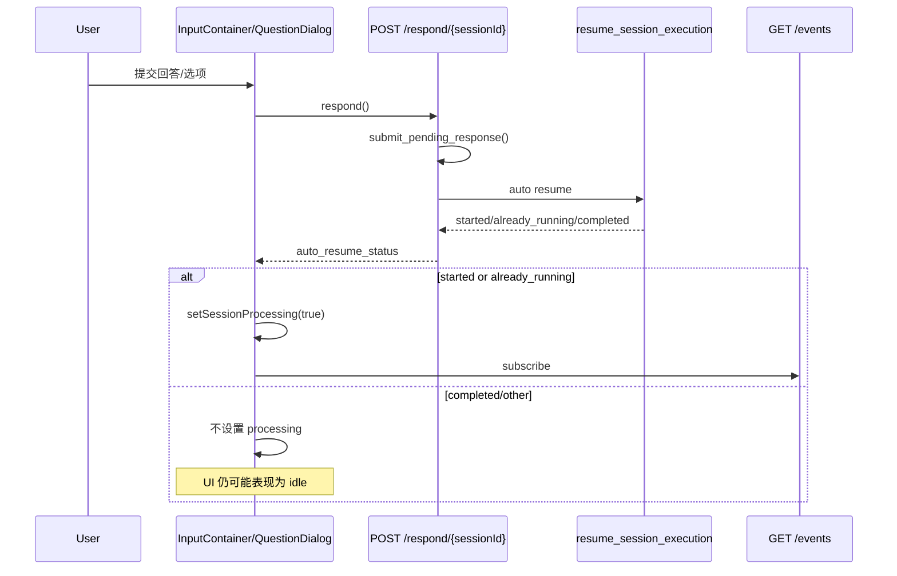

# Zenith 前端 pending / processing 状态失真专项审查报告

- 项目：`/Users/bigduu/Workspace/TauriProjects/zenith`
- 审查范围：`lotus/` 前端聊天执行链路、`bamboo/` 后端 execute/respond/events 生命周期
- 目标问题：**后台真实已经发起请求/继续执行，但前端 `pending` / `processing` / `isStreaming` 仍然是 false，UI 不能正确反馈运行状态**
- 审查方式：静态代码审查 + 前后端链路对照 + 两个只读 subagent 并行复核
- 结论级别：高置信度

---

## Executive Summary

### 结论一句话
这**不是单一组件的显示小 bug**，而是当前聊天页把“请求是否在进行中”完全建立在前端本地 `processingChats` 上，而**不是建立在后端生命周期的强一致信号上**，导致多个时间窗口里：**后端已经在工作，但前端还没把会话标记为 processing**。

### 最关键结论
当前聊天执行状态的单一真相源是 Zustand 里的：
- `processingChats: Set<string>`：`lotus/src/pages/ChatPage/store/slices/chatSessionSlice.ts:619`
- `setSessionProcessing(sessionId, boolean)`：`lotus/src/pages/ChatPage/store/slices/chatSessionSlice.ts:1153`

而真正的问题在于：
1. **发送消息链路里，`processing=true` 设置得太晚**，是在 `sendMessage -> loadChatHistory -> execute` 之前的一个后置步骤，而不是请求一发出就设为 true。见 `lotus/src/pages/ChatPage/hooks/useChatManager/useMessageStreaming.ts:314-349`。
2. **respond / conclusion_with_options 恢复链路里，只有 `auto_resume_status` 是 `started` / `already_running` 时才会设置 processing=true**，条件过窄。见 `lotus/src/pages/ChatPage/components/InputContainer/index.tsx:483-486` 与 `lotus/src/components/QuestionDialog/QuestionDialog.tsx:410-415`。
3. **SSE 订阅是否建立，完全依赖 `processingChats`**。如果 `processing` 没及时变成 true，那么前端根本不会订阅，早期事件就会错过。见 `lotus/src/hooks/useAgentEventSubscription.ts:1044-1062`。
4. **后端没有专门的“execution started / session active”事件**来作为前端 pending 的强信号；最早的实时事件通常要等到 token / tool / runner progress。见 `bamboo/crates/bamboo-agent-core/src/agent/events.rs:93-372`。
5. **后端 SSE 是广播流，不会为晚订阅客户端重放完整开始阶段事件**；事件转发器只是 `broadcast_tx.send(event)`。见 `bamboo/crates/bamboo-engine/src/runtime/execution/event_forwarder.rs:29-58`。

### 最可能导致你观察到“pending 永远 false”的主因
**主因不是后端没跑，而是前端太依赖本地 `processingChats`，并且这个 flag 在关键路径上设晚了、设窄了。**

尤其是两条路径：
- 普通消息发送：`sendWithAgent()`
- 回答 `conclusion_with_options` 的 `respond()` 恢复执行

它们都会产生“后端已经在工作，但 UI 还没切到 processing”的窗口。

### 总体判断
- **问题级别**：高
- **影响范围**：聊天页主执行流、respond 恢复流、SSE 订阅时机、ExecutionStatusRail、输入区交互
- **根因类型**：前后端契约不完整 + 前端状态建模过于本地化 + 请求启动时序有缺陷

---

## 审查范围与核心对象

### 前端关键文件
- `lotus/src/pages/ChatPage/hooks/useChatManager/useMessageStreaming.ts`
- `lotus/src/pages/ChatPage/components/InputContainer/index.tsx`
- `lotus/src/components/QuestionDialog/QuestionDialog.tsx`
- `lotus/src/hooks/useAgentEventSubscription.ts`
- `lotus/src/pages/ChatPage/store/slices/chatSessionSlice.ts`
- `lotus/src/pages/ChatPage/components/ExecutionStatusRail/index.tsx`
- `lotus/src/services/chat/AgentService.ts`
- `lotus/src/pages/ChatPage/utils/openSession.ts`

### 后端关键文件
- `bamboo/crates/bamboo-server/src/handlers/agent/execute/handler/mod.rs`
- `bamboo/crates/bamboo-server/src/handlers/agent/respond/handlers/submit.rs`
- `bamboo/crates/bamboo-server/src/handlers/agent/events/handler.rs`
- `bamboo/crates/bamboo-server/src/session_app/execute.rs`
- `bamboo/crates/bamboo-server/src/session_app/respond.rs`
- `bamboo/crates/bamboo-server/src/session_app/resume.rs`
- `bamboo/crates/bamboo-server/src/handlers/agent/sessions/types.rs`
- `bamboo/crates/bamboo-server/src/handlers/agent/sessions/handlers/crud/query.rs`
- `bamboo/crates/bamboo-server/src/handlers/agent/sessions/handlers/crud/running.rs`
- `bamboo/crates/bamboo-engine/src/runtime/execution/event_forwarder.rs`
- `bamboo/crates/bamboo-agent-core/src/agent/events.rs`

---

## 一、当前前端 pending / processing 机制的真实设计

### 1.1 单一真相源：`processingChats`
前端聊天页并没有广泛使用 React Query 的 `isPending` / `useMutation` 作为聊天执行态真相源；聊天执行链路基本是自定义状态机。

真正控制会话是否“在跑”的是：
- `processingChats: new Set<string>()`：`lotus/src/pages/ChatPage/store/slices/chatSessionSlice.ts:619`
- `setSessionProcessing(sessionId, isProcessing)`：`lotus/src/pages/ChatPage/store/slices/chatSessionSlice.ts:1153-1160`

```ts
setSessionProcessing: (sessionId, isProcessing) => {
  set((state) => {
    const processingChats = new Set(state.processingChats);
    if (isProcessing) processingChats.add(sessionId);
    else processingChats.delete(sessionId);
    return { processingChats };
  });
}
```

### 1.2 UI 展示完全依赖它
输入区直接把它映射成：
- `isProcessing`：`lotus/src/pages/ChatPage/components/InputContainer/index.tsx:283`
- `isStreaming = isProcessing`：`lotus/src/pages/ChatPage/components/InputContainer/index.tsx:358`

模型选择器、respond 按钮、MessageInput 交互都因此受影响：
- 模型按钮 disabled：`lotus/src/pages/ChatPage/components/InputContainer/index.tsx:889`
- ProviderModelPicker disabled：`lotus/src/pages/ChatPage/components/InputContainer/index.tsx:925`
- respond 选项 disabled：`lotus/src/pages/ChatPage/components/InputContainer/index.tsx:1047`
- MessageInput 的 `interaction.isStreaming`：`lotus/src/pages/ChatPage/components/InputContainer/index.tsx:1092-1099`

ExecutionStatusRail 也直接读它：
- `const isProcessing = useAppStore((state) => state.processingChats.has(sessionId));`
- `lotus/src/pages/ChatPage/components/ExecutionStatusRail/index.tsx:139`

所以一旦 `processingChats` 没及时置 true，用户看到的就会是：
- 没有 running / thinking 状态
- rail 不显示正确状态
- 控件仍然可点
- 体验上像“前端没进入 pending”

### 1.3 SSE 订阅也依赖它
`useAgentEventSubscription` 的关键 effect：
- `lotus/src/hooks/useAgentEventSubscription.ts:1044-1062`

```ts
processingChats.forEach((sessionId) => ensureSubscription(sessionId));
```

也就是说：
- **不是请求发出后自动订阅**
- **而是只有 `processingChats` 里有这个 sessionId，才会开始订阅 SSE**

这是整个设计最重要的脆弱点之一。

---

## 二、主因 1：普通消息发送链路里，processing 设置过晚

### 2.1 实际执行顺序
核心代码：`lotus/src/pages/ChatPage/hooks/useChatManager/useMessageStreaming.ts:314-349`

关键顺序如下：

1. 先向后端发 chat 请求：
   - `agentClientRef.current.sendMessage(...)`
   - `lotus/src/pages/ChatPage/hooks/useChatManager/useMessageStreaming.ts:314-335`
2. 然后立即拉一次历史：
   - `loadChatHistory(sessionId, { mode: "replace" })`
   - `lotus/src/pages/ChatPage/hooks/useChatManager/useMessageStreaming.ts:344-345`
3. **到这里之后才设置**：
   - `deps.setSessionProcessing(sessionId, true)`
   - `lotus/src/pages/ChatPage/hooks/useChatManager/useMessageStreaming.ts:347-348`
4. 再调用 execute：
   - `agentClientRef.current.execute(...)`
   - `lotus/src/pages/ChatPage/hooks/useChatManager/useMessageStreaming.ts:351-366`

### 2.2 这为什么会让你感觉 pending 一直是 false
在第 1 步和第 2 步期间：
- HTTP 请求已经发出
- 后端可能已经完成消息入库
- 用户已经看到自己的消息被追加到 UI：`addMessage` 在 `lotus/src/pages/ChatPage/hooks/useChatManager/useMessageStreaming.ts:449`
- **但前端还没有 `processing=true`**

这意味着这段时间里：
- `ExecutionStatusRail` 还是 idle
- `InputContainer` 里的 `isStreaming` 还是 false
- 用户看到的是“消息发出去了，但系统没开始跑”

### 2.3 这不是理论问题，而是结构性时序问题
当前逻辑的注释写的是：
> Activate processing/subscription before execute so early events are not missed.

即：`lotus/src/pages/ChatPage/hooks/useChatManager/useMessageStreaming.ts:347`

它只保证了：
- **在 execute 之前**订阅尽量开启

但没有保证：
- **在“真实请求开始时”就让 UI 进入 pending**

因此从用户视角看，pending 确实会出现明显空窗期。

### 2.4 结论
这是当前问题的**第一主因**。

---

## 三、主因 2：respond / update 恢复链路里，processing 只在部分状态下被置 true

你提到“不是非常频繁的请求是有 update，我发现 pending 永远是 false”，结合代码，**respond/update 这类恢复继续执行的链路非常符合你的观察**。

### 3.1 InputContainer 的 respond 提交逻辑
关键代码：`lotus/src/pages/ChatPage/components/InputContainer/index.tsx:466-486`

```ts
const result = await agentApiClient.post<{ auto_resume_status?: string }>(
  `respond/${sessionId}`,
  respondPayload,
);

const resumeStatus = result?.auto_resume_status;
if (resumeStatus && ["started", "already_running"].includes(resumeStatus)) {
  setSessionProcessing(sessionId, true);
}
```

### 3.2 QuestionDialog 里也复制了同样模式
关键代码：`lotus/src/components/QuestionDialog/QuestionDialog.tsx:390-415`

```ts
const submitResult = await agentApiClient.post<RespondSubmitResult>(`respond/${sessionId}`, ...);
const resumeStatus = submitResult?.auto_resume_status;
if (["started", "already_running"].includes(resumeStatus || "")) {
  setSessionProcessing(sessionId, true);
}
```

### 3.3 这段逻辑的问题
前端把“是否该进入 processing”绑定到了一个**过窄的后端返回值条件**上。

也就是说，只有当后端显式返回：
- `started`
- `already_running`

才进入 processing。

只要返回：
- `completed`
- `error`
- 字段缺失
- 或未来新增状态

前端就不会进入 processing。

### 3.4 后端 respond 的真实语义
后端 `respond` handler：
- `bamboo/crates/bamboo-server/src/handlers/agent/respond/handlers/submit.rs:93-105`

它做两件事：
1. `submit_pending_response(...)`
2. `resume_session_execution(...)`

最终返回：
```json
{
  "auto_resume_status": "started | already_running | completed | error: session not found"
}
```

### 3.5 后端 `completed` 的真实来源
`ResumeOutcome::Completed` 定义：
- `bamboo/crates/bamboo-server/src/session_app/types.rs:197-216`

`resume_session_execution()` 中：
- `bamboo/crates/bamboo-server/src/session_app/resume.rs:88-95`

```rust
if !has_pending_user_message(&session) {
    return ResumeOutcome::Completed;
}
```

而 `has_pending_user_message()` 的实现是：
- `bamboo/crates/bamboo-server/src/session_app/execute.rs:299-330`

```rust
pub fn has_pending_user_message(session: &Session) -> bool {
    if has_pending_conclusion_with_options_resume(session) || has_pending_retry_resume(session) {
        return true;
    }
    session.messages.last().map(|message| matches!(message.role, Role::User)).unwrap_or(false)
}
```

这说明 `completed` 的语义并不是：
- “前端一定可以当成 idle，不需要任何 processing 展示了”

它真正的语义更接近：
- “此刻服务器判断没有待继续执行的 user/resume 工作”

### 3.6 为什么这会造成前端误判
由于前端逻辑是：
- `started/already_running` => processing=true
- 其它 => 什么都不做

所以 **respond 路径天然容易表现成“后台做了事，但前端 pending 没起来”**。

尤其当 respond 调用本身已经是一个真实网络请求、且内部还可能触发状态更新/恢复判定时，用户感知上就会更强烈地认为：
- “请求是真发了”
- “但 pending 永远 false”

### 3.7 结论
这是当前问题的**第二主因**，并且非常贴近你描述的“不是非常频繁的 update 请求”。

---

## 四、主因 3：SSE 订阅建立依赖 processing=true，导致早期事件容易错过

### 4.1 订阅是后置动作，不是先验动作
事件订阅只在 `processingChats` 变化时触发：
- `lotus/src/hooks/useAgentEventSubscription.ts:1044-1062`

如果 `processing` 没及时被设为 true：
- 就不会 `ensureSubscription(sessionId)`
- 就不会连上 `GET /events/{sessionId}`

### 4.2 AgentService 的 SSE 客户端没有重放补偿机制
前端订阅实现：
- `lotus/src/services/chat/AgentService.ts:750-845`
- `lotus/src/services/chat/AgentService.ts:850-1015`

它只是：
- 调 `fetchRaw(events/{sessionId})`
- 按 SSE `data:` 行流式消费
- 收到什么处理什么

**没有“补一条 execution started”或“回放本次运行开始状态”的额外机制。**

### 4.3 后端也没有“execution started”事件
后端事件枚举：
- `bamboo/crates/bamboo-agent-core/src/agent/events.rs:93-372`

有：
- `token`
- `reasoning_token`
- `tool_start`
- `tool_complete`
- `runner_progress`
- `complete`
- `error`

但没有类似：
- `execution_started`
- `session_active`
- `turn_started`

这意味着前端如果错过前几拍：
- 它不会收到一个“你现在应该进 pending 了”的强信号

### 4.4 后端事件转发器不会为晚订阅者重放过程态
事件转发器：
- `bamboo/crates/bamboo-engine/src/runtime/execution/event_forwarder.rs:29-58`

```rust
while let Some(event) = mpsc_rx.recv().await {
    ...
    let _ = broadcast_tx.send(event);
}
```

这是标准广播语义：
- 已经发出的事件不会自动回放给后来的订阅者
- 晚一步建立 SSE，早期事件就没了

### 4.5 当前 only-if-processing 才订阅，形成闭环缺陷
现在系统要求：
1. 先 `processing=true`
2. 才订阅 SSE
3. 才能收到运行时事件

但反过来，前端又希望：
- 通过 SSE 知道后端真的开始跑了

这就构成了闭环依赖：
- **必须先相信自己在跑，才能订阅到“确实在跑”的证据**

这是设计层面的根缺陷。

---

## 五、后端契约本身也给前端留下了歧义空间

### 5.1 chat / execute / events 是三段式，不是一个原子事务
后端真实架构是：
1. `POST /chat`：持久化消息
2. `POST /execute/{session_id}`：启动 agent runner
3. `GET /events/{session_id}`：拿 SSE 事件

相关代码：
- execute handler：`bamboo/crates/bamboo-server/src/handlers/agent/execute/handler/mod.rs:28-250`
- events handler：`bamboo/crates/bamboo-server/src/handlers/agent/events/handler.rs:15-68`

这意味着前端必须自己协调：
- 请求提交
- processing 切换
- SSE 建连
- execute 返回状态

任何一个时序点晚了，pending 就会表现不稳定。

### 5.2 execute 返回 `completed` 并不等价于“前端可安全当成 idle”
前端处理 execute 结果的逻辑：
- `lotus/src/pages/ChatPage/hooks/useChatManager/useMessageStreaming.ts:233-280`

```ts
if (["started", "already_running"].includes(resolvedExecuteResult.status)) {
  return;
}
if (resolvedExecuteResult.status === "completed") {
  deps.setSessionProcessing(sessionId, false);
  return;
}
```

这意味着前端把 `completed` 直接解释成：
- processing=false
- UI idle

但后端的 `completed` 更像是：
- “当前没有 pending user message / resume work”

如果前端之前没正确进入 processing，再加上 `completed` 又立刻把 processing 清掉，用户体验上就是：
- 请求发生了
- 但 pending 几乎没亮过，或者完全没亮

### 5.3 events endpoint 虽然支持 terminal fast-path，但不能替代 started 语义
events handler：
- `bamboo/crates/bamboo-server/src/handlers/agent/events/handler.rs:52-68`

当 runner 不在 running 状态时，它可以直接返回 terminal event：
- `Complete`
- `Error`

这能帮助“晚打开页面的人”看到一个终态，
但**不能帮助前端建立“这个请求刚开始跑了”**的实时 pending 感知。

---

## 六、次因与放大器

## 6.1 `loadChats()` 会重建 processing 状态，但它只适合“恢复”，不适合“实时”
`loadChats()`：
- `lotus/src/pages/ChatPage/store/slices/chatSessionSlice.ts:992-1021`

它会从 session list 恢复：
```ts
const runningSessions = chats.filter((c) => c.isRunning).map((c) => c.id);
processingChats: new Set<string>(runningSessions)
```

而 `sessionSummaryToChatItem()` 把后端摘要的 `is_running` 映射成前端 `isRunning`：
- `lotus/src/pages/ChatPage/store/slices/chatSessionSlice.ts:125-180`
- 关键行：`isRunning: s.is_running`：`lotus/src/pages/ChatPage/store/slices/chatSessionSlice.ts:154`

后端摘要的 `is_running` 来源：
- `bamboo/crates/bamboo-server/src/handlers/agent/sessions/types.rs:47-74`
- `bamboo/crates/bamboo-server/src/handlers/agent/sessions/handlers/crud/query.rs:8-21`
- `bamboo/crates/bamboo-server/src/handlers/agent/sessions/handlers/crud/running.rs:7-27`

其判定本质上是：
- 只看 `agent_runners` 里该 session 是否 `AgentStatus::Running`

这说明：
- 页面刷新 / 会话列表刷新后，**有机会自愈**
- 但它是摘要级恢复，不是请求开始瞬间的实时 pending 机制

### 6.2 `applySessionsList()` 会把后端 running 状态并入 processing
`applySessionsList()`：
- `lotus/src/pages/ChatPage/store/slices/chatSessionSlice.ts:523-592`

```ts
const nextProcessing = new Set(state.processingChats);
next.forEach((c) => {
  if (c.isRunning) {
    nextProcessing.add(c.id);
  }
});
```

这说明系统作者已经意识到：
- `processingChats` 需要从后端 running 状态中恢复

但目前它只是补救，不是主时序依赖。

### 6.3 `openSession()` 也会尝试自愈，但仍然是“切会话时补救”
`openSession()`：
- `lotus/src/pages/ChatPage/utils/openSession.ts:53-63`

```ts
if (shouldSubscribeIfRunning && chat.isRunning) {
  store.setSessionProcessing(sessionId, true);
}
```

这对以下场景有帮助：
- 页面刷新后重新打开会话
- 从侧边栏切换到运行中的会话

但对你说的核心现象没有根治效果，因为：
- **它不发生在请求发起的那一刻**
- 只是会话打开时的 best-effort 恢复

### 6.4 terminal / error 清理路径整体偏积极
`useAgentEventSubscription` 中：
- 完成后清理：`lotus/src/hooks/useAgentEventSubscription.ts:249-262`
- 出错后清理：`lotus/src/hooks/useAgentEventSubscription.ts:771-795`
- 订阅异常清理：`lotus/src/hooks/useAgentEventSubscription.ts:992-997`

这使得状态清理非常积极，但启动又不够及时，于是整体表现偏向：
- “很容易没亮起来”
- “一旦异常就很快回 idle”

---

## 七、根因排序（按置信度）

## Root Cause A — 高置信度
**发送消息时 `setSessionProcessing(true)` 设置过晚。**

证据：
- `lotus/src/pages/ChatPage/hooks/useChatManager/useMessageStreaming.ts:314-349`

影响：
- 后端已经收到 chat 请求，但 UI 仍然 idle
- SSE 订阅延后
- 用户直观看到 pending 失真

---

## Root Cause B — 高置信度
**respond/update 恢复流只有 `auto_resume_status in [started, already_running]` 才置 processing=true，条件过窄。**

证据：
- `lotus/src/pages/ChatPage/components/InputContainer/index.tsx:483-486`
- `lotus/src/components/QuestionDialog/QuestionDialog.tsx:410-415`

影响：
- 这类“不是很频繁的 update / continue / respond 请求”最容易表现为：后台做了事，但前端 pending 没亮

---

## Root Cause C — 高置信度
**SSE 订阅建立依赖 processing=true，形成闭环依赖。**

证据：
- `lotus/src/hooks/useAgentEventSubscription.ts:1044-1062`

影响：
- 必须先认为自己在运行，才能订阅到运行信号
- 一旦 processing 置晚/漏置，就会错过早期事件

---

## Root Cause D — 中高置信度
**后端缺少 execution started 类事件，前端缺乏强契约来驱动 pending。**

证据：
- `bamboo/crates/bamboo-agent-core/src/agent/events.rs:93-372`

影响：
- 前端很难只靠事件流建立可靠启动态
- 只能靠本地乐观标记 + 会后补偿

---

## Root Cause E — 中置信度
**前端把 execute/respond 的 `completed` 过度等同于 idle。**

证据：
- `lotus/src/pages/ChatPage/hooks/useChatManager/useMessageStreaming.ts:268-279`
- `bamboo/crates/bamboo-server/src/session_app/resume.rs:88-95`
- `bamboo/crates/bamboo-server/src/session_app/execute.rs:299-330`

影响：
- 状态会被过早/过快清空
- 更容易出现“像是从来没 pending 过”

---

## 八、架构流转图

## 8.1 普通发送消息链路（当前实现）



### 关键问题
`processing=true` 和 SSE 建连都晚于第一个真实后端请求。

---

## 8.2 respond / update 恢复链路（当前实现）



### 关键问题
前端把 pending 是否成立，过度绑定在 `auto_resume_status` 的部分枚举值上。

---

## 九、修复建议（按优先级）

## P0：把 `processing=true` 提前到“请求发起前/发起时”

### 建议
在 `sendWithAgent()` 中，把：
- `deps.setSessionProcessing(sessionId, true)`

从当前的：
- `lotus/src/pages/ChatPage/hooks/useChatManager/useMessageStreaming.ts:347-348`

前移到：
- `sendMessage()` 里 `sendWithAgent()` 调用前，或者
- `sendWithAgent()` 一开始、在 `agentClientRef.current.sendMessage()` 之前

### 理由
这才符合用户心智：
- 只要前端已经决定发起请求，就应该先进入 pending
- 后续失败再 rollback 为 false

### 预期收益
- 立刻修复“请求已发但 pending 还是 false”的最明显空窗
- 让 rail / input / cancel / streaming 状态同步起来

---

## P0：respond / continue / update 链路改为乐观进入 processing

### 建议
在这两处都调整：
- `lotus/src/pages/ChatPage/components/InputContainer/index.tsx:466-486`
- `lotus/src/components/QuestionDialog/QuestionDialog.tsx:390-415`

推荐做法：
- `respond` 请求成功后，不要只在 `started/already_running` 时置 true
- 更稳妥的是：**提交成功即先 `setSessionProcessing(sessionId, true)`**
- 再根据后续 SSE/execute/terminal 事件自然归零

### 更保守方案
至少不要只依赖 `started/already_running`，而应结合：
- 后端返回的 `auto_resume_status`
- 是否存在 pending resume marker / has_pending_user_message
- 或紧接着主动拉一次 session summary / execute sync

### 预期收益
这会直接击中你提到的“低频 update 请求 pending 永远 false”。

---

## P1：将 SSE 订阅从 `processingChats` 的后置副作用，改成“发起请求时立即建立”

### 建议
不要把：
- “是否订阅 SSE”
- 完全建立在 `processingChats` 已经变 true 上

可以改为：
1. 发请求时立即创建/确保订阅
2. 再发 `chat/execute/respond`
3. 用 `processingChats` 控制 UI，而不是决定能否订阅

### 理由
这样即使 `processing` 状态写入稍晚，也不会错过最早的事件。

---

## P1：补一个明确的后端开始事件

### 建议
在后端引入显式事件，例如：
- `execution_started`
- `session_active`
- `turn_started`

时机建议：
- runner reservation 成功后
- 或 `spawn_agent_execution` / `spawn_resume_execution` 后立即发

### 理由
现在前端缺少可靠的启动信号，只能自己猜。

### 预期收益
- pending 展示从“推断”变成“契约驱动”
- 前后端状态会更稳

---

## P1：重新定义 `respond` 返回契约

### 建议
不要只返回：
- `auto_resume_status: "started" | "already_running" | "completed"`

应返回更前端友好的字段，例如：
- `should_subscribe: boolean`
- `should_mark_processing: boolean`
- `resume_triggered: boolean`
- `server_state: { is_running, has_pending_user_message, has_pending_question }`

### 理由
`completed` 对前端来说语义太粗，容易被错误映射成 UI idle。

---

## P2：把 `processingChats` 从“唯一真相源”降级为“前端缓存态”

### 建议
构建更稳的多源状态：
- optimistic local flag（请求一发出即 true）
- SSE live state（started / progress / complete / error）
- session summary `is_running`（刷新/切页时恢复）
- execute/respond sync payload（补偿对齐）

最终 UI 用一个 `deriveProcessingState(session)` 统一收敛，而不是只看 `processingChats.has(sessionId)`。

---

## P2：补回归测试

建议至少加以下测试：

1. **send message 时，应在第一个网络请求发出前后立即进入 processing**
2. **respond 提交成功后，即使返回 `completed`，也应走明确的 UI 状态收敛逻辑**
3. **SSE 晚订阅时，不应导致整轮 pending 完全缺失**
4. **切会话 / 刷新页面时，`is_running` 应能恢复 processing 显示**
5. **execute 返回 `completed` 但 history 尚未完全同步时，不应闪烁成 idle**

---

## 十、我建议的最小修复路径

如果你想先低风险修复、再做架构升级，我建议按这个顺序：

### Step 1：先修前端时序
- 普通发送：`sendWithAgent` 在发第一个请求前就 `setSessionProcessing(true)`
- respond/update：提交成功后立即 `setSessionProcessing(true)`，不要只看 `started/already_running`

### Step 2：再补前端收敛逻辑
- `execute completed` 不要机械立即清 false；结合 history / pending question / summary 状态收敛

### Step 3：最后补后端契约
- 增加明确 `execution_started` 事件
- 或给 `respond/execute` 返回更强语义字段

---

## 十一、最终判断

### 你观察到的现象是否真实？
**是，完全真实，而且从代码看是高概率稳定复现的问题。**

### 是前端错觉，还是后端没通知？
**两边都有责任，但主责任在前端状态建模与时序。**

- 前端问题：
  - processing 设置过晚
  - respond 路径条件过窄
  - 订阅依赖 processing，形成闭环
- 后端问题：
  - 没有明确 started 事件
  - `respond` / `execute` 返回契约对 UI 不够友好

### 这是不是“pending 永远 false”的根本原因？
**是。更准确地说，不是一个变量坏了，而是当前架构下 `processing/pending` 的建立时机和信号来源不可靠。**

---

## 十二、建议优先修改文件清单

### 前端优先
1. `lotus/src/pages/ChatPage/hooks/useChatManager/useMessageStreaming.ts`
2. `lotus/src/pages/ChatPage/components/InputContainer/index.tsx`
3. `lotus/src/components/QuestionDialog/QuestionDialog.tsx`
4. `lotus/src/hooks/useAgentEventSubscription.ts`

### 后端增强
5. `bamboo/crates/bamboo-agent-core/src/agent/events.rs`
6. `bamboo/crates/bamboo-server/src/handlers/agent/execute/handler/mod.rs`
7. `bamboo/crates/bamboo-server/src/handlers/agent/respond/handlers/submit.rs`
8. `bamboo/crates/bamboo-server/src/session_app/resume.rs`

---

## 附录：关键证据索引

- `lotus/src/pages/ChatPage/store/slices/chatSessionSlice.ts:125-180`
- `lotus/src/pages/ChatPage/store/slices/chatSessionSlice.ts:523-592`
- `lotus/src/pages/ChatPage/store/slices/chatSessionSlice.ts:992-1021`
- `lotus/src/pages/ChatPage/store/slices/chatSessionSlice.ts:1153-1160`
- `lotus/src/pages/ChatPage/hooks/useChatManager/useMessageStreaming.ts:233-280`
- `lotus/src/pages/ChatPage/hooks/useChatManager/useMessageStreaming.ts:314-349`
- `lotus/src/pages/ChatPage/components/InputContainer/index.tsx:283`
- `lotus/src/pages/ChatPage/components/InputContainer/index.tsx:358`
- `lotus/src/pages/ChatPage/components/InputContainer/index.tsx:466-486`
- `lotus/src/components/QuestionDialog/QuestionDialog.tsx:390-415`
- `lotus/src/hooks/useAgentEventSubscription.ts:249-262`
- `lotus/src/hooks/useAgentEventSubscription.ts:713-720`
- `lotus/src/hooks/useAgentEventSubscription.ts:810`
- `lotus/src/hooks/useAgentEventSubscription.ts:994-997`
- `lotus/src/hooks/useAgentEventSubscription.ts:1044-1062`
- `lotus/src/pages/ChatPage/components/ExecutionStatusRail/index.tsx:139-176`
- `lotus/src/pages/ChatPage/utils/openSession.ts:53-63`
- `lotus/src/services/chat/AgentService.ts:750-845`
- `lotus/src/services/chat/AgentService.ts:850-1015`
- `bamboo/crates/bamboo-server/src/handlers/agent/execute/handler/mod.rs:181-228`
- `bamboo/crates/bamboo-server/src/handlers/agent/respond/handlers/submit.rs:93-105`
- `bamboo/crates/bamboo-server/src/handlers/agent/events/handler.rs:52-68`
- `bamboo/crates/bamboo-server/src/session_app/execute.rs:83-85`
- `bamboo/crates/bamboo-server/src/session_app/execute.rs:299-330`
- `bamboo/crates/bamboo-server/src/session_app/respond.rs:67-72`
- `bamboo/crates/bamboo-server/src/session_app/resume.rs:88-110`
- `bamboo/crates/bamboo-server/src/session_app/types.rs:197-216`
- `bamboo/crates/bamboo-server/src/handlers/agent/sessions/types.rs:47-74`
- `bamboo/crates/bamboo-server/src/handlers/agent/sessions/handlers/crud/query.rs:8-21`
- `bamboo/crates/bamboo-server/src/handlers/agent/sessions/handlers/crud/running.rs:7-27`
- `bamboo/crates/bamboo-engine/src/runtime/execution/event_forwarder.rs:29-58`
- `bamboo/crates/bamboo-agent-core/src/agent/events.rs:93-372`
