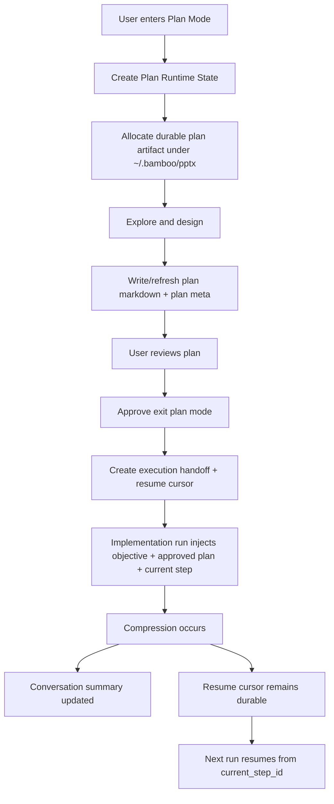

# Bamboo / Lotus vs Claude Code-style Plan Mode Gap Analysis

## Executive Summary

当前 Bamboo + Lotus 已经具备了 **plan mode 的基础状态闭环**，但离 Claude Code 风格的“真正 plan mode”仍有几处关键差距。

最核心的差异不是 UI，而是：

1. **Plan 还没有成为一个真正的一等上下文对象**
   - Bamboo 目前有 `PlanModeState`、`plan_file_path`、`PlanStore`、前端 badge/indicator
   - 但 plan 文件本身还没有真正接入运行时主循环
   - 也没有把“当前计划内容 / 当前执行锚点 / 下一步”稳定注入到执行上下文里

2. **当前 context 管理更偏“任务列表 + memory + conversation summary”**，而不是“plan 驱动执行”
   - Bamboo 会把 task list、external memory、workspace/instruction/env context 注入 system prompt
   - 压缩后也会保留 conversation summary
   - 但并没有单独、稳定地把 plan 本身作为恢复与继续执行的主锚点

3. **PlanStore 已存在，但实际落盘路径和接线还不符合目标**
   - 现在 `PlanStore` 默认是 `${BAMBOO_DATA_DIR}/plans/*.md`
   - 你希望改到 `~/.bamboo/pptx/` 下
   - 更重要的是：当前代码里几乎看不到 `PlanStore::write_plan/read_plan/delete_plan` 被真正接入 plan mode 生命周期

4. **压缩/恢复后的“从哪里开始”仍主要依赖摘要与任务列表，而不是 plan checkpoint**
   - 当前恢复能力偏向：`conversation_summary` + `task_list` + `external_memory` + `pending_question`
   - 缺少显式的“resume anchor / execution cursor / current objective block”
   - 这会导致压缩后还能大概知道做什么，但不够稳定地知道“现在正处于 plan 的哪一步、下一步从哪里继续”

---

## Current Architecture Snapshot

### Backend (Bamboo)

#### 1. Runtime plan mode state exists
- File: `bamboo/crates/bamboo-domain/src/session/runtime_state.rs`
- `PlanModeState` currently includes:
  - `entered_at`
  - `pre_permission_mode`
  - `plan_file_path`
  - `status`
- `PlanModeStatus` variants:
  - `exploring`
  - `designing`
  - `reviewing`
  - `finalizing`
  - `awaiting_approval`

This means Bamboo already treats plan mode as persisted runtime state, not just a transient UI flag.

#### 2. Enter/exit plan mode transitions exist
- File: `bamboo/crates/bamboo-server/src/session_app/respond.rs`
- `EnterPlanMode` currently:
  - creates `runtime_state.plan_mode`
  - sets `status = Exploring`
  - sets `plan_file_path = None`
- `ExitPlanMode` currently:
  - clears `runtime_state.plan_mode`
  - restores previous permission mode logically

Important gap:
- Entering plan mode does **not** currently allocate or persist a real plan file path
- Exiting plan mode does **not** appear to read or embed the final plan content as a durable execution handoff artifact

#### 3. Plan mode instructions are injected into system prompt
- File: `bamboo/crates/bamboo-engine/src/runtime/runner/prompt_context/plan_mode.rs`
- When `session.agent_runtime_state.plan_mode` is active, Bamboo injects a prompt block with:
  - read-only exploration constraints
  - status hint (`EXPLORE`, `DESIGN`, `REVIEW`, `FINALIZE`, `AWAITING APPROVAL`)
  - workflow guidance

This is useful, but the injected block is mostly **behavioral instruction**, not **execution memory**.

It tells the model *how to behave in plan mode*, but it does not guarantee that the model still knows:
- the exact current plan
- the current milestone
- the next actionable step
- what has already been completed in the plan

#### 4. Session summary/index mirrors plan mode to frontend
- File: `bamboo/crates/bamboo-server/src/handlers/agent/sessions/types.rs`
- File: `bamboo/crates/bamboo-infrastructure/src/storage/v2.rs`

`SessionSummary` and `SessionIndexEntry` both include `plan_mode`, so the frontend can render plan status without loading full session history.

That part is good and already close to “Claude-style visible state”.

#### 5. SSE critical events include plan mode state transitions
- File: `bamboo/crates/bamboo-server/src/handlers/agent/execute/runtime/events.rs`
- `PlanModeEntered` / `PlanModeExited` are treated as critical replayable events

This means late subscribers can still catch up on current plan mode state.
That is correct for UI continuity.

---

### Frontend (Lotus)

#### 1. Frontend consumes `plan_mode` from session summaries
- File: `lotus/src/services/chat/AgentService.ts`
- `SessionSummary.plan_mode` exists
- `SessionPlanModeState` currently includes:
  - `entered_at`
  - `pre_permission_mode`
  - `plan_file_path`
  - `status`

But note a mismatch:
- backend supports more statuses (`reviewing`, `awaiting_approval`)
- frontend type currently only accepts:
  - `exploring`
  - `designing`
  - `finalizing`

This means frontend typing is already lagging behind backend state richness.

#### 2. Frontend handles plan mode SSE events
- File: `lotus/src/hooks/useAgentEventSubscription.ts`

Current behavior:
- `plan_mode_entered` -> updates session `planMode`
- `plan_mode_exited` -> clears session `planMode`
- fallback path refreshes chats when event payload is insufficient

This is enough for status mirroring, but still not enough for **execution continuity**.

#### 3. UI indicators exist
- File: `lotus/src/pages/ChatPage/components/ChatItem/index.tsx`
  - sidebar row shows purple `Plan` badge
- File: `lotus/src/pages/ChatPage/components/ChatView/index.tsx`
  - current chat view top area shows plan mode tag

So the frontend visual part is mostly implemented.

---

## Comparison: Bamboo/Lotus vs Claude Code-style Plan Mode

## 1. Biggest gap: context management model

### Current Bamboo model
Bamboo currently manages context through multiple parallel channels:
- system prompt base prompt
- workspace context
- instruction context
- env context
- skill context
- tool guide context
- external memory
- task list
- conversation summary (`conversation_summary`)
- runtime plan mode instruction block

This is a strong general-purpose context system.

### Claude Code-style expectation
Claude Code-style plan mode is closer to:

1. A **plan artifact** exists outside the current transient conversation
2. The runtime always knows:
   - what the objective is
   - what the current plan is
   - what step is current
   - what is already done
   - what comes next
3. Compression does **not** demote the plan into a fuzzy summary
4. Exiting plan mode becomes a controlled handoff from
   - exploration / design context
   - to implementation context
   - with plan preserved as execution scaffold

### Gap summary
Current Bamboo:
- has many context sources
- but plan is **not yet the primary control artifact**

Claude-style target:
- plan should become a **first-class execution scaffold**

### Recommendation
Introduce a dedicated **Plan Runtime Context** section that is injected separately from:
- external memory
- task list
- conversation summary

Suggested structure:

```md
<!-- BAMBOO_PLAN_RUNTIME_START -->
# Current Objective
...

# Approved / Active Plan
...

# Current Execution Cursor
- phase: implementing
- step_id: step-3
- step_title: wire SessionSummary.plan_mode into Lotus store

# Completed Steps
- step-1
- step-2

# Next Step
- step-4: update plan-mode-aware resume prompt
<!-- BAMBOO_PLAN_RUNTIME_END -->
```

This should survive compression and be regenerated from durable state, not inferred from recent messages only.

---

## 2. Plan storage location

### Current implementation
- File: `bamboo/crates/bamboo-memory/src/plan_store.rs`
- Current storage directory:
  - `${BAMBOO_DATA_DIR}/plans/`

### Important finding
`PlanStore` exists, but current code inspection strongly suggests it is **not truly wired into the plan mode lifecycle yet**:
- `PlanStore::write_plan`
- `PlanStore::read_plan`
- `PlanStore::delete_plan`
- `PlanStore::plan_exists`

appear to exist primarily as storage primitives and tests, but are not visibly integrated into the active Enter/Exit/Resume flow.

So the real gap is not only **where** the plan is stored, but **that the plan store is not yet authoritative runtime state**.

### Your target
You want plan files under:
- `~/.bamboo/pptx/`

### Recommendation
If this directory name is intentional for your own taxonomy, Bamboo can support it, but from a semantics perspective the stronger design is:

- `~/.bamboo/plans/` for semantic clarity
- OR if you insist on `~/.bamboo/pptx/`, make it an explicit plan artifact directory and document the naming convention

If using `~/.bamboo/pptx/`, define a clear layout:

```text
~/.bamboo/pptx/
  <session-id>.plan.md
  <session-id>.execution.md        # optional execution handoff snapshot
  <session-id>.meta.json           # status, cursor, updated_at, root objective
```

### Recommended stronger design
Do not store only markdown.
Store:

1. **Human-readable markdown plan**
2. **Machine-readable metadata**

Example:

```json
{
  "session_id": "...",
  "status": "awaiting_approval",
  "objective": "Implement true plan mode for Bamboo",
  "current_step_id": "step-3",
  "completed_step_ids": ["step-1", "step-2"],
  "updated_at": "...",
  "source_session_updated_at": "..."
}
```

This machine-readable metadata is what will let resume/compaction remain reliable.

---

## 3. Plan mode status model is present but underused

### Current state
Backend statuses include:
- `exploring`
- `designing`
- `reviewing`
- `finalizing`
- `awaiting_approval`

Frontend currently only accepts:
- `exploring`
- `designing`
- `finalizing`

### Gap
This means status exists more richly in backend than frontend consumes.

### Recommendation
Align frontend with full backend enum:
- `exploring`
- `designing`
- `reviewing`
- `finalizing`
- `awaiting_approval`

And expose status-specific UI semantics:
- `exploring`: read-only discovery
- `designing`: architecture/plan authoring
- `reviewing`: polishing/checking plan
- `finalizing`: writing durable plan artifact
- `awaiting_approval`: frozen plan awaiting user exit approval

---

## 4. Current task list is helpful, but it is not enough to replace plan

### Current Bamboo behavior
Task list is injected into system prompt:
- File: `bamboo/crates/bamboo-engine/src/runtime/runner/prompt_context/task.rs`

Compression summarization also explicitly treats task list as source-of-truth for active work.
This is good.

### But the task list is not the same as the plan
A task list answers:
- what work items exist
- what status they are in

A plan answers:
- why this approach was chosen
- what sequence matters
- what assumptions and risks exist
- what exactly should happen next
- what constitutes done for the current step

### Claude-style target
Plan should be the **narrative control plane**.
Task list should be the **operational checklist**.

### Recommendation
Keep both, but make their roles explicit:

- **Plan** = durable reasoning artifact and execution scaffold
- **Task list** = actionable progress tracker derived from / linked to plan

---

## 5. Compression is sophisticated, but resume anchoring is weak

### Current Bamboo compression model
Bamboo already has a fairly advanced compression pipeline:
- rolling summaries
- message archiving
- compression events
- prompt-side token management
- current task list included in summarization prompt
- conversation summary preserved in `session.conversation_summary`

This is significantly better than a naive “just trim old messages”.

### Current weakness
After compression, the runtime mainly relies on:
- conversation summary
- task list
- external memory
- surviving recent messages

What is missing is a **stable plan/execution resume anchor**.

### Why this matters
After compression, the model may know:
- roughly what the conversation was about
- roughly what tasks exist

But it may still lose precision on:
- what exact step was currently in progress
- whether the plan had already been approved
- whether implementation had started from plan step 2 or step 4
- what was intentionally postponed vs forgotten

### Recommendation: introduce a resume cursor
Add durable execution metadata such as:

```json
{
  "mode": "plan" | "execution",
  "objective": "...",
  "plan_file_path": "~/.bamboo/pptx/...",
  "current_phase": "implementing",
  "current_step_id": "step-3",
  "current_step_title": "Wire backend plan_mode summary into Lotus session store",
  "last_completed_step_id": "step-2",
  "resume_instruction": "Continue by implementing step-3. Do not redesign the plan unless blocked.",
  "updated_at": "..."
}
```

This should be injected into prompt as a dedicated runtime section before execution resumes.

---

## 6. “If executing the plan, the context must know the current goal”

This is exactly right.

### Current situation
When Bamboo transitions out of plan mode, it currently does not appear to automatically construct a strong execution handoff context that includes:
- the approved plan
- the current objective
- the current step
- what is already done
- where to continue

### Result
Execution after plan mode can still drift because it relies too heavily on:
- recent conversation
- task list
- memory summary

### Recommendation: explicit execution handoff block
When user approves leaving plan mode, Bamboo should generate a durable **execution handoff artifact**.

Example:

```md
# Execution Handoff

## Objective
Implement true Bamboo plan mode end-to-end.

## Approved Plan
1. Persist backend plan mode state
2. Expose session summary / SSE plan state
3. Show Lotus sidebar + chat indicators
4. Verify backend + frontend behavior

## Current Status
- Completed: 1, 2, 3
- In progress: 4

## Resume From
Run targeted validation for Bamboo server + Lotus typecheck/tests.

## Constraints
- Do not redesign the backend state model unless validation reveals a bug
- Preserve existing session summary API shape where possible
```

This block should be injected on execution runs even after compression.

---

## 7. “If work is done or compressed, where do we resume from?”

This is the most important design question.

### Current answer in Bamboo
Today, the answer is effectively:
- from conversation summary
- from task list
- from external memory
- from remaining recent messages
- from pending question state if one exists

This is **good for recovery**, but not yet **strong enough for deterministic continuation**.

### Better answer
Resume should come from this priority stack:

1. **Execution cursor / resume metadata**
   - authoritative
2. **Approved plan artifact**
   - durable scaffold
3. **Task list**
   - operational progress
4. **Conversation summary**
   - narrative memory fallback
5. **Recent messages**
   - local tactical detail

### In short
After compression, the system should not ask:
> “What were we doing again?”

It should ask:
> “Given the durable execution cursor and approved plan, continue from step X.”

---

## 8. Specific implementation gaps found in code

## Gap A — `PlanStore` is not truly integrated
Current evidence suggests:
- storage primitive exists
- lifecycle integration is incomplete or absent

### Fix
Wire it into:
- `EnterPlanMode` -> allocate/init plan artifact path
- plan finalization -> write markdown plan + metadata
- `ExitPlanMode` approval -> persist execution handoff metadata
- resume flow -> load plan artifact + cursor into prompt

---

## Gap B — frontend type enum is incomplete
- File: `lotus/src/services/chat/AgentService.ts`
- `SessionPlanModeState.status` currently misses:
  - `reviewing`
  - `awaiting_approval`

### Fix
Align frontend enum with backend fully.

---

## Gap C — plan mode prompt block contains instructions, not plan memory
- File: `bamboo/crates/bamboo-engine/src/runtime/runner/prompt_context/plan_mode.rs`

Current content is mostly behavioral policy.

### Fix
Split into two prompt sections:
1. **Plan Mode Policy Section** — what tools/behavior are allowed
2. **Plan Runtime Context Section** — actual objective / plan / cursor / next step

---

## Gap D — execution handoff is missing
No strong evidence of an automatic handoff block after plan approval.

### Fix
When exiting plan mode with approval:
- generate execution handoff context
- persist it durably
- inject it in subsequent implementation runs

---

## Gap E — compression preserves summary, but not step cursor
Compression summary is already decent, but it is still not the same as a durable execution cursor.

### Fix
Persist a machine-readable cursor outside compressed conversation history.

---

## Recommended Target Architecture



---

## Concrete Recommendations

## High Priority

### 1. Make plan artifact durable and authoritative
Implement:
- markdown plan file
- machine-readable metadata file
- persistent `current_step_id`
- persistent `mode = plan | execution`

### 2. Move plan storage to the desired Bamboo data directory
If your chosen design is `~/.bamboo/pptx/`, wire it explicitly into `PlanStore`.

Suggested adaptation:
- change `PlanStore::new(data_dir)` target from `data_dir/plans` to `data_dir/pptx`
- or add config-based directory override

### 3. Inject plan runtime context into prompt
Do not rely only on:
- task list
- external memory
- summary

Add a dedicated injected section for:
- objective
- approved plan
- current step
- completed steps
- next step
- constraints

### 4. Add execution resume cursor
This is the key to answering:
- “压缩后从哪里继续？”
- “做完一个阶段后从哪里继续？”

## Medium Priority

### 5. Align Lotus plan mode status typing with backend
Update frontend enum support for:
- `reviewing`
- `awaiting_approval`

### 6. Show richer plan mode UI
Possible UI additions:
- status chip text by phase
- link/button to open current plan artifact
- “resume from step X” hint in chat header

### 7. Distinguish plan context from summary context
Make sure summary does not replace approved plan.
Summary is fallback memory, not authoritative plan state.

## Low Priority

### 8. Add observability for plan lifecycle
Track:
- plan artifact created_at / updated_at
- current_step_id changes
- transition timestamps
- compression count since approval
- last successful execution resume source

---

## Direct answers to your questions

## Q1. Bamboo + Lotus 和 Claude Code plan 模式最大的差异是什么？
**最大的差异确实是 context 管理。**

不是 badge，也不是 enter/exit 状态本身。
而是：
- Claude-style plan mode 把 plan 当成执行的主锚点
- 当前 Bamboo 更多还是把 summary/task list/memory 当恢复主锚点

## Q2. plan 要不要放在项目目录里？
**不应该放在项目目录里。**
应该放在 Bamboo 自己的数据目录下。

如果你要放到：
- `~/.bamboo/pptx/`

这是可行的，但建议配套：
- markdown 计划文件
- machine-readable metadata 文件
- 明确命名规范

## Q3. 如果进入执行 plan，如何保证上下文知道目标？
必须在执行阶段注入一个独立的 **execution handoff / resume context**，其中至少包含：
- objective
- approved plan
- current step
- completed steps
- next step
- constraints

不能只依赖 conversation summary。

## Q4. 如果做完了或者压缩了，要从哪里开始？
应该从：
1. durable execution cursor
2. approved plan artifact
3. task list
4. conversation summary
5. recent messages

而不是只从压缩摘要开始。

---

## Suggested Next Implementation Steps

1. **Wire `PlanStore` into the real plan mode lifecycle**
   - create plan artifact on enter
   - write/update on finalize
   - load on resume

2. **Change storage target to `~/.bamboo/pptx/`**
   - or make it configurable

3. **Create a durable plan metadata/cursor file**
   - `current_step_id`
   - `mode`
   - `objective`
   - `resume_instruction`

4. **Inject a new prompt section for plan runtime context**
   - distinct from summary/task/memory

5. **On exit approval, generate execution handoff context**

6. **On compression, keep updating summary — but never let summary replace the plan cursor**

7. **Update Lotus status typing and UI to reflect all backend states**

---

## Bottom Line

你的判断是对的：

> plan mode 的关键不是“进入 plan mode 时显示一个标识”，而是“系统在压缩、恢复、执行切换之后，是否仍然知道当前目标、当前计划、当前步骤，以及该从哪里继续”。

当前 Bamboo/Lotus：
- 已经有 plan mode 状态和 UI 雏形
- 但还没有把 **plan 本身** 做成真正的 durable execution scaffold

下一步最值得做的不是继续加 UI，
而是把 **plan artifact + execution cursor + prompt injection** 这一层补完整。
