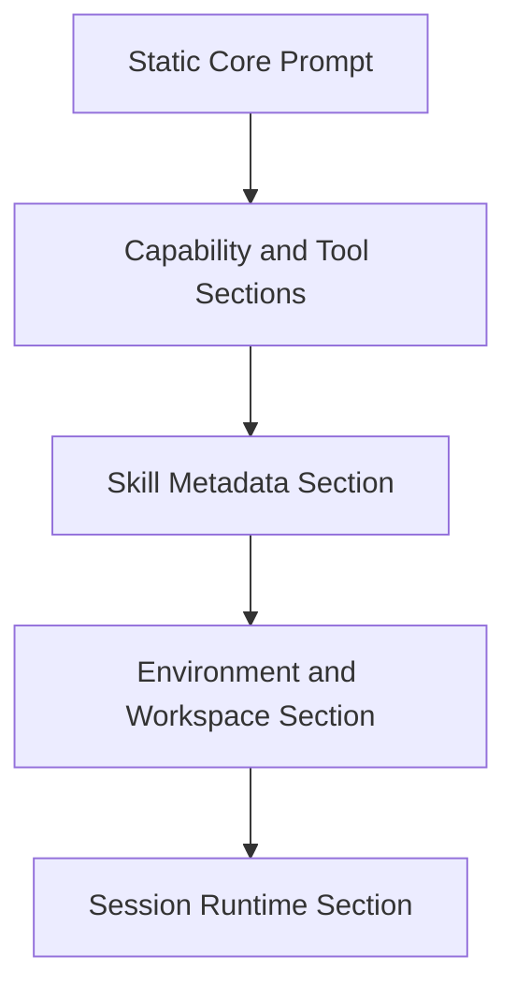

# Prompt 架构对比：Claude Code vs Zenith / Bamboo

> 本文只聚焦 **prompt 架构**，不再讨论 runtime、tool、skill、sub-agent 的执行细节本身。
>
> 重点回答的问题：
>
> 1. Claude Code 的 prompt 设计强在哪里？
> 2. Zenith / Bamboo / Lotus 现有 prompt 设计强在哪里？
> 3. 我们最值得学习什么？
> 4. 哪些地方不该照搬？
>
> 参考代码：
>
> - Claude Code
>   - `claude-code/src/constants/prompts.ts`
>   - `claude-code/src/context.ts`
>   - `claude-code/src/utils/queryContext.ts`
>   - `claude-code/src/tools/AgentTool/prompt.ts`
>   - `claude-code/src/tools/SkillTool/prompt.ts`
>   - `claude-code/src/coordinator/coordinatorMode.ts`
>
> - Zenith / Bamboo / Lotus
>   - `zenith/bamboo/src/agent/loop_module/runner/session_setup/prompt_setup.rs`
>   - `zenith/bamboo/src/agent/skill/context.rs`
>   - `zenith/bamboo/src/agent/tools/guide/context.rs`
>   - `zenith/lotus/src/shared/utils/systemPromptEnhancement.ts`
>   - `zenith/lotus/src/shared/utils/osInfoUtils.ts`
>   - `zenith/lotus/src/shared/utils/taskEnhancementUtils.ts`
>   - `zenith/lotus/src/shared/utils/mermaidUtils.ts`
>   - `zenith/lotus/src/shared/utils/copilotConclusionWithOptionsEnhancementUtils.ts`

---

## Executive Summary

### 一句话结论

Claude Code 的 prompt 体系更像一个 **prompt compiler / prompt operating system**，它把 system prompt 拆成多层 section，并明确了静态与动态边界、cache 行为、角色化 prompt、上下文分层注入；而我们当前的 Zenith / Bamboo / Lotus 体系已经具备 **prompt pipeline** 和 **metadata-only skill 注入** 的好基础，但在“边界设计、角色化模板、cache-aware assembly、可观测性”上仍然有明显提升空间。

### 最值得学的不是“它写了什么”

最值得学的是：

1. **把 prompt 当成可组合系统，而不是一大段文案**
2. **明确静态/动态 prompt 边界**
3. **让 tool / skill / policy / env / session state 分层注入**
4. **对子代理、协调者、skill execution 设计 prompt families**
5. **让 prompt assembly 可缓存、可观测、可 diff**

---

# 一、Claude Code 的 Prompt 架构为什么强？

## 1. 它不是一个 system prompt，而是一套 system prompt system

Claude Code 的 `constants/prompts.ts` 并没有把所有规则写成一整段字符串，而是拆成很多 section function：

- `getSimpleIntroSection()`
- `getSimpleSystemSection()`
- `getSimpleDoingTasksSection()`
- `getActionsSection()`
- `getUsingYourToolsSection()`
- `getAgentToolSection()`
- `getOutputStyleSection()`
- `getMcpInstructionsSection()`

证据：
- `claude-code/src/constants/prompts.ts:127`
- `claude-code/src/constants/prompts.ts:142`
- `claude-code/src/constants/prompts.ts:151`
- `claude-code/src/constants/prompts.ts:160`
- `claude-code/src/constants/prompts.ts:175`
- `claude-code/src/constants/prompts.ts:198`
- `claude-code/src/constants/prompts.ts:255`
- `claude-code/src/constants/prompts.ts:268`
- `claude-code/src/constants/prompts.ts:316`

这意味着 Claude Code 的 prompt 不是“一个文件”，而是“多个 prompt section 的组合产物”。

### 这带来的工程优势

- 可以按 feature gate 条件插拔 section
- 可以按角色切换 section
- 可以对 section 单独缓存、单独追踪
- 可以更清楚地知道某一段规则到底来自哪里

---

## 2. 它显式区分静态 prompt 和动态 prompt

Claude Code 在 `constants/prompts.ts` 中非常明确地声明了：

- `SYSTEM_PROMPT_DYNAMIC_BOUNDARY`

并且注释直接说明：

- marker 前面的内容可以做 cross-org cache
- marker 后面的内容包含 user/session-specific 动态内容

证据：
- `claude-code/src/constants/prompts.ts:105-115`

### 这件事为什么重要？

因为 prompt 越复杂，真正决定系统可维护性的不是“写得多不多”，而是：

1. 哪些内容是稳定的？
2. 哪些内容是和用户/项目/会话绑定的？
3. 改一段 prompt 会不会让整个缓存体系全部失效？

Claude Code 已经把这个问题当成 prompt 架构的一部分来设计了。

---

## 3. 它把“系统规则”和“上下文”分成不同层

Claude Code 有两个非常关键的 context builder：

- `getSystemContext()`
- `getUserContext()`

证据：
- `claude-code/src/context.ts:116-149`
- `claude-code/src/context.ts:155-189`

### 其中：

#### `systemContext`
会注入：
- git status snapshot
- cache breaker injection

#### `userContext`
会注入：
- CLAUDE.md / memory files
- current date

也就是说 Claude Code 并没有把这些东西硬塞进同一段 system prompt，而是区分为：

- **基础规则层**
- **系统上下文层**
- **用户/项目上下文层**

这是 prompt 分层设计中非常成熟的做法。

---

## 4. 它的 prompt 组装是 cache-aware 的

`utils/queryContext.ts` 里有一句特别关键的话：

> building the API cache-key prefix

证据：
- `claude-code/src/utils/queryContext.ts:1-44`

它不是简单返回一个 prompt，而是在构造：

- `defaultSystemPrompt`
- `userContext`
- `systemContext`

并且这三个部分明确参与到 query cache-key 的构造逻辑中。

### 这意味着什么？

Claude Code 的 prompt 体系不是“给模型一段说明”这么简单，而是：

> prompt 组装本身就是 runtime cache strategy 的一部分。

这点非常值得学。

---

## 5. 它对角色 prompt 做了专门设计

Claude Code 不是只有一个主 prompt，它对不同 runtime role 有不同 prompt 族：

- 主线程 agent
- AgentTool 子代理
- coordinator mode
- worker mode
- skill fork execution
- teammate addendum

关键证据：
- `claude-code/src/tools/AgentTool/prompt.ts`
- `claude-code/src/tools/SkillTool/prompt.ts`
- `claude-code/src/coordinator/coordinatorMode.ts:111`
- `claude-code/src/utils/swarm/teammatePromptAddendum.ts`

这说明它已经把 prompt 从“一个 system prompt”升级为：

> **一组面向不同 runtime role 的 prompt families**

这点对 sub-agent / child session / scheduler / reviewer 这类角色特别重要。

---

## 6. 它把 context compression 也写进了 prompt 心智模型

在 Claude Code 的 prompt section 中，会明确告诉模型：

- conversation has unlimited context through automatic summarization
- system will automatically compress prior messages

证据：
- `claude-code/src/constants/prompts.ts:131-134`
- `claude-code/src/constants/prompts.ts:193`

### 为什么这很重要？

因为这其实是在告诉模型：

- 短期上下文不是唯一记忆载体
- 历史会被压缩，但不会完全消失
- 你要学会把关键结论写得稳定、可摘要

这是一种“prompt 与 compression strategy 对齐”的成熟设计。

---

# 二、我们当前的 Prompt 架构强在哪里？

## 1. Lotus 的 systemPromptEnhancement pipeline 已经是对的方向

Lotus 当前有明显的 enhancement pipeline：

- OS info enhancement
- Bamboo Operational Guidance
- user enhancement
- Mermaid enhancement
- Task enhancement
- Copilot conclusion_with_options enhancement
- workspace context

证据：
- `zenith/lotus/src/shared/utils/systemPromptEnhancement.ts:71-117`

### 这很重要

因为这说明我们已经不是“把 prompt 写死在一个文件里”，而是开始把 prompt 当作：

> **多个 segment 的可组合流水线**

这是对的，而且值得继续发展。

---

## 2. Bamboo 的 skill context 采用 metadata-only 注入，这是一个很大的优点

Bamboo 的 `build_skill_context()` 只注入：

- skill id
- name
- description
- tool refs
- compatibility hint

不会把 SKILL.md 正文塞进 prompt。

证据：
- `zenith/bamboo/src/agent/skill/context.rs:3-97`

### 这个设计的优点

1. 节省 token
2. skill catalog 可见，但正文按需加载
3. prompt 更稳，不容易膨胀
4. 与 `load_skill` / `read_skill_resource` 工具形成闭环

这点我认为我们不应该丢掉。

---

## 3. Bamboo 已经开始做 runtime prompt composer 了

`prompt_setup.rs` 这一层其实已经很接近 prompt compiler 雏形。

它会：

- resolve base prompt
- build tool guide context
- build skill context
- merge 到 system prompt
- 计算 fingerprint
- 记录 component flags / lengths
- 打印 effective system prompt

证据：
- `zenith/bamboo/src/agent/loop_module/runner/session_setup/prompt_setup.rs:15-103`
- `zenith/bamboo/src/agent/loop_module/runner/session_setup/prompt_setup.rs:105-215`

### 这说明我们已经有很好的基础：

不是从 0 开始，而是已经有：
- prompt assembly
- prompt fingerprint
- prompt metadata
- runtime logging

我们需要的是继续把这条路走深，而不是换方向。

---

# 三、我们最值得学习的 Prompt 架构设计

## 1. 学会明确“静态层”和“动态层”

这是我认为最值得学的第一点。

### 建议把 Bamboo prompt 分成：

#### Layer 1: Static Core Prompt
- agent identity
- 基础行为准则
- 安全/风险规则
- 通用任务哲学

#### Layer 2: Capability / Tool Prompt
- tool 使用规则
- permission 模式规则
- schedule / sub-session / workspace / memory 使用规则

#### Layer 3: Skill Metadata Prompt
- skill catalog metadata
- selected skills summary
- skill mode
- load protocol

#### Layer 4: Environment Prompt
- OS
- workspace path
- config location
- shell/platform hints
- env injection hints

#### Layer 5: Session Runtime Prompt
- task list summary
- compression reminder
- pending question / clarification state
- maybe child session summary

### 为什么这样分

因为这些层的变化频率、缓存价值和 token 价值完全不同。

---

## 2. 把所有 prompt section 函数化，而不是继续 append 字符串

Claude Code 最大的可借鉴点之一，就是 section function 化。

### 我建议我们未来的 prompt composer 结构是：

- `build_core_prompt_section()`
- `build_policy_prompt_section()`
- `build_tool_prompt_section()`
- `build_skill_prompt_section()`
- `build_environment_prompt_section()`
- `build_session_runtime_prompt_section()`
- `build_role_prompt_addendum(role)`

每个 section：
- 独立生成
- 独立开关
- 独立 fingerprint
- 独立统计 token

这样比“enhancement pipeline + append string”更适合长期演进。

---

## 3. 让子代理 / skill / scheduler / reviewer 有 prompt families

这点非常值得学，而且和你前面关注的 sub-agent/runtime 完全相关。

### 不建议继续只用：
- base prompt
- 加一句“you are child session”

### 更建议：
定义 prompt families：

- `root_session`
- `child_session`
- `reviewer`
- `researcher`
- `planner`
- `skill_fork`
- `scheduler_run`
- `coordinator`

每个 family 可以共享 core sections，但必须有自己的 role addendum。

### 收益

- 不同角色的行为会更稳定
- 不需要在主 prompt 里不断堆条件分支
- 更适合配合 agent profile / subagent_type 演进

---

## 4. 把 prompt 与 context compression / memory strategy 明确对齐

Claude Code 这点做得很好：它在 prompt 中明确告诉模型上下文会自动压缩。

我们建议在 Bamboo prompt 中系统化加入：

- 对话上下文可能被压缩和总结
- 关键决策应写入 task/memory/session metadata 等持久通道
- 不要依赖瞬时上下文中脆弱的信息
- skill / task / memory_note 是长期锚点

这样模型的行为会更稳定，也更符合我们的 runtime 设计。

---

## 5. 让 prompt assembly 可观测，而不只是最终字符串可见

Bamboo 已经有：
- composer version
- fingerprint
- component flags
- component lengths

这是非常好的基础。

### 下一步建议补：

1. section-level hash
2. static hash vs dynamic hash
3. token estimate per section
4. section diff log
5. session 中记录“哪些 section 被启用”

### 为什么重要

以后你分析“这轮为什么变聪明/变傻/触发某个奇怪行为”时，真正有用的是：

- 哪个 section 改了
- 哪一层变了
- 哪个 enhancement 在生效

而不是只看一大坨最终 prompt。

---

# 四、我们不该误学什么？

## 1. 不要只学它写了哪些句子

Claude Code 的 prompt 强，不是因为某段句子特别神，而是因为它有：

- 分层
- 角色化
- 动态边界
- cache-aware 组装
- section 化

如果只是抄文案，很容易得到一个更长、更乱、更难维护的 system prompt。

---

## 2. 不要把所有增强都继续堆在一个 pipeline 里

Lotus 当前 enhancement pipeline 很好，但长期风险是：

- 越加越多
- 难区分哪些是 UI enhancement，哪些是 runtime policy
- provider-specific 逻辑越来越杂

所以后续应该从：

- `enhancement pipeline`

进化到：

- `typed prompt sections + layered prompt composer`

---

## 3. 不要把 role-specific 行为永远放在主 prompt 上 patch

如果未来继续这样做：
- child session append 一段
- reviewer append 一段
- scheduler append 一段
- skill mode append 一段

那主 prompt 最终会越来越像一个“条件分支大杂烩”。

这正是 prompt families 应该解决的问题。

---

# 五、我建议 Zenith / Bamboo 下一步怎么升级 prompt 架构

## P0：先做 prompt layering

建议先落一个明确模型：



### 落地做法

在 Bamboo 里增加：
- `PromptSectionId`
- `PromptLayer`
- `PromptSectionOutput`
- `PromptAssemblyReport`

让每个 section 都有：
- id
- layer
- content
- chars
- token estimate
- cacheability
- enabled_reason

---

## P0：引入 static / dynamic boundary

建议在 Bamboo prompt composer 中定义两个边界：

- `STATIC_CORE_BOUNDARY`
- `DYNAMIC_RUNTIME_BOUNDARY`

并分别记录：
- static hash
- dynamic hash
- full hash

这会让后续的 prompt cache、debug 和回归分析容易很多。

---

## P1：做 role prompt families

建议先从最重要的四类开始：

1. root session
2. child session
3. reviewer
4. researcher

然后再扩展：
- planner
- scheduler
- skill fork
- coordinator

---

## P1：把 Lotus enhancement 映射到 typed prompt sections

当前 Lotus 的：
- OS info enhancement
- Mermaid enhancement
- Task enhancement
- Copilot conclusion enhancement
- workspace context

都可以映射到不同 PromptSection，而不是继续只是字符串 pipeline。

这样做的好处是：
- UI 开关和 runtime section 一一对应
- 更容易记录 metrics
- 更容易知道最终 prompt 是怎么来的

---

## P2：做真正的 prompt compiler / registry

最终理想形态：

```ts
{
  id: "skill-metadata",
  layer: "capability",
  cacheability: "dynamic",
  enabledWhen: ["skill_manager_available"],
  build: () => {...}
}
```

也就是把 prompt section 变成一种正式 registry，而不是散落在各处的拼接逻辑。

---

# 六、最后结论

## Claude Code 在 prompt 架构上最强的地方

1. section 化
2. 静态/动态边界
3. context 分层
4. role prompt families
5. cache-aware assembly
6. compression-aware prompt design

## 我们当前最强的地方

1. enhancement pipeline 已经存在
2. skill metadata-only 注入很优秀
3. runtime prompt fingerprint / metadata 已经开始做了
4. Lotus 和 Bamboo 分层后更容易做 typed prompt system

## 我们最该学习的 5 件事

1. **static/dynamic boundary**
2. **section 化 prompt composer**
3. **role-specific prompt families**
4. **prompt 与 compression/memory strategy 对齐**
5. **section-level observability**

## 一句话建议

**不要把 prompt 做得更长，而要把 prompt 做得更有架构。**
