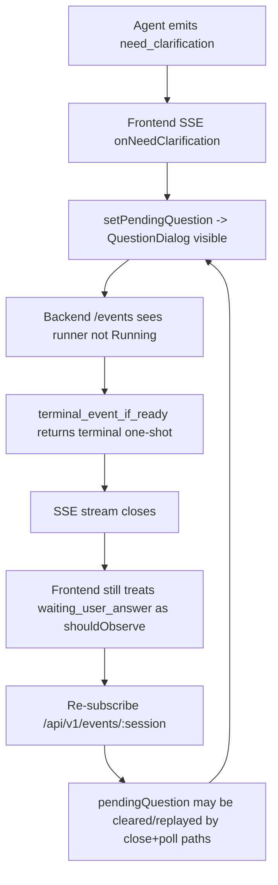

# QuestionDialog 持续闪烁 / 重复渲染分析

## 结论

`QuestionDialog` 的闪烁**不是单纯 React 普通重渲染**，而是更上游的 **SSE 订阅被反复重建 + pendingQuestion 状态被来回 set/clear** 导致的 UI 抖动。

从当前代码看，核心根因是：

1. 前端把 `waiting_user_answer` 也当作 `busy` / `shouldObserve=true`，因此在等待用户回答时仍然持续维持/重建 SSE 订阅。
2. 后端 `/api/v1/events/:session_id` 在 runner 不再 Running 时，会尝试直接返回 one-shot terminal response；当前 `terminal_event_if_ready()` 只检查：
   - 最后一条消息是不是 user
   - 有没有 running child
   **没有检查 session 是否正处于 pending question / suspended 等待回答态。**
3. 因此在 `need_clarification` 之后，前端收到问题并进入 `waiting_user_answer`，但 SSE 很快被服务端当成“可终结”流关闭；前端又因为 `waiting_user_answer` 仍属于 busy 态，立刻再次订阅 `/events`；于是形成：
   - 订阅
   - 服务端立即终结
   - 前端再次订阅
   - ...循环
4. 在这个过程中，`QuestionDialog` 自己还会通过 `/respond/{sessionId}/pending` 轮询与 store 状态交互；另一边 SSE `onComplete` 里也会 `clearPendingQuestion(sessionId)`。这会让对话框在 store 中被反复清空/重现，表现为闪烁。

---

## 关键证据

### 1. `QuestionDialog` 本身是按 `storePendingQuestion` 决定显示与否

- `lotus/src/components/QuestionDialog/QuestionDialog.tsx:521`
- `lotus/src/components/QuestionDialog/QuestionDialog.tsx:522`

```tsx
if (isLoading || !storePendingQuestion) {
  return null;
}
```

只要 `storePendingQuestion` 被清掉，组件立即消失；再次被写入，又立刻出现。

### 2. `QuestionDialog` 自己会轮询 `/respond/:sessionId/pending`

- `lotus/src/components/QuestionDialog/QuestionDialog.tsx:176`
- `lotus/src/components/QuestionDialog/QuestionDialog.tsx:197`
- `lotus/src/components/QuestionDialog/QuestionDialog.tsx:202`
- `lotus/src/components/QuestionDialog/QuestionDialog.tsx:333`
- `lotus/src/components/QuestionDialog/QuestionDialog.tsx:358`

其中：
- 有 pending question -> `setPendingQuestion(sessionId, payload)`
- 无 pending question / 404 / poll error -> `clearPendingQuestion(sessionId)`

所以只要上游接口或状态来回变化，Dialog 就会闪。

### 3. `useAgentEventSubscription` 在收到 clarification 时会写入 pendingQuestion

- `lotus/src/hooks/useAgentEventSubscription.ts:1662`
- `lotus/src/hooks/useAgentEventSubscription.ts:1677`

```ts
onNeedClarification: (event) => {
  ...
  setPendingQuestion(targetSessionId, {
    question: event.question || "",
    options: event.options || [],
    allowCustom: event.allow_custom ?? true,
    toolCallId: event.tool_call_id ?? null,
  });
}
```

### 4. 但同一个 hook 在 `onComplete` 时又会清掉 pendingQuestion

- `lotus/src/hooks/useAgentEventSubscription.ts:1219`
- `lotus/src/hooks/useAgentEventSubscription.ts:1223`
- `lotus/src/hooks/useAgentEventSubscription.ts:1259`
- `lotus/src/hooks/useAgentEventSubscription.ts:1260`

虽然这里已经有 `rootClarificationSeen` 保护：

```ts
if (rootClarificationSeen) {
  terminalEventSeen = true;
  setStreamingStatus(null);
  streamingMessageBus.forceFlush();
  return;
}
```

正常 live SSE 场景下，这能避免 clarification 后被当成普通 complete 处理。

### 5. 但后端事件流入口会在 runner 非 Running 时直接尝试 terminal response

- `bamboo/crates/bamboo-server/src/handlers/agent/events/handler.rs:58`
- `bamboo/crates/bamboo-server/src/handlers/agent/events/handler.rs:65`
- `bamboo/crates/bamboo-server/src/handlers/agent/events/handler.rs:67`

```rust
let should_attempt_terminal = !matches!(runner_status, Some(AgentStatus::Running));
if should_attempt_terminal {
    if let Some(terminal_event) =
        terminal_event_if_ready(&state, &session_id, runner_status).await
    {
        return terminal_response(...);
    }
}
```

也就是说，只要 runner 不再是 `Running`，就可能直接返回 one-shot terminal stream。

### 6. `terminal_event_if_ready()` 没有检查 pending question / suspended

- `bamboo/crates/bamboo-server/src/handlers/agent/events/terminal.rs:8`
- `bamboo/crates/bamboo-server/src/handlers/agent/events/terminal.rs:13`
- `bamboo/crates/bamboo-server/src/handlers/agent/events/terminal.rs:16`
- `bamboo/crates/bamboo-server/src/handlers/agent/events/terminal.rs:19`

```rust
pub(super) async fn terminal_event_if_ready(...) -> Option<AgentEvent> {
    if last_message_is_user(state, session_id).await {
        return None;
    }
    if has_running_child(state, session_id).await {
        return None;
    }
    Some(terminal_event_for_status(runner_status))
}
```

问题在这里：

它只知道：
- 最后一条 message 是否 user
- 是否有运行中的 child

**不知道当前 session 其实在等待用户回答 clarification。**

而项目里其他地方其实已经有这种概念：
- `SessionSummary.has_pending_question`
- `session.has_pending_question()`
- `agent_runtime_state.status == Suspended`

但这里没用上。

### 7. 前端把 `waiting_user_answer` 当作 busy，会继续强制保持 SSE 观察

- `lotus/src/pages/ChatPage/store/slices/executionStateSlice.ts:218`
- `lotus/src/pages/ChatPage/store/selectors/executionSelectors.ts:112`
- `lotus/src/hooks/useAgentEventSubscription.ts:1943`
- `lotus/src/hooks/useAgentEventSubscription.ts:1976`

`isBusyPhase()` 的定义只排除：
- idle
- completed
- error
- cancelled

所以 `waiting_user_answer` 仍然属于 busy。

这会让 `useAgentEventSubscription` 的 effect 不断确保该 session 有订阅：

```ts
Object.entries(state.executionBySession)
  .filter(([, entry]) => isBusyPhase(entry.phase))
```

于是等待澄清时：
- 前端认为还应继续 observe
- 后端却认为可以 terminal close
- 两边语义冲突，产生高频重连

### 8. 你的截图和日志与此完全吻合

截图里的服务端日志持续打印：

- `Events subscription requested`

这正是：
- 前端不断 `startSubscription(sessionId)`
- `AgentClient.subscribeToEvents()` 重复连 `/api/v1/events/:sessionId`
- 服务端每次都进入 `handler()`

而非普通 React render 能直接造成的现象。

---

## 为什么会表现成 QuestionDialog 闪烁



完整链路大致是：

1. Agent 发出 `need_clarification`
2. 前端 SSE 收到事件，`setPendingQuestion()`，Dialog 出现
3. 当前 SSE 流因服务端 terminal 逻辑被关闭
4. 前端仍把该 session 视为 busy -> 立刻重新订阅
5. 某些订阅结束路径 / poll / summary 同步又会触发 `clearPendingQuestion()` 或让组件短暂进入空态
6. 下一次 `/pending` poll 或 replay 又重新 `setPendingQuestion()`
7. UI 上就看到 Dialog 一直闪

---

## 最小修复建议

### 方案 A：优先修后端（推荐）

在 `bamboo/crates/bamboo-server/src/handlers/agent/events/terminal.rs` 的 `terminal_event_if_ready()` 中，增加“等待用户回答时不可 terminal”的判断。

也就是在下面两项之外，再加一项：
- last message is user -> 不 terminal
- has running child -> 不 terminal
- **has pending question / runtime suspended -> 不 terminal**

建议检查来源：
- `session.has_pending_question()`
- 或 session runtime state 是否为 suspended / waiting clarification

目标语义：

> 当 session 正在等待用户对 `NeedClarification` 作答时，`/events/:session_id` 不应返回 one-shot terminal；应该维持 live stream（哪怕只是 heartbeat），直到用户 respond 或状态真正结束。

这是根因修复，能解决：
- 高频 `Events subscription requested`
- 前后端对等待澄清语义不一致
- Dialog 闪烁

### 方案 B：前端兜底修复

即便后端修了，我仍建议前端补一个保护，避免 future regressions。

#### B1. 在 SSE close 后，如果当前 phase 是 `waiting_user_answer`，不要重连，也不要清 pendingQuestion

可在：
- `lotus/src/hooks/useAgentEventSubscription.ts:1722` 附近

当前逻辑是：
- stream ended
- 若 `stillBusy` 为 true，则 `scheduleReconnect()`

建议增加：

```ts
const currentEntry = useAppStore.getState().executionBySession?.[sessionId];
if (currentEntry?.phase === "waiting_user_answer") {
  return;
}
```

同样在 error/reject 分支也加类似保护。

这样即便后端错误地关闭了 SSE，前端也不会在等待用户输入阶段疯狂重连。

#### B2. `selectShouldObserve()` 不要简单等于 `isBusyPhase()`

当前位置：
- `lotus/src/pages/ChatPage/store/selectors/executionSelectors.ts:112`

现在：

```ts
return isBusyPhase(entry?.phase);
```

建议改成更精确的“需要 SSE 实时观察”的语义，例如排除：
- `waiting_user_answer`

因为这个阶段本质不是 agent 正在执行，而是 agent 已暂停等待用户输入。

这会减少很多无效 SSE 连接。

---

## 我更推荐的修复顺序

1. **先修后端 terminal 判断**
   - 让等待 clarification 的 session 不返回 terminal one-shot
2. **再修前端 observe 语义**
   - `waiting_user_answer` 不再自动重连 SSE
3. 保留 `QuestionDialog` 的 `/pending` 轮询作为兜底
   - 它本来就是为“问题后来才出现”以及 missed SSE 准备的

---

## 建议验证方法

### 打开前端调试

在 DevTools Console 里：

```js
localStorage.setItem('lotus_debug_sse', '1')
localStorage.setItem('lotus_debug_respond', '1')
```

然后刷新页面。

### 期望修复后行为

1. 当 agent 发出 clarification：
   - `QuestionDialog` 出现一次
   - 不应持续闪烁
2. 服务端日志：
   - `Events subscription requested` 最多出现少量正常次数
   - 不应每秒多次刷屏
3. 前端日志：
   - 不应看到 `streamEnded -> scheduleReconnect -> startSubscription` 在 waiting_user_answer 期间循环
4. 用户回答后：
   - Dialog 消失
   - execution 恢复
   - SSE 在真正恢复运行时再重新进入 live 状态

---

## 关键代码位置清单

### 前端
- `lotus/src/components/QuestionDialog/QuestionDialog.tsx:176`
- `lotus/src/components/QuestionDialog/QuestionDialog.tsx:197`
- `lotus/src/components/QuestionDialog/QuestionDialog.tsx:202`
- `lotus/src/components/QuestionDialog/QuestionDialog.tsx:333`
- `lotus/src/components/QuestionDialog/QuestionDialog.tsx:521`
- `lotus/src/hooks/useAgentEventSubscription.ts:1662`
- `lotus/src/hooks/useAgentEventSubscription.ts:1722`
- `lotus/src/hooks/useAgentEventSubscription.ts:1775`
- `lotus/src/pages/ChatPage/store/selectors/executionSelectors.ts:112`
- `lotus/src/pages/ChatPage/store/slices/executionStateSlice.ts:218`

### 后端
- `bamboo/crates/bamboo-server/src/handlers/agent/events/handler.rs:58`
- `bamboo/crates/bamboo-server/src/handlers/agent/events/handler.rs:65`
- `bamboo/crates/bamboo-server/src/handlers/agent/events/terminal.rs:8`
- `bamboo/crates/bamboo-server/src/handlers/agent/events/terminal.rs:13`
- `bamboo/crates/bamboo-server/src/handlers/agent/events/terminal.rs:16`
- `bamboo/crates/bamboo-server/src/handlers/agent/events/terminal.rs:19`

---

## 一句话总结

`QuestionDialog` 一直闪，是因为**等待用户回答**这个状态，在前端被当成“还要持续 SSE 观察”，但在后端 `/events` 又被当成“可以 terminal close”；两边语义冲突，导致 SSE 高频重连、pendingQuestion 状态反复 set/clear，最终表现为 Dialog 闪烁。
