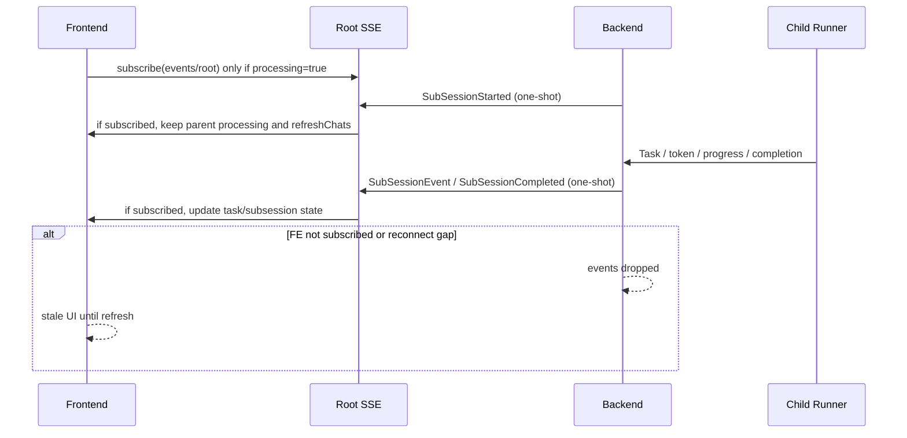
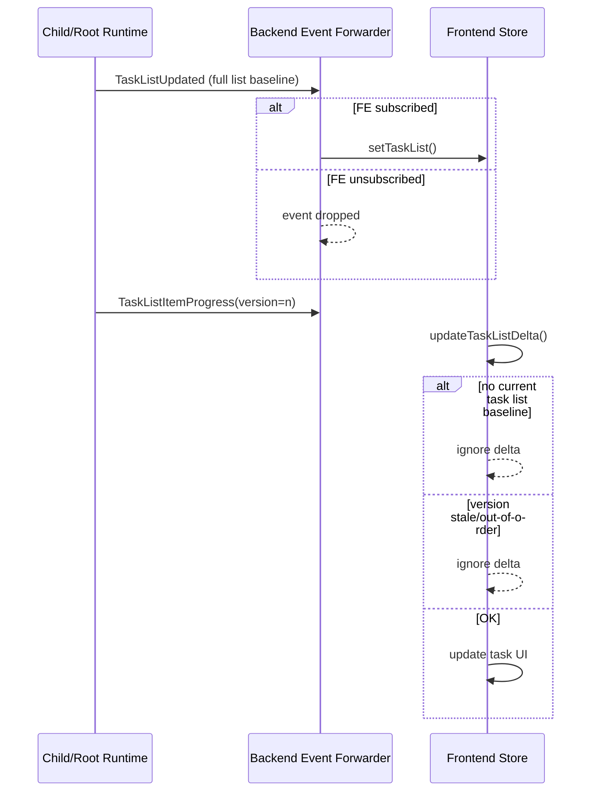

# Root Session / Sub Session / Task 同步问题深度分析报告

- 项目：`/Users/bigduu/Workspace/TauriProjects/zenith`
- 审查范围：`lotus/` 前端同步逻辑、`bamboo/` 后端事件传播与 child/root 协调
- 用户问题：
  - 之前降低了请求后端 session / events 的频率后，同步明显变差
  - root session 与 sub session 的最新状态经常要整页刷新才能看到
  - child session 完成后，root session 不一定及时显示最新消息/状态
  - Task 工具在前端很容易“卡住”，但后端其实还在正常运行
  - root session 创建 sub session 时，前端有时也拿不到最新状态
- 结论级别：高置信度

---

## Executive Summary

### 结论一句话
**是的，这个问题和之前“降频”有直接关系，但不只是降频本身。** 更准确地说：

> 你们把“周期性自愈同步”削弱了，但前后端现有的实时事件链路本来就不是强可靠、可重放、可补偿的设计。

结果就是：
- 一旦 SSE 短暂断开、订阅建立稍晚、或者某个事件在没有订阅者时发出，前端就可能**永远错过一次关键状态跃迁**；
- 而 session index 的主动轮询又被关闭了，系统失去了“靠后端摘要自动补回”的兜底机制；
- 对于 root/sub-session/task 这种**强依赖事件顺序**的场景，表现最明显。

### 本次审查得到的核心结论

#### 前端侧
1. **周期性 session index 同步已经被关闭**，前端不再每 2 秒主动拉 session 列表：
   - `lotus/src/pages/ChatPage/store/index.ts:237-241`
2. 前端现在高度依赖：
   - `processingChats` 触发 SSE 订阅
   - 事件回调里触发 `refreshChats()`
   - `refreshChats()` 再去更新 sidebar / child session 列表
3. 但 `refreshChats()` 本身又有：
   - **750ms throttle**
   - **in-flight dedup**
   - `applySessionsList()` 优先保留本地状态、只做有限合并
   - `loadChatHistory(monotonic)` 对“更短/未明显进展”的快照会直接拒绝替换
4. 所以现在前端已经变成一个**高度事件驱动 + 低频摘要刷新 + 强本地保守合并**的系统。只要漏掉几个关键事件，就很容易一直 stale。

#### 后端侧
1. **服务端事件转发器在没有 SSE 订阅者时会直接丢事件**：
   - `bamboo/crates/bamboo-server/src/handlers/agent/execute/runtime/events.rs:34-44`
2. 对晚订阅者的 replay 基本只有：
   - `TokenBudgetUpdated`
   - 而 **没有 Task / SubSession / Tool / Child completion 的 replay**
   - `bamboo/crates/bamboo-server/src/handlers/agent/events/handler.rs:47-50`
3. child session 的关键状态变化很多是**一次性 broadcast 事件**：
   - `SubSessionStarted`
   - `SubSessionEvent`
   - `SubSessionCompleted`
   - 如果前端当时没连上或刚好断开，就只能等别的路径补回来
4. root 恢复执行、child completion 写入隐藏 resume message、Task 共享到 root 的状态，很多是：
   - **写盘成功，但不保证有一个可重放的“当前完整状态快照”能马上被前端重新拿到**

### 总结判断
当前同步问题不是一个单点 bug，而是以下三件事叠加：

1. **前端移除了周期性兜底同步**
2. **后端实时事件不是可靠投递/可重放语义**
3. **root/sub-session/task 这三条链刚好最依赖关键事件不能漏**

所以你看到的这些现象：
- child 完成后 root 不更新
- Task 卡在前端但后端正常继续
- root 创建 sub session 前端不立刻看到
- 需要整页刷新才恢复

都是**同一个系统性同步设计缺口**的不同表现。

---

## 一、当前前端同步模型：已经从“轮询兜底”切到“事件驱动优先”

## 1.1 周期性 session index 同步已关闭
证据：
- `lotus/src/pages/ChatPage/store/index.ts:237-241`

```ts
// NOTE: startSessionsIndexSync is no longer auto-started.
// ... updated on-demand rather than polling every 2 seconds
// useAppStore.getState().startSessionsIndexSync();
```

这意味着：
- 以前就算事件漏了，2 秒后 session list 还有机会补回来；
- 现在不再自动补，除非：
  - 用户主动操作
  - 某个事件回调触发 `refreshChats()`
  - 打开 session 时手动 `openSession(..., forceRefreshIndex)`

### 结论
这是问题恶化的第一个前提条件。

---

## 1.2 前端 session 列表更新现在依赖 `refreshChats()`
证据：
- `lotus/src/pages/ChatPage/store/slices/chatSessionSlice.ts:955-990`

`refreshChats()` 的行为：
1. 如果有请求 in-flight，直接复用
2. 如果在 throttle window 内，不立即发，排到 trailing promise
3. 否则立刻请求一次 `listSessions()`

### 关键参数
- `REFRESH_CHATS_THROTTLE_MS = 750`
  - `lotus/src/pages/ChatPage/store/slices/chatSessionSlice.ts:501`

### 意味着什么
如果在 750ms 内发生多个关键状态变化，比如：
- root 创建 child
- child 很快启动
- child 很快发出第一批事件
- child 又完成

那么前端对 session index 的 refresh 可能被**压缩成 1 次**，甚至因为 in-flight / trailing overlap 而观测不到某个中间状态。

### 结论
`refreshChats()` 本身不是 bug，但在“没有周期性补偿”的前提下，它成为了一个**会扩大事件丢失影响范围的节流门**。

---

## 1.3 `applySessionsList()` 是“保守合并”，不是强制以后端为准
证据：
- `lotus/src/pages/ChatPage/store/slices/chatSessionSlice.ts:523-592`

关键特征：
- 保留本地 `messages`
- `messageCount` 取 `Math.max(prev, next)`
- `updatedAt` / title / pinned 可能偏向本地较新的字段
- `processingChats` 只会**添加**后端仍在运行的 session，不会主动对所有 stale 状态做彻底重建

### 影响
这会让前端更不容易被“短暂落后的 session summary”回滚，优点是防抖；
但缺点是：
- 如果本地本来就 stale，`applySessionsList()` 也不一定能强行纠正它；
- 对 child / task / root message 这种强依赖准确最终状态的场景，不够强。

---

## 1.4 message history 同步还有 `monotonic` 保护
证据：
- `lotus/src/pages/ChatPage/store/slices/chatSessionSlice.ts:1030-1086`
- `lotus/src/hooks/useAgentEventSubscription.ts:713-720`

`onComplete` 最终会调用：
```ts
loadChatHistory(sessionId, {
  mode: "monotonic",
  retries: 4,
  retryDelayMs: 200,
  waitForAssistant: true,
})
```

而 `monotonic` 模式只在这些情况下替换：
- backend 明显更长
- 或等长但 terminal item changed
- 或 user tail resolved

否则：
- 只更新 `messageCount`
- **不替换消息内容**

### 影响
这在 root/sub-session 场景里会带来一个副作用：
- 如果后端的真实变化不是“消息条数明显增加”，而是：
  - 某条工具结果的 metadata 更新了
  - child completion 触发了 root resume，但最终 assistant 消息还没持久化完成
  - task list / runtime message 的可见变化不满足 monotonic replace 条件
- 前端就可能“知道有变化”，但**UI 仍保持旧消息树**。

### 结论
这会放大“看起来卡住、要刷新页面才能好”的体感。

---

## 二、前端实时订阅模型：root / sub-session / task 全都绑在 `processingChats`

## 2.1 SSE 订阅是否存在，取决于 `processingChats`
证据：
- `lotus/src/hooks/useAgentEventSubscription.ts:1044-1062`

```ts
processingChats.forEach((sessionId) => ensureSubscription(sessionId));
```

这意味着：
- 只有当某个 session 被标记成 processing 时，才会主动维持 SSE
- 如果 root session 没被正确保持在 processing 状态，就可能失去对子 session forwarding 事件的订阅

### 对 root / child 问题的含义
对于 parent/root：
- root 完成自己的主执行后，前端需要靠 `backgroundChildrenByParentRef` 保持订阅不关
- 但这个机制本身也依赖先收到 `SubSessionStarted` 事件

如果 `SubSessionStarted` 那次事件漏掉：
- 前端根本不知道有 background child
- `finalizeParentCompletion()` 会在 parent 完成时把 processing 清掉
- 于是 root 的 SSE 被关掉
- 后续 child 的 completion / forwarded task updates 全都看不到

这就是“child 完成了但 root 还是旧的，直到刷新”的关键前端条件之一。

---

## 2.2 `SubSessionStarted` 事件是前端保持 parent 订阅活着的关键
证据：
- `lotus/src/hooks/useAgentEventSubscription.ts:798-833`

收到 `onSubSessionStarted` 时，前端会：
1. 把 child id 放进 `backgroundChildrenByParentRef`
2. `setSessionProcessing(sessionId, true)` 保持 parent SSE 活着
3. `upsertSubSessionProgress(...)`
4. `refreshChats()` 让 child 出现在列表里

### 问题
这整个机制依赖：
- 这个事件**一定要被收到**

一旦错过：
- parent 不知道自己有 background child
- child 在 UI 中可能只会“突然出现”或者根本不出现
- root 订阅也可能过早关闭

### 结论
`SubSessionStarted` 在当前设计里是一个**单点关键事件**，但系统没有给它可靠投递或 replay。

---

## 2.3 `onSubSessionEvent` 才负责把 child 的 Task 进度映射到 root 共享任务视图
证据：
- `lotus/src/hooks/useAgentEventSubscription.ts:835-897`

关键逻辑：
- `task_list_updated` → `setTaskList(sharedSessionId, taskList)`
- `task_list_item_progress` → `updateTaskListDelta(sharedSessionId, delta)`
- `task_evaluation_started/completed` → 更新 evaluation state

### 关键点
这里不是从 root 自己的普通事件拿 task 更新，很多时候是从：
- `SubSessionEvent { event: TaskListUpdated / TaskListItemProgress / ... }`

转发到 parent/root 的 stream。

所以如果：
- parent SSE 不在
- 或者 child forwarded event 漏了
- 或者前端在 reconnect gap 里

那么 root 页面上的 Task UI 就会：
- 停在旧版本
- 看起来像“Task tool 卡住”
- 但实际上 backend child 还在继续跑

这正好对应你观察到的现象。

---

## 2.4 `SubSessionsPanel` 本身高度依赖 `refreshChats()` 才拿到 persisted child
证据：
- `lotus/src/pages/ChatPage/components/ChatView/SubSessionsPanel.tsx:117-181`
- `lotus/src/pages/ChatPage/components/ChatView/SubSessionsPanel.tsx:831-832`
- `lotus/src/pages/ChatPage/components/ChatView/SubSessionsPanel.tsx:929`

`SubSessionsPanel` 的数据来源有两种：
1. `subSessionsByParent`：内存态 progress map
2. `chats.filter(c.kind === "child" && c.parentSessionId === parentSessionId)`：持久化 child 索引

而第二种需要 `refreshChats()` 才能把 child 拉进来。

### 问题
如果 `SubSessionStarted` 事件漏掉、或者 `refreshChats()` 被 throttle / inFlight 延迟：
- 面板会先只显示 progress-only entry
- 或者根本不显示 child
- 直到你整页刷新，`loadChats()` / `listSessions()` 重建状态

### 结论
SubSessionsPanel 不是自己 polling child list，而是依赖上游事件触发 refresh。这在降频后更脆弱。

---

## 三、后端事件传播模型：不是可靠事件流，而是“有订阅者才广播”

## 3.1 关键结论：没有订阅者时，server 直接丢事件
证据：
- `bamboo/crates/bamboo-server/src/handlers/agent/execute/runtime/events.rs:34-44`

```rust
if session_tx.receiver_count() == 0 {
    dropped_without_subscribers = dropped_without_subscribers.saturating_add(1);
    ...
    continue;
}
```

这意味着：
- 没有 SSE 订阅者时，**绝大多数 AgentEvent 都不会被保留**
- 不是“稍后重放”
- 而是“直接跳过”

### 影响范围
会丢掉的包括：
- `TaskListUpdated`
- `TaskListItemProgress`
- `TaskEvaluationStarted`
- `TaskEvaluationCompleted`
- `SubSessionStarted`
- `SubSessionEvent`
- `SubSessionCompleted`
- `ToolStart/ToolComplete`
- `Token/ReasoningToken`

### 这为什么与你的问题高度相关
如果前端：
- 因为 `processingChats` gating 还没订阅上
- 或者 parent SSE 已经被关掉
- 或者网络/浏览器把 SSE 短暂中断

那么这些事件就**不是延迟到达，而是永久丢失**。

这就是“必须整页刷新才恢复”的后端根因之一。

---

## 3.2 Late subscriber replay 几乎只有 `TokenBudgetUpdated`
证据：
- `bamboo/crates/bamboo-server/src/handlers/agent/events/handler.rs:47-50`
- `bamboo/crates/bamboo-server/src/handlers/agent/execute/runtime/events.rs:22-31`

当前 events endpoint 对晚订阅者只会 replay：
- `runner.last_budget_event`

不会 replay：
- task list 当前完整状态
- child session 当前 active/completed 状态
- tool lifecycle 当前状态
- 最近一次 SubSessionStarted / Completed

### 直接后果
前端一旦错过某次关键状态变更，
除非靠别的 API 主动拉回，不然 SSE 自己不会帮你补。

---

## 3.3 `SubSessionStarted` 只发一次 broadcast
证据：
- `bamboo/crates/bamboo-server/src/tools/child_session_adapter.rs:319-324`

```rust
let _ = parent_tx.send(AgentEvent::SubSessionStarted { ... });
```

这是一次性的 broadcast。

### 问题
如果 parent 页面当时：
- 没有有效 SSE subscriber
- 或刚好在 reconnect gap 里
- 或 processing 未保持导致 subscription 已经被清掉

那么这个事件永远丢失。

### 前端表现
- root 看不到 child 刚被创建
- child 列表不刷新
- root 不知道要保持背景订阅
- 后续 child progress/completion 也更容易继续漏

---

## 3.4 child completion 更新 parent/root 时，重点是“写盘 + resume”，不是“给前端一个完整可重放状态”
证据：
- `bamboo/crates/bamboo-server/src/app_state/child_completion_coordinator.rs:340-384`

child 完成后，后端会：
1. 更新 runtime state
2. 在 should_resume 时把隐藏 runtime resume message 加到 parent
3. `save_and_cache(&parent)`
4. `resume_parent(parent.id.clone())`

### 关键观察
这里主要保证的是：
- parent 的 durable state 正确
- root 能继续运行

但它**没有同时提供一个“前端可重放的 parent state changed snapshot”**。

前端如果在这期间漏掉：
- child completion event
- parent resumed event
- parent 新一轮 SSE 开始前的关键过渡

就会停在旧状态，直到下一次主动拉历史或整页刷新。

---

## 四、Task 工具为什么特别容易“前端卡住但后端正常”

这是你问题里非常典型、也最容易复现的一类。

## 4.1 Task 完整列表只靠 `TaskListUpdated` 事件建立初始基线
证据：
- 后端 Task 写入：`bamboo/crates/bamboo-engine/src/runtime/runner/tool_execution/task/taskwrite.rs:58-62`
- 前端完整列表接收：`lotus/src/hooks/useAgentEventSubscription.ts:597-600`
- store：`lotus/src/pages/ChatPage/store/slices/todoListSlice.ts:88-99`

### 问题
Task delta 更新 (`TaskListItemProgress`) 只有在前端已经有完整 `taskList` 基线时才有意义。

因为前端 store 写得很明确：
- `lotus/src/pages/ChatPage/store/slices/todoListSlice.ts:111-115`

```ts
if (!currentList) {
  // No existing list, ignore delta
  return state;
}
```

### 含义
如果前端错过了最初那次 `TaskListUpdated`：
- 后面所有 `TaskListItemProgress` 都会被直接忽略
- UI 就会一直像“卡住”

这几乎完美解释了你看到的：
> Task 工具特别容易卡在某一步，前端拿不到最新状态，但后端正常运行

因为 backend 其实一直在发 delta，
但 frontend **没有基线 list**，所以根本不接。

这是一个非常强的证据点。

---

## 4.2 Task delta 还有 version gate，会进一步放大漏事件问题
证据：
- `lotus/src/pages/ChatPage/store/slices/todoListSlice.ts:104-109`

```ts
if (delta.version <= currentVersion) {
  return state;
}
```

### 影响
如果前端因为某次错序/断线拿到了：
- 旧版本 full list
- 或者中间少了某次升级

那么之后某些 delta 也可能被直接忽略。

这本身是合理的防重复设计，
但在“full list 不可靠、事件可能丢失”的系统里，会把恢复变得更难。

---

## 4.3 Task evaluation / completed 也是一次性事件，不是状态快照
证据：
- `TaskEvaluationStarted`：
  - `bamboo/crates/bamboo-engine/src/runtime/task_evaluation/executor.rs:81-86`
- `TaskListCompleted`：
  - `bamboo/crates/bamboo-engine/src/runtime/runner/task_lifecycle/finalize.rs:19-30`
- 前端消费：
  - `lotus/src/hooks/useAgentEventSubscription.ts:616-627`
  - `lotus/src/hooks/useAgentEventSubscription.ts:859-877`

### 影响
如果这些事件漏掉：
- 前端 evaluation badge 可能不消失
- completed 提示不会更新
- task panel 可能停在旧状态

而且它们没有补偿 replay。

---

## 五、root / sub-session 为什么特别脆弱

## 5.1 root 依赖 child forwarded events，而 child forwarded events 本身不可重放
root 页面要保持对 child 的实时感知，需要依赖：
- `SubSessionStarted`
- `SubSessionEvent`
- `SubSessionCompleted`

这些事件：
- 全都不是 durable replay state
- 都可能在无 subscriber 时直接丢失

### 结果
root 页面最容易出现：
- child 已创建但 UI 没出现
- child 已完成但 root 仍显示在等
- root 实际已经 resumed，但 UI 还停在旧状态

---

## 5.2 child completion 触发 root resume 后，前端需要连续成功看到多个阶段
child 完成后，理想链路大致是：
1. child terminal
2. parent/root 收到 `SubSessionCompleted`
3. child completion coordinator 更新 parent runtime state
4. parent 被 resume
5. parent 新一轮执行发 SSE
6. parent `complete` 后前端 `loadChatHistory(monotonic)` 收最终消息

只要漏了其中任何关键阶段：
- parent UI 就可能不自愈

而当前系统里这些阶段：
- 既不是单一事务
- 也没有完整状态快照回放
- 还失去了 periodic polling 兜底

所以 root/sub-session 就自然成为最脆弱场景。

---

## 六、为什么“整页刷新”能恢复

整页刷新之所以有效，不是因为前端逻辑本身 eventually consistent，
而是因为刷新做了几件平时不会稳定发生的事：

1. `loadChats()` 重新拉 `listSessions()`
   - `lotus/src/pages/ChatPage/store/slices/chatSessionSlice.ts:992-1021`
2. 重新建立 `chats` / `processingChats`
3. ChatView 按 messageCount 缺口触发 `loadChatHistory()`
   - `lotus/src/pages/ChatPage/components/ChatView/index.tsx:135-147`
4. `openSession()` 可在 missing session 时强制 refresh index / load history
   - `lotus/src/pages/ChatPage/utils/openSession.ts:19-63`

换句话说，整页刷新相当于强制走了一遍：
- **后端 durable state → 前端重建 state**

而平时的实时链路只是在赌：
- **关键事件不要漏**。

---

## 七、根因排序（前后端合并）

## Root Cause A — 最高优先级
**前端关闭了周期性 session index 轮询，但后端实时事件又不是可靠/可重放语义。**

证据：
- `lotus/src/pages/ChatPage/store/index.ts:237-241`
- `bamboo/crates/bamboo-server/src/handlers/agent/execute/runtime/events.rs:34-44`
- `bamboo/crates/bamboo-server/src/handlers/agent/events/handler.rs:47-50`

这是整个问题簇的根本背景。

---

## Root Cause B — 最高优先级
**server-side event forwarder 在没有 subscriber 时直接丢事件。**

证据：
- `bamboo/crates/bamboo-server/src/handlers/agent/execute/runtime/events.rs:34-44`

这是导致：
- child start/completion 漏通知
- task updates 漏通知
- root/sub-session 状态跳变丢失

的核心后端原因。

---

## Root Cause C — 高优先级
**前端 SSE 订阅依赖 `processingChats`，而 root 对 child 的追踪又依赖先收到 `SubSessionStarted`。**

证据：
- `lotus/src/hooks/useAgentEventSubscription.ts:798-833`
- `lotus/src/hooks/useAgentEventSubscription.ts:1044-1062`

这导致 child start 事件一旦漏掉，后续 root 的整个 background-child tracking 都容易失效。

---

## Root Cause D — 高优先级
**Task UI 先要有 `TaskListUpdated` 基线，否则后续 progress delta 全部忽略。**

证据：
- `lotus/src/pages/ChatPage/store/slices/todoListSlice.ts:111-115`
- `bamboo/crates/bamboo-engine/src/runtime/runner/tool_execution/task/taskwrite.rs:58-62`

这是 Task “最容易卡住”的直接机制性解释。

---

## Root Cause E — 中高优先级
**`refreshChats()` 的 throttle + inFlight dedup +保守合并，使漏事件后的恢复更慢、更不稳定。**

证据：
- `lotus/src/pages/ChatPage/store/slices/chatSessionSlice.ts:501`
- `lotus/src/pages/ChatPage/store/slices/chatSessionSlice.ts:955-990`
- `lotus/src/pages/ChatPage/store/slices/chatSessionSlice.ts:523-592`

它不是根因，但会明显放大问题。

---

## Root Cause F — 中优先级
**`loadChatHistory(monotonic)` 的保守替换策略可能拒绝本应更新的后端快照。**

证据：
- `lotus/src/pages/ChatPage/store/slices/chatSessionSlice.ts:1054-1086`
- `lotus/src/hooks/useAgentEventSubscription.ts:713-720`

对 root 最终消息 / child completion resume 的 UI 收敛不够强。

---

## 八、架构时序图

## 8.1 当前 root/sub-session 同步链路



---

## 8.2 Task 卡住链路



---

## 九、建议修复优先级

## P0：恢复一个“低频但稳定”的 session index 自愈机制

### 建议
不要回到 2 秒高频轮询，但建议恢复一个低频兜底，例如：
- 每 10~15 秒一次 `listSessions()`
- 仅在页面可见时开启
- 仅在存在 running root/child 或最近 60 秒内活跃时开启

### 理由
当前系统太依赖事件不丢，但后端不提供可靠 replay。

### 收益
这会显著减少“必须整页刷新”的情况。

---

## P0：后端不要在 `receiver_count() == 0` 时直接丢关键事件

### 建议
至少对以下事件做持久缓存 / replay 队列：
- `SubSessionStarted`
- `SubSessionCompleted`
- `TaskListUpdated`
- `TaskListItemProgress`
- `TaskEvaluationStarted`
- `TaskEvaluationCompleted`
- `ToolLifecycle`

### 最小方案
即便不做全量 event log，也至少：
- 缓存“最近一份 root task list”
- 缓存“当前 child 状态 map”
- 缓存“最近一次 child completion / child started”

让 `GET /events/{session_id}` late subscriber 能 replay 这些状态。

---

## P0：给 root session 提供可拉取的“当前 child state 快照”API 或 session summary 扩展

### 建议
当前 root 要靠一次次 `SubSession*` 事件拼图，不稳。

建议增加：
- root session summary 中直接包含 child 摘要
- 或单独的 `GET /sessions/{rootId}/children` 强一致接口

前端就可以在：
- `refreshChats()` 后
- 或打开 root session 时

直接获取 child 当前状态，而不是只靠历史事件。

---

## P1：Task UI 必须有“丢基线后的重建路径”

### 建议
当前如果错过 `TaskListUpdated`，delta 永远没法恢复。

建议增加以下任一方案：
1. 后端在 session history / task endpoint 提供当前完整 task list
2. 前端在收到 delta 但本地没有 list 时，主动拉一次 task list snapshot
3. 后端对 late subscriber replay 最近一次 `TaskListUpdated`

### 这是非常关键的专门修复
因为 Task 卡住的问题，本质是“基线丢了，delta 白发”。

---

## P1：前端 `refreshChats()` 节流策略要区分事件类型

### 建议
不是所有 refresh 都该一视同仁 750ms throttle。

可考虑：
- `SubSessionStarted` / `SubSessionCompleted` 用更高优先级的 refresh
- 普通 sidebar 小变动保持 throttle
- 或允许关键事件 bypass throttle

### 理由
child start/completion 是状态边界，不应和普通刷新同权。

---

## P1：重新审视 `loadChatHistory(monotonic)` 对 root 最终状态的保守策略

### 建议
对以下场景使用更积极的同步：
- child completion 后 parent resume 完成
- root terminal event 之后
- 打开一个 recently active root session

可以考虑：
- 某些完成路径改用 `replace`
- 或增加“terminal consistency sync”模式

---

## P2：前端将 `subSessionsByParent` 从“事件增量缓存”升级为“事件 + 快照混合模型”

### 建议
当前 `subSessionsByParent` 很强依赖 event 增量。
可以改成：
- event 增量用于快速 UI
- `refreshChats()` 或 `children snapshot` 用于定期校正

避免它成为“只要错过一次关键事件就永久偏移”的状态结构。

---

## 十、最终判断

### 你的怀疑是否正确？
**正确。** 之前降低请求频率，确实让问题显性化了。

### 但根因是不是单纯“前端请求太少”？
**不是。** 更深层的问题是：
- 后端事件链路并不是可靠消息系统
- 前端又太依赖这个不可靠事件链路
- 同时还取消了周期性兜底同步

### 为什么 root/sub-session/task 这三类最明显？
因为它们都依赖：
- 少量关键边界事件不能漏
- 且这些边界事件当前不可 replay

### 为什么整页刷新能解决？
因为刷新不是“等事件 eventually 到达”，而是重新从 durable state 重建整个前端状态。

---

## 十一、建议优先处理顺序

### 第一批（最值）
1. 恢复低频 session index 兜底同步
2. 后端停止在无 subscriber 时直接丢 `SubSession* / Task*` 关键事件
3. 给 Task / child state 增加 late-subscriber replay 或 snapshot 拉取能力

### 第二批（提升稳定性）
4. `refreshChats()` 对 child start/completion 走高优先级 refresh
5. terminal/root-resume 场景改进 `loadChatHistory` 收敛策略

### 第三批（架构升级）
6. 为 root 提供 child state snapshot API
7. 前端改成 event + snapshot 混合同步模型

---

## 附录：关键证据索引

### 前端
- `lotus/src/pages/ChatPage/store/index.ts:237-241`
- `lotus/src/pages/ChatPage/store/slices/chatSessionSlice.ts:501`
- `lotus/src/pages/ChatPage/store/slices/chatSessionSlice.ts:523-592`
- `lotus/src/pages/ChatPage/store/slices/chatSessionSlice.ts:955-990`
- `lotus/src/pages/ChatPage/store/slices/chatSessionSlice.ts:1030-1086`
- `lotus/src/hooks/useAgentEventSubscription.ts:219-237`
- `lotus/src/hooks/useAgentEventSubscription.ts:249-274`
- `lotus/src/hooks/useAgentEventSubscription.ts:713-720`
- `lotus/src/hooks/useAgentEventSubscription.ts:798-833`
- `lotus/src/hooks/useAgentEventSubscription.ts:835-930`
- `lotus/src/hooks/useAgentEventSubscription.ts:1044-1062`
- `lotus/src/pages/ChatPage/store/slices/todoListSlice.ts:88-146`
- `lotus/src/pages/ChatPage/components/ChatView/SubSessionsPanel.tsx:117-181`
- `lotus/src/pages/ChatPage/components/ChatView/SubSessionsPanel.tsx:208-243`
- `lotus/src/pages/ChatPage/components/ChatView/SubSessionsPanel.tsx:264-327`
- `lotus/src/pages/ChatPage/utils/openSession.ts:19-63`
- `lotus/src/pages/ChatPage/components/ChatView/index.tsx:108-147`
- `lotus/src/pages/ChatPage/components/ExecutionStatusRail/index.tsx:138-176`

### 后端
- `bamboo/crates/bamboo-server/src/handlers/agent/execute/runtime/events.rs:22-56`
- `bamboo/crates/bamboo-server/src/handlers/agent/events/handler.rs:37-68`
- `bamboo/crates/bamboo-server/src/tools/child_session_adapter.rs:307-324`
- `bamboo/crates/bamboo-server/src/app_state/child_completion_coordinator.rs:340-384`
- `bamboo/crates/bamboo-server/src/app_state/child_completion_coordinator.rs:421-484`
- `bamboo/crates/bamboo-engine/src/runtime/runner/tool_execution/task/taskwrite.rs:56-64`
- `bamboo/crates/bamboo-engine/src/runtime/runner/tool_execution/task/progress.rs:25-27`
- `bamboo/crates/bamboo-engine/src/runtime/task_evaluation/executor.rs:81-86`
- `bamboo/crates/bamboo-engine/src/runtime/runner/task_lifecycle/finalize.rs:19-30`
