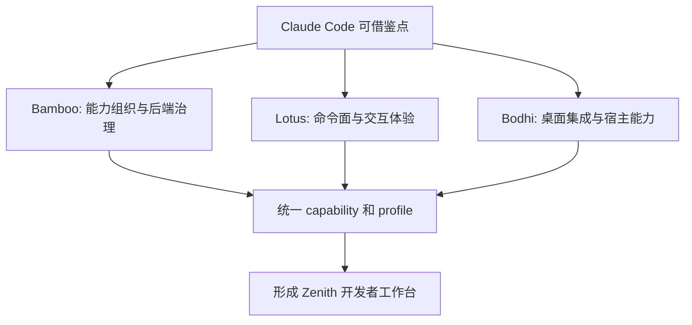
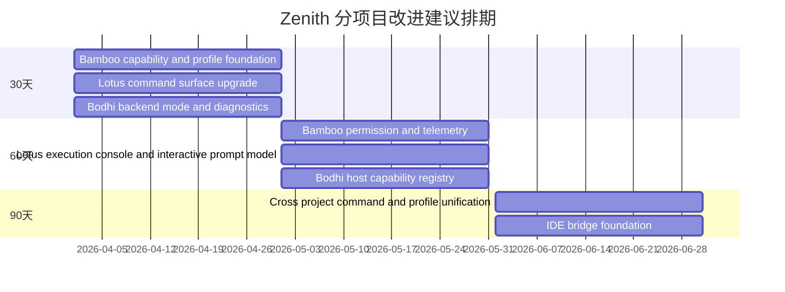

# Zenith 分项目改进清单（参考 Claude Code，可直接排期）

> 目标：把上一份《Claude Code vs Zenith Agent 架构对比报告》进一步拆成 `Bamboo / Lotus / Bodhi` 三个子项目可执行清单。
>
> 原则：
>
> 1. **学 Claude Code 的方法论，不照搬其单体结构**
> 2. **保留 Zenith 的分层优势**：Bamboo 后端、Lotus 前端、Bodhi 桌面壳
> 3. 每个子项目按 **P0 / P1 / P2** 排序，便于 roadmap 和 owner 认领

---

## 总体路线图

---

# 一、Bamboo 改进清单

## Bamboo 当前优势

Bamboo 已经具备很强的后端基础设施：

- 工具模块化明确：`bamboo/src/agent/tools/tools/mod.rs:1`
- 工具 alias/兼容层存在：`bamboo/src/agent/tools/executor.rs:64`
- 有工具 guide registry：`bamboo/src/agent/tools/tools/registry.rs:37`
- 有 orchestrator、mutability classification、retry：`bamboo/src/agent/tools/orchestrator.rs:17`
- 有并行工具执行 runtime：`bamboo/src/agent/tools/parallel.rs:25`
- 有 sub-session / scheduler / skill runtime / SSE / sync protection
- 配置层已经支持 tool/skill disable、hooks、env_vars、mcpServers：`bamboo/src/core/config.rs:150`

这说明 Bamboo 的问题不是“没有架构”，而是：**能力组织、策略治理、可发现性、产品化协议** 还有提升空间。

---

## Bamboo P0（优先做）

### P0-1：建立 Capability Matrix，而不是仅靠 prompt 约束能力

#### 为什么
Claude Code 很强的一点是：工具、命令、模式、特性开关之间的关系非常清晰。

Bamboo 现在已经有：
- tools disabled
- skills disabled
- alias
- permission
- server tools / builtins

但还缺一个统一的 capability 视图。

#### 建议
为 Bamboo 增加统一 capability model，例如：

- session_mode：`chat / plan / execute / review / safe`
- agent_profile：`general / coder / reviewer / researcher / planner`
- capability_bundle：
  - 可用 tools
  - 可用 server tools
  - 可用 skills
  - 并行/子会话是否允许
  - 权限默认模式

#### 预期收益
- 更容易做 UI 暴露规则
- 更容易做 agent profile
- 更容易做 enterprise / internal / public 分层发布
- 比单纯拼 system prompt 更稳

---

### P0-2：把 SubSession 从“工具能力”升级为“角色化能力”

#### 为什么
Claude Code 的多 agent 强在 team/coordinator 的产品化，而不仅是能 spawn。

Bamboo 当前 `SubSession` 已经不错：
- 支持 title / responsibility / prompt / subagent_type：`bamboo/src/server/tools/spawn_session.rs:22`
- 禁止 child 再开 child：`bamboo/src/server/tools/spawn_session.rs:13`
- 有 `sub_session_manager` 做复用管理：`bamboo/src/server/tools/sub_session_manager.rs:16`

但是 `subagent_type` 还比较像自由文本，没有产品化模板。

#### 建议
先把 subagent_type 固化为几个官方 profile：

- `researcher`
- `coder`
- `reviewer`
- `architect`
- `release-manager`

每个 profile 明确：
- prompt pack
- tool allowlist
- 是否允许 bash/write
- 输出格式 contract
- 风险等级

#### 预期收益
- 子会话稳定性更高
- UI 更容易展示与推荐
- 后续更容易做 team orchestration

---

### P0-3：把 command / workflow / skill / tool 四层关系统一起来

#### 为什么
Claude Code 的 command surface 非常强。Bamboo 目前有 tools、skills、workflows、scheduler，但关系还不够统一。

#### 建议
在 Bamboo 侧增加一个统一的注册模型：

- Tool：底层执行能力
- Skill：策略/流程模板
- Workflow：可重复任务脚本
- Command：面向用户的显式操作入口

定义统一 schema，例如：
- `id`
- `kind`
- `display_name`
- `description`
- `category`
- `tags`
- `requires_capabilities`
- `default_profile`
- `ui_entry_points`

#### 预期收益
- Lotus 的 CommandSelector 能直接消费
- 更容易对齐 GUI 与 backend 能力
- 后续插件化更自然

---

### P0-4：把权限模式产品化，而不是只保留 request_permissions 工具

#### 为什么
Claude Code 很强的一部分是 permission mode 非常明确。

Bamboo 目前已有：
- mutability 分类：`bamboo/src/agent/tools/orchestrator.rs:52`
- read-only auto-approve：`bamboo/src/agent/tools/orchestrator.rs:58`
- permission checker：`bamboo/src/agent/tools/executor.rs:9`
- `request_permissions`

但还缺清晰的“用户可理解模式”。

#### 建议
引入显式权限模式：

- `read_only`
- `ask_on_mutation`
- `workspace_auto`
- `full_trust`

并让 session metadata / API / UI 都能感知当前模式。

#### 预期收益
- 减少随机 prompt 行为
- 用户更能理解 agent 为什么会被拦截
- 可支撑企业/公共版差异

---

### P0-5：把同步保护继续升级为“显式 session consistency contract”

#### 为什么
Bamboo 当前在 execute 前已经做了很好的 client/server sync 检查：
- message_count
- last_message_id
- pending_question

见：`bamboo/src/server/handlers/agent/execute/handler/mod.rs:61`

这已经是强产品化能力。

#### 建议
把它升级成正式 contract：
- 所有 execute/respond API 都带 cursor/version
- 定义 sync error code
- 提供“自动恢复建议”字段
- 支持多窗口冲突策略

#### 预期收益
- Lotus/Bodhi 多窗口一致性更强
- 后续移动端 / IDE bridge 更稳

---

## Bamboo P1（第二优先级）

### P1-1：做更强的 Tool Telemetry / Evaluation

建议增加：
- tool 成功率
- tool 平均耗时
- tool 重试率
- permission prompt 频率
- child session 完成率
- scheduler 成功率

这样能像 Claude Code 一样，用数据判断哪些能力成熟、哪些还在“实验态”。

---

### P1-2：建立 Feature Gating 体系

建议增加：
- `stable`
- `beta`
- `internal`
- `experimental`

作用对象：
- tools
- server tools
- skill runtime
- scheduler
- sub-session
- prompt enhancements

这样后端就能成为真正的 capability source of truth。

---

### P1-3：补“IDE / Editor bridge 所需 API”

为后续 VS Code/JetBrains 集成提前准备：
- open file at line
- diff preview
- apply patch preview
- selection context ingest
- diagnostics ingest
- editor state hints

这一步 Bamboo 是最关键的 owner。

---

### P1-4：统一错误码和可恢复语义

当前后端已有很多好的错误路径，但建议再做一层标准化：
- user_action_required
- sync_required
- permission_denied
- transient_retryable
- policy_blocked
- invalid_capability

这样 Lotus/Bodhi 的 UI 可以更精确，不再只能靠 message string 猜。

---

## Bamboo P2（中长期）

### P2-1：引入 Plugin Manifest / Extension Protocol
为未来第三方扩展做准备。

### P2-2：补更强的 Workflow Runtime
把 workflows 从脚本层进一步升级为带状态、可视化、可追踪的 runtime。

### P2-3：做更细粒度的模型/请求 override 策略 UI 接口
你们 config 已经支持 request overrides 的结构，值得未来产品化。

---

## Bamboo 一句话建议

**Bamboo 接下来最该做的，是把“已经有的能力”组织成统一 capability / profile / policy 体系。**

---

# 二、Lotus 改进清单

## Lotus 当前优势

Lotus 现在已经明显不是简单聊天页，而是有完整 agent GUI 雏形：

- 全局事件订阅：`lotus/src/app/MainLayout.tsx:42`
- MultiPaneChatView：`lotus/src/app/MainLayout.tsx:16`
- CommandPalette：`lotus/src/app/MainLayout.tsx:21,106`
- CommandSelector：`lotus/src/pages/ChatPage/components/CommandSelector/index.tsx:1`
- ExecutionStatusRail：`lotus/src/pages/ChatPage/components/ExecutionStatusRail/index.tsx:21`
- QuestionDialog：`lotus/src/components/QuestionDialog/QuestionDialog.tsx:17`
- SkillManager / SkillSelector
- system prompt enhancement pipeline：`lotus/src/shared/utils/systemPromptEnhancement.ts:71`
- 对 `conclusion_with_options` 的产品化增强：`lotus/src/shared/utils/copilotConclusionWithOptionsEnhancementUtils.ts:15`

Lotus 当前最值得强化的是：**把 GUI 的“可见交互面”做得像 Claude Code 的 commands surface 一样强且一致。**

---

## Lotus P0（优先做）

### P0-1：把 CommandPalette / CommandSelector 升级成真正的用户操作总入口

#### 为什么
Claude Code 的强项之一是 command surface。Lotus 已经有 CommandPalette 和 CommandSelector，但现在更像辅助组件，还不是整个产品的第一入口。

证据：
- `CommandSelector` 已支持 workflow/skill/mcp 分类展示：`lotus/src/pages/ChatPage/components/CommandSelector/index.tsx:20`
- `useCommandSelectorState` 会动态拉取命令列表：`lotus/src/pages/ChatPage/components/CommandSelector/useCommandSelectorState.ts:28`

#### 建议
让 CommandPalette 承担统一操作入口：
- Commands
- Skills
- Workflows
- Recent actions
- Saved prompts
- Session actions

优先支持：
- review code
- summarize changes
- spawn researcher
- compact context
- schedule automation
- export session

#### 预期收益
- 用户不必什么都靠自然语言描述
- 高价值能力更容易被发现和复用
- 直接向 Claude Code 的 command surface 对齐

---

### P0-2：把 ExecutionStatusRail 做成完整执行控制台

#### 为什么
现在 ExecutionStatusRail 已经有比较好的状态机：
- thinking
- running_tools
- waiting_approval
- waiting_user_answer
- running_children
- completed
- error

见：`lotus/src/pages/ChatPage/components/ExecutionStatusRail/index.tsx:23`

但目前它更像一个状态条，而不是执行控制面板。

#### 建议
增强为 execution console：
- 当前回合状态
- 正在运行的 tool 列表
- pending approval tool
- child sessions 摘要
- token/context budget 摘要
- sync mismatch / reconnect 提示

#### 预期收益
- 大幅提升长任务可观测性
- 降低“agent 卡住了？”的用户焦虑
- 把 Bamboo 后端已有的信息更充分利用起来

---

### P0-3：统一“待用户回答”类交互模型

#### 为什么
QuestionDialog 已经很好，但现在更多像“pending question 特例 UI”。

证据：
- `respond/{sessionId}/pending` 轮询：`lotus/src/components/QuestionDialog/QuestionDialog.tsx:101`
- 适配 `conclusion_with_options` / pending question：`lotus/src/components/QuestionDialog/QuestionDialog.tsx:17`

#### 建议
统一抽象为 `InteractivePrompt` 模型，覆盖：
- request_permissions
- conclusion_with_options
- choose next step
- conflict resolution
- sync recovery suggestion

并统一成卡片/弹层/侧边栏可复用组件。

#### 预期收益
- UI 一致性更好
- 后续加入更多 agent clarification 不会碎片化
- 更适合多面板/桌面场景

---

### P0-4：把 prompt enhancement 从“本地设置技巧”升级为“用户可理解的能力开关”

#### 为什么
Lotus 当前有很强的 system prompt enhancement pipeline：
- OS info
- Bamboo Operational Guidance
- Mermaid enhancement
- Task enhancement
- Copilot conclusion_with_options enhancement
- workspace context

见：`lotus/src/shared/utils/systemPromptEnhancement.ts:71`

这很强，但对普通用户偏隐性。

#### 建议
把它改造成 UI 可理解的开关分组：
- 结构化输出增强
- Mermaid 解释增强
- Task discipline 增强
- Completion confirmation 增强
- Workspace awareness 增强

每项要有：
- 说明
- 风险/收益
- 适用场景
- provider compatibility

#### 预期收益
- 用户知道自己开启了什么
- 更容易调试 prompt 行为
- 更利于产品运营和 A/B

---

### P0-5：增强 Command/Skill/Workflow 的可见来源与边界

#### 为什么
当前 CommandSelector 已有 type/tag/category/server 信息，但还可以更强。

#### 建议
在 UI 里明确显示：
- 来源：builtin / mcp / workflow / skill / plugin
- 风险等级：safe / write / execute / remote
- 所需能力：workspace / internet / file write / sub-session
- 推荐 profile

#### 预期收益
- 用户对 agent 能力更有掌控感
- 与 Bamboo capability matrix 形成闭环

---

## Lotus P1（第二优先级）

### P1-1：做统一的 Session Inspector 视图

整合：
- task list
- active tools
- compression history
- child sessions
- model/reasoning_effort
- pending question
- sync state

让高级用户像看 Claude Code 内部状态一样理解系统。

---

### P1-2：做“结果可复用”层

例如：
- 把一次回答保存为 workflow 草稿
- 把一次成功的 command 变成快捷动作
- 把子会话模板另存为 agent profile

这是 GUI 产品比 CLI 更容易赢的地方。

---

### P1-3：更强的错误恢复 UX

结合 Bamboo 的 sync 与错误码，Lotus 应该提供：
- 一键同步
- 重试上次执行
- 从最后用户消息重跑
- 查看为什么被权限拦截

---

### P1-4：更强的多窗格 / 多会话工作台体验

既然已经有 MultiPaneChatView，就继续放大：
- 主会话 + 子会话并排
- diff/notes/reference side panel
- compare two child sessions
- reviewer pane

这比 CLI 形态更有产品差异化。

---

## Lotus P2（中长期）

### P2-1：引入更统一的视觉语言用于 tool / command / session / profile
### P2-2：做 usage insights / agent analytics dashboard
### P2-3：做 command discovery / recommendation engine

---

## Lotus 一句话建议

**Lotus 最该做的，是把现有零散但优秀的组件，整合成一个真正的 agent command-and-control GUI。**

---

# 三、Bodhi 改进清单

## Bodhi 当前优势

Bodhi 当前定位很清楚：
- 负责 Tauri runtime
- 内嵌 Bamboo backend
- 装载 Lotus 前端
- 处理窗口、快捷键、配置、代理、自签名、发布

关键证据：
- embedded Bamboo 服务：`bodhi/src-tauri/src/embedded/mod.rs:1`
- setup 中启动 embedded service：`bodhi/src-tauri/src/lib.rs:237`
- Tauri plugin 注册：`bodhi/src-tauri/src/lib.rs:444`
- 全局快捷键：`bodhi/src-tauri/src/lib.rs:452`
- proxy config 命令：`bodhi/src-tauri/src/lib.rs:267`

Bodhi 的主要问题不是功能弱，而是：**桌面壳能力还没有被系统化为“开发者工作台宿主层”**。

---

## Bodhi P0（优先做）

### P0-1：明确 Bodhi 的“宿主能力边界”

#### 为什么
现在 Bodhi 既做：
- embedded server 生命周期
- proxy config
- setup 状态
- devtools/diagnostic overlay
- window theme
- global shortcut

这些都是合理的，但边界还可以更明确。

#### 建议
将 Bodhi 的职责收敛为四类：
- app shell lifecycle
- desktop integrations
- secure local config mediation
- window/workspace orchestration

而避免把 Bamboo 的产品逻辑再写回 Tauri 命令里。

#### 预期收益
- 不会和 Bamboo API 职责混淆
- 后续桌面特性增加时结构更稳

---

### P0-2：把桌面特性做成“宿主能力目录”

#### 为什么
Claude Code 的 bridge/desktop handoff 值得学习。Bodhi 应该成为 Zenith 的宿主能力中心。

#### 建议
补一层 host capability registry，例如：
- clipboard
- global shortcut
- open file in editor
- reveal file in Finder/Explorer
- open terminal at workspace
- OS notification
- window pin/focus/toggle
- open devtools

并把这些能力统一暴露给 Lotus/Bamboo，而不是分散成零碎 tauri command。

#### 预期收益
- 未来接 IDE / shell / OS integrations 更顺
- 宿主能力可测试、可枚举、可灰度

---

### P0-3：做 backend runtime 模式切换产品化

#### 为什么
现在 Bodhi 会优先探测端口上是否已有 backend，若已有则跳过 embedded start：`bodhi/src-tauri/src/lib.rs:241`

这个设计很好，但还不够产品化。

#### 建议
显式支持并展示三种模式：
- Embedded Bamboo
- External Local Bamboo
- Remote Bamboo

并在 UI 设置页中可见：
- 当前模式
- 当前 backend 地址
- 健康状态
- 切换方式

#### 预期收益
- 对开发和调试非常友好
- 也为将来企业部署 / remote workspace 做准备

---

### P0-4：把桌面诊断和恢复做完整

#### 为什么
Bodhi 已经有：
- webview diag overlay
- optional devtools open
- internal startup confirmation

见：`bodhi/src-tauri/src/lib.rs:99-177,189-230`

#### 建议
补成正式的 diagnostic / recovery 面板：
- Lotus 是否挂起
- Bamboo 是否健康
- 当前 backend mode
- 日志位置
- 一键重启 embedded backend
- 一键打开 logs
- 一键 reset setup

#### 预期收益
- 桌面问题定位效率提升
- 减少“空白页/没响应”这类灰色故障

---

### P0-5：为未来 IDE bridge 预留桌面协同能力

#### 为什么
Claude Code 的一个巨大优势是 IDE bridge。Bodhi 是未来实现桌面桥接的最佳位置。

#### 建议
先预留：
- open file and line in editor
- register editor executable/path
- bring Bodhi to front from external tool
- share current workspace context to Bamboo
- deep-link into session / message / sub-session

#### 预期收益
- 为开发者工作流铺路
- Bodhi 不只是“桌面打包器”，而是“桌面集成层”

---

## Bodhi P1（第二优先级）

### P1-1：统一 setup / config mediation 体验
目前 proxy/setup/theme 等设置有一部分走 Tauri command，一部分走 Bamboo API。建议统一“设置来源与权威归属”。

### P1-2：引入窗口编排能力
例如：
- 主窗
- 子会话详情窗
- settings 窗
- diff / review 辅助窗

### P1-3：加强桌面通知 / 后台运行 / 快捷入口
对长任务、scheduler、child session 很有价值。

---

## Bodhi P2（中长期）

### P2-1：支持插件化宿主能力
### P2-2：支持更强的本地安全存储策略
### P2-3：支持桌面级 release/diagnostics telemetry

---

## Bodhi 一句话建议

**Bodhi 不应只做 Tauri 包装层，而应逐步成长为 Zenith 的 desktop host platform。**

---

# 四、跨项目联动清单（最重要）

真正高价值的，不是三个项目各做各的，而是三者形成闭环。

## 联动 P0

### 1. 统一 Capability Schema
- Bamboo 提供 capability/profile/policy source of truth
- Lotus 可视化与交互
- Bodhi 提供 desktop host capability

### 2. 统一 Command Surface
- Bamboo 定义 command registry
- Lotus 作为主要 UI 入口
- Bodhi 提供系统级快捷触发

### 3. 统一 Session Consistency Contract
- Bamboo 定义 sync contract
- Lotus 实现恢复与冲突 UX
- Bodhi 处理多窗口/深链/恢复入口

### 4. 统一 Agent Profile
- Bamboo 定义 profile
- Lotus 选择与展示
- Bodhi 为桌面工作流提供快捷使用方式

---

# 五、建议排期顺序（30/60/90）

### 30 天
- Bamboo：capability/profile 基础设施
- Lotus：command surface 升级
- Bodhi：backend mode + diagnostics

### 60 天
- Bamboo：permission mode + telemetry
- Lotus：execution console + interactive prompt model
- Bodhi：host capability registry

### 90 天
- 三端统一 command / capability / profile
- 开始做 IDE bridge 基础层

---

# 六、最后结论

## 如果只能各选一个最该做的事项

### Bamboo
**做 Capability Matrix + Agent Profile**

### Lotus
**把 CommandPalette/CommandSelector 升级成真正的 command surface**

### Bodhi
**把宿主能力抽象成 Host Capability Registry，并产品化 backend mode/diagnostics**

## 一句话总建议

**Zenith 的正确方向不是变成另一个 Claude Code，而是把 Bamboo 的后端能力、Lotus 的 GUI 能力、Bodhi 的桌面宿主能力，整合成一个更适合多端与开发者工作流的 Agent Operating Layer。**
