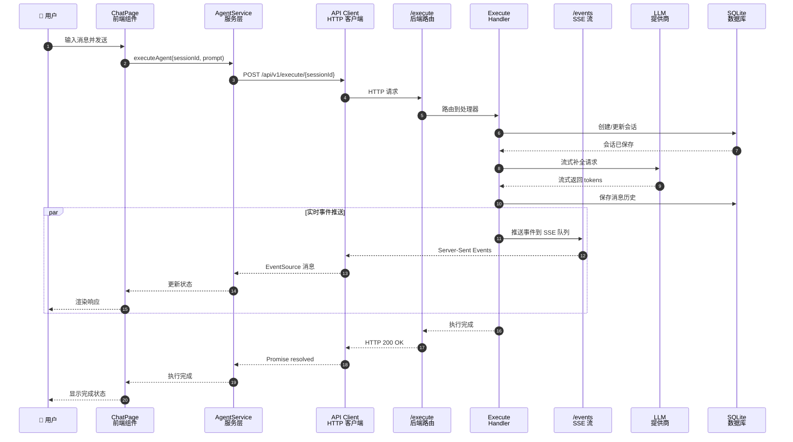
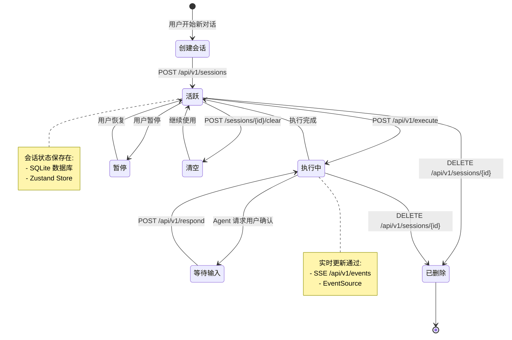
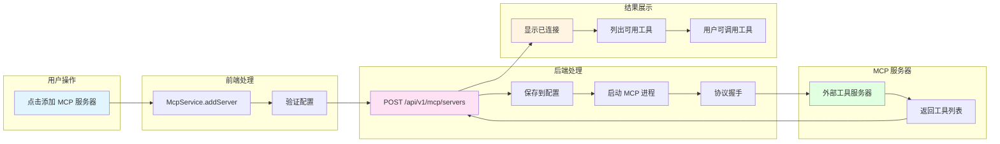
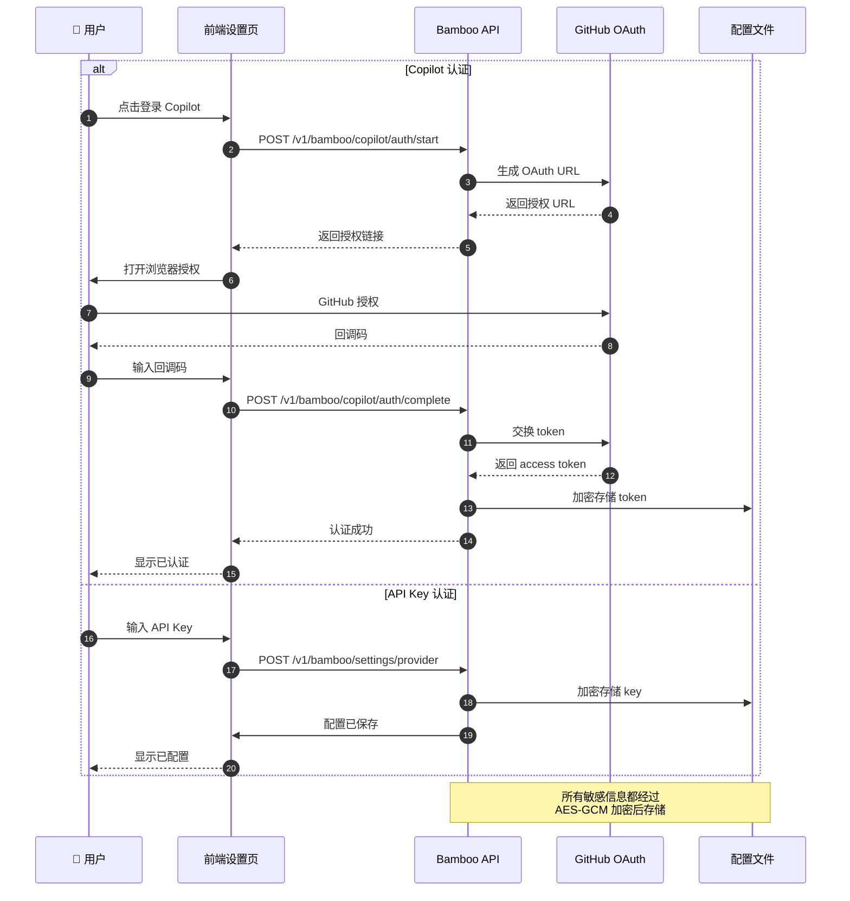
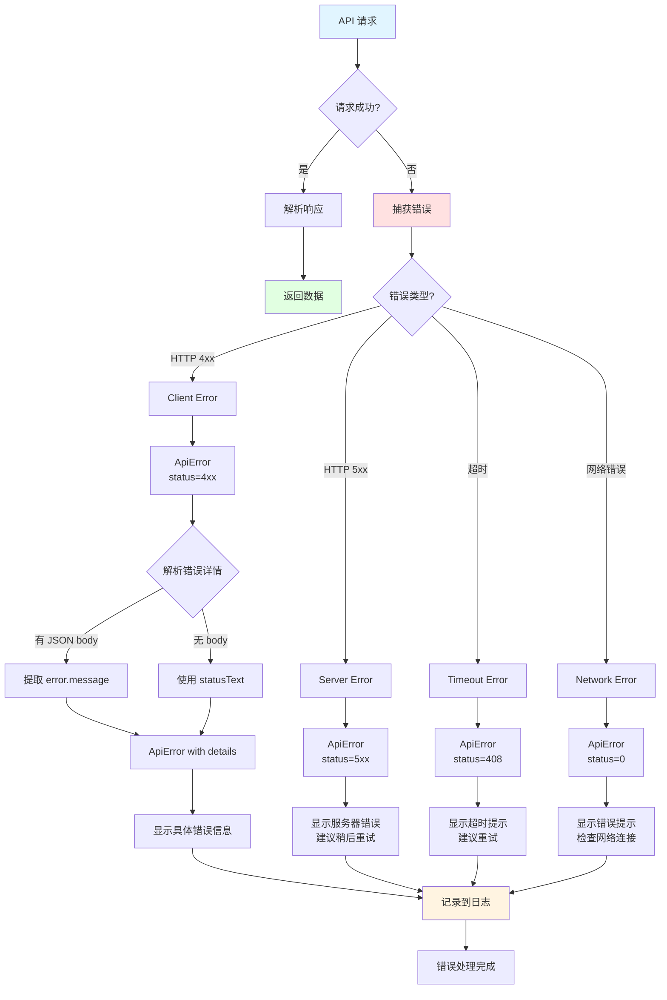
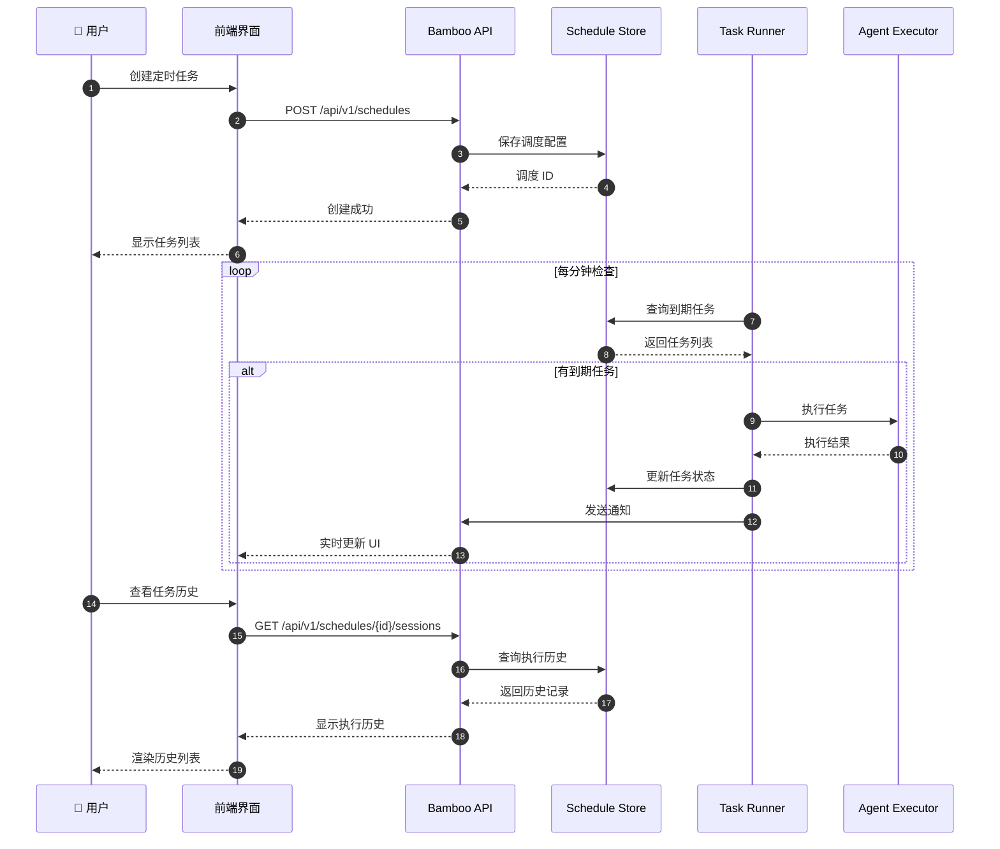

# Zenith 架构流程图

## 1. 整体架构流程

```mermaid
graph TB
    subgraph "用户层"
        U[👤 用户]
    end
    
    subgraph "前端应用层"
        L[Lotus Web UI<br/>React + TypeScript]
        B[Bodhi Desktop<br/>Tauri Shell]
        P[Pavilion<br/>文档站点]
    end
    
    subgraph "服务层"
        AS[AgentService<br/>执行代理]
        SS[SkillService<br/>技能管理]
        TS[ToolService<br/>工具执行]
        MS[McpService<br/>MCP管理]
        WS[WorkspaceService<br/>工作区]
    end
    
    subgraph "API网关层"
        API[统一 API Client<br/>错误处理 + 认证]
    end
    
    subgraph "后端服务层 Bamboo"
        subgraph "核心路由 /api/v1/*"
            CH[Chat Handler]
            EX[Execute Handler]
            EV[Events SSE]
            SE[Sessions]
            SC[Schedules]
        end
        
        subgraph "配置路由 /v1/*"
            CFG[Config]
            PR[Provider]
            MCP[MCP Servers]
            WK[Workspace]
        end
        
        subgraph "提供商转发"
            OAI[/openai/v1/*]
            ANT[/anthropic/v1/*]
            GEM[/gemini/v1/*]
        end
    end
    
    subgraph "数据层"
        DB[(SQLite<br/>会话存储)]
        FS[文件系统<br/>工作区]
    end
    
    subgraph "外部服务"
        LLM[LLM 提供商<br/>OpenAI/Anthropic/Gemini]
        MCPS[MCP Servers<br/>外部工具]
    end
    
    U -->|访问| L
    U -->|桌面应用| B
    B -.->|嵌入| L
    U -->|查看文档| P
    
    L --> AS
    L --> SS
    L --> TS
    L --> MS
    L --> WS
    
    AS --> API
    SS --> API
    TS --> API
    MS --> API
    WS --> API
    
    API -->|POST /api/v1/chat| CH
    API -->|POST /api/v1/execute| EX
    API -->|GET /api/v1/events| EV
    API -->|CRUD /api/v1/sessions| SE
    API -->|CRUD /api/v1/schedules| SC
    
    API -->|GET/POST /v1/bamboo/config| CFG
    API -->|GET/POST /v1/bamboo/provider| PR
    API -->|CRUD /api/v1/mcp/*| MCP
    API -->|POST /v1/workspace/*| WK
    
    EX -->|流式调用| OAI
    EX -->|流式调用| ANT
    EX -->|流式调用| GEM
    
    OAI --> LLM
    ANT --> LLM
    GEM --> LLM
    
    CH --> DB
    EX --> DB
    SE --> DB
    SC --> DB
    
    MCP --> MCPS
    WK --> FS
    
    EV -.->|SSE 实时推送| AS
    
    style U fill:#e1f5ff
    style L fill:#fff4e1
    style B fill:#fff4e1
    style API fill:#ffe1f5
    style CH fill:#e1ffe1
    style EX fill:#e1ffe1
    style LLM fill:#ffe1e1
```

## 2. 核心聊天执行流程



## 3. 会话管理流程



## 4. MCP 服务器集成流程



## 5. 认证流程



## 6. 错误处理流程



## 7. 定时任务调度流程



---

**生成时间**: 2026-03-18  
**工具**: frontend-backend-analyzer skill  
**项目**: Zenith Monorepo
